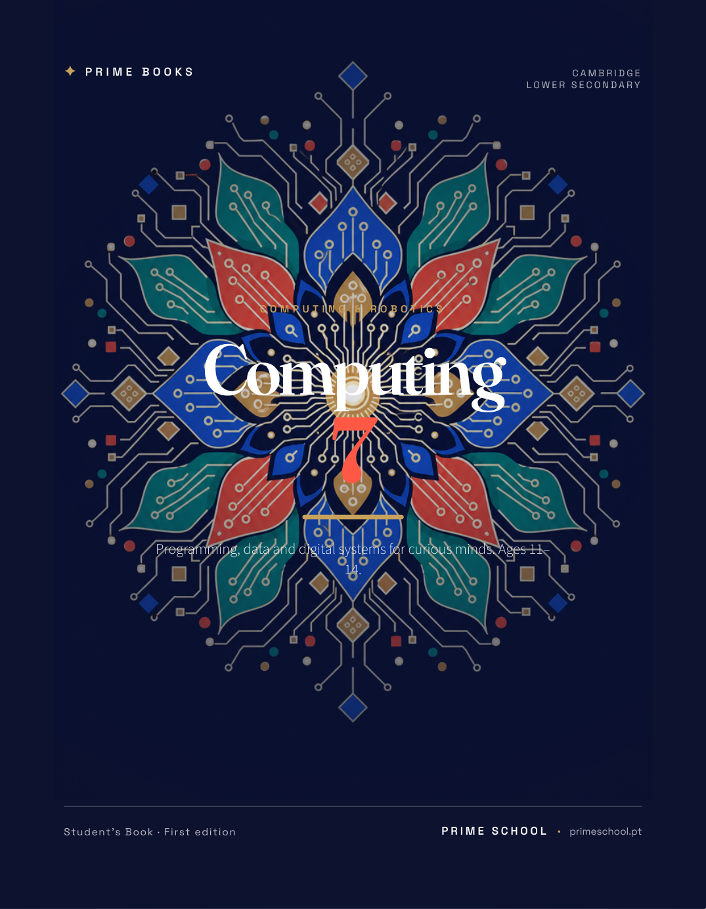
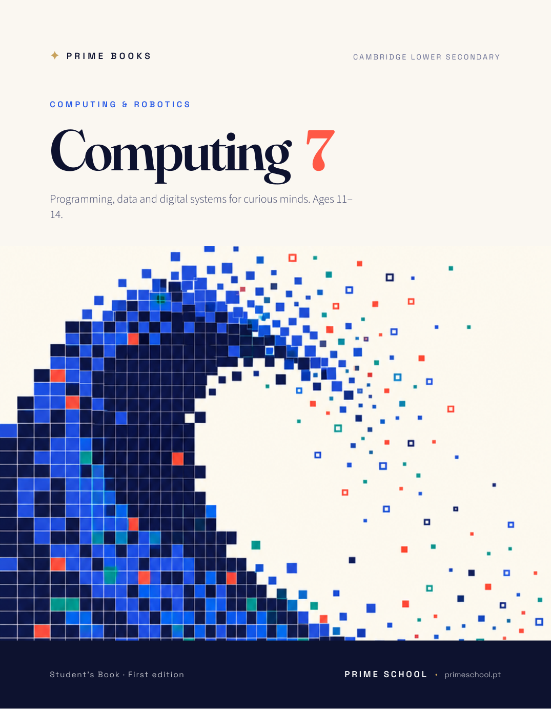
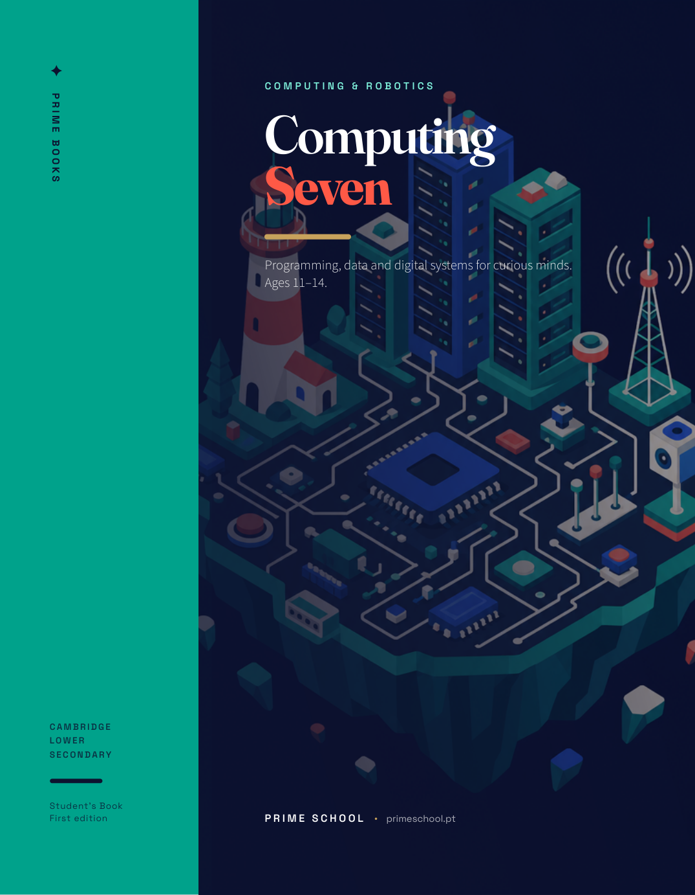
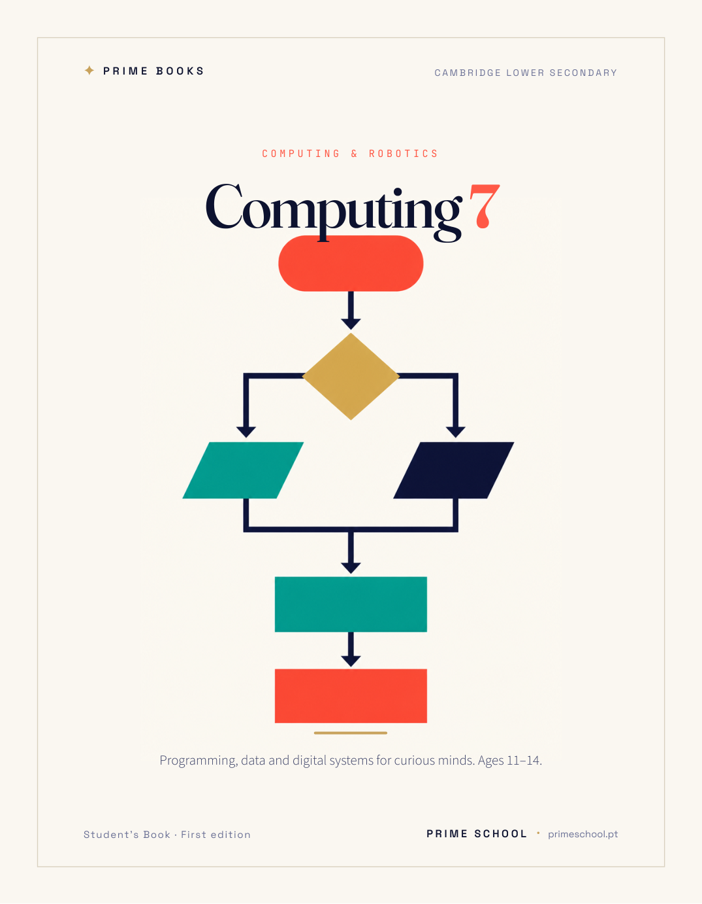
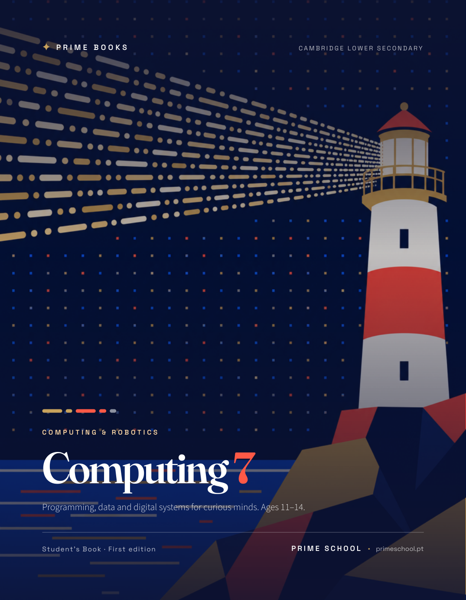

# Cover Proposals
## Prime Books · Cambridge Computing Year 07 · Prime School 2026

Five cover routes. Each is a genuinely different layout and typographic system, not one
template with the artwork swapped. All are print-ready at 210 × 270 mm, full bleed, and
supplied as both PDF (for print) and PNG (for review).

All five share the same fixed brand furniture so the series reads as one family:
`✦ PRIME BOOKS` mark, Cambridge Lower Secondary endorsement line, edition line,
`PRIME SCHOOL · primeschool.pt` imprint, and the palette below.

| Token | Hex |
|---|---|
| Indigo | `#0E1330` |
| Cream | `#FBF8F1` |
| Electric blue | `#2B5BE8` |
| Teal | `#00A38C` |
| Coral | `#FF5A47` |
| Gold | `#C9A35C` |

---

### 01 · Circuit Bloom
**Dark, centred, ceremonial.** A symmetrical mandala grown entirely from circuit traces,
sitting behind a stacked centred lockup. The year numeral is set enormous in coral beneath
the wordmark, so the shelf reads "Computing / 7" from across a room.

- Mood: authoritative, flagship, the safe premium choice
- Type: Fraunces centred, gold rule, generous vertical rhythm
- Best for: the lead title of the series



---

### 02 · Pixel Wave
**Light, editorial, unmistakably Portuguese.** An Atlantic wave built from pixels that
dissolve into spray. Cream upper third carries the type, the artwork occupies the lower
two thirds, and a solid indigo footer bar anchors the imprint.

- Mood: warm, contemporary, approachable without being childish
- Type: left-aligned Fraunces with the numeral set inline beside the word
- Best for: standing out on a shelf of dark technology covers



---

### 03 · Split Terminal
**Architectural.** A hard vertical split: a solid teal spine panel carrying vertical
`PRIME BOOKS` type, against an isometric island city of computing objects. The title spells
the year as a word, "Seven", which gives the cover a quieter, more literary voice.

- Mood: designed, confident, the most distinctive of the five
- Type: vertical sans on the spine panel, ranged-left serif in the main field
- Best for: a series where each year gets its own spine colour



---

### 04 · Flow State
**Swiss minimal.** Almost no artwork in the illustrative sense: the cover *is* a flowchart,
abstracted to pure geometry inside a hairline frame. The most restrained option and the one
that will still look good in ten years.

- Mood: intelligent, calm, grown-up
- Type: centred Fraunces with a mono eyebrow, enormous negative space
- Best for: a school that wants understatement over spectacle



---

### 05 · Light Signal
**Cinematic.** A coastal lighthouse throws a beam broken into Morse dashes across a dark
sky of LED dots. A row of coloured dash and dot bars above the eyebrow encodes the same
signalling idea as a graphic device, tying directly to Unit 7.6.

- Mood: atmospheric, narrative, the most emotive route
- Type: bottom-weighted lockup, full-bleed image, gold and coral accents
- Best for: making the subject feel like an adventure



---

## Files

```
Cover/
  01_circuit-bloom.pdf    01_circuit-bloom.png
  02_pixel-wave.pdf       02_pixel-wave.png
  03_split-terminal.pdf   03_split-terminal.png
  04_flow-state.pdf       04_flow-state.png
  05_light-signal.pdf     05_light-signal.png
  art/                    source artwork (fal.ai openai/gpt-image-2, quality medium)
  README.md               this document
```

The cover currently bound into `Cambridge Computing Year 07.pdf` is a sixth treatment
(a centred circuit-tree lockup). To adopt one of these five instead, say which number and
it will be swapped into the book and rebuilt.

Regenerate all five at any time with:

```
cd Output/_build && python covers.py
```
