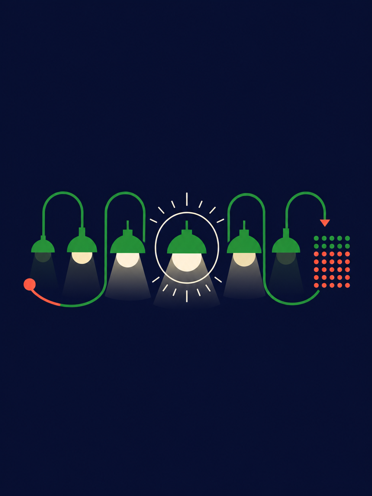

<!-- unit: u6 -->
<!--html
<section class="sheet opener">
  
  <div class="veil"></div>
  <div class="inner">
    <div>
      <div class="ulab">Unit</div>
      <div class="unum">7.6</div>
      <h1>Sequencing and pattern recognition<span class="thin">Getting the message across</span></h1>
      <div class="rule"></div>
    </div>
    <div class="lo">
      <div class="feat-lab"><span class="gl">✓</span>Learning outcomes</div>
      <p style="margin:0 0 3mm;font-size:9.4pt;color:var(--ink-soft)">In this unit you will learn to:</p>
      <ul class="tick">
        <li>recognise patterns in problems and use them to simplify a solution</li>
        <li>replace repeated code with a count-controlled loop</li>
        <li>use a list to store many related values under one name</li>
        <li>spot the patterns shared by different text-based programming languages</li>
        <li>write a project plan with clear, ordered, achievable tasks</li>
        <li>build a test plan and record real results against it</li>
        <li>identify syntax, runtime and logic errors, and debug them methodically</li>
        <li>program a sequence of lights with precise timing</li>
        <li>control the brightness of individual LEDs</li>
        <li>combine sequence, selection and iteration in one working program</li>
      </ul>
    </div>
  </div>
</section>
-->

<!--html
<div class="flow">
-->

::: raw
<div class="feat f-scenario" style="border-left-color:var(--sig)">
<div class="feat-lab"><span class="gl">◆</span>Get started</div>
<p style="font-family:'Fraunces',serif;font-style:italic;font-size:11.4pt;line-height:15.4pt;margin-bottom:3mm">A lighthouse on the Atlantic coast never speaks, yet every sailor knows exactly which one it is.</p>
<p>The lighthouse at Cabo da Roca flashes in a fixed rhythm, and no two lighthouses nearby share the same pattern. Discuss with a partner.</p>
<ul class="dot">
<li>How can a light with only two states, on and off, carry useful information?</li>
<li>Why must the timing be exact rather than roughly right?</li>
<li>What other everyday signals use a pattern of light or sound to mean something?</li>
</ul>
<p>A pattern is information. Once you can see the pattern in a problem, you can usually replace a long list of instructions with a short, elegant one. That is the heart of this unit.</p>
<p>You will learn to spot repetition, to express it as a loop, and to build precisely timed sequences of light. Then you will plan, build, test and evaluate a complete signalling project of your own.</p>
</div>
:::

::: keywords
**pattern recognition** noticing similarities or repetition within a problem, and using them to
simplify the solution

**iteration** repeating a set of instructions, also called looping

**sequence** instructions carried out one after another in a fixed order
:::

::: warmup Warm up
Look at each sequence and work out the rule, then give the next two terms.

1. 2, 4, 8, 16, 32, ...
2. 1, 4, 9, 16, 25, ...
3. on, on, off, on, on, off, on, ...
4. 5, 10, 20, 40, ...

Now the important question. For sequence 1, would you rather write out the first thirty terms
by hand, or write one rule that produces them? Explain what that tells you about programming.
:::

::: remember
Everything in this unit builds on tools you already have.

- **Sequence** from Unit 7.1: steps in order.
- **Selection** from Unit 7.1: `if`, `elif` and `else`.
- **The micro:bit display** from Unit 7.2: `display.set_pixel(x, y, brightness)`.
- **Test plans** from Units 7.1 and 7.2: normal, boundary and erroneous data.

The one genuinely new idea is **iteration**: getting the computer to repeat something for you.
:::

## [Unit 7.6 · Topic 1] Pattern recognition

**Pattern recognition** means spotting what repeats. It is what turns a tedious problem into a
short one.

### Seeing the repetition

Suppose you want to light the top row of the micro:bit display. Without pattern recognition you
would write five near-identical lines.

```python
from microbit import *

display.set_pixel(0, 0, 9)
display.set_pixel(1, 0, 9)
display.set_pixel(2, 0, 9)
display.set_pixel(3, 0, 9)
display.set_pixel(4, 0, 9)
```

Look carefully at what changes and what stays the same. Only the first number changes, and it
counts 0, 1, 2, 3, 4. Everything else is identical. That is a pattern, and a **for loop**
expresses it in two lines.

```python
from microbit import *

for x in range(5):
    display.set_pixel(x, 0, 9)
```

### Understanding range()

`range()` produces a sequence of whole numbers. It is the engine of most loops you will write.

| Call | Produces | Count |
|---|---|---|
| `range(5)` | 0, 1, 2, 3, 4 | 5 values |
| `range(1, 6)` | 1, 2, 3, 4, 5 | 5 values |
| `range(0, 10, 2)` | 0, 2, 4, 6, 8 | 5 values |
| `range(5, 0, -1)` | 5, 4, 3, 2, 1 | 5 values |

The count always **starts at the first number and stops before the last**. `range(5)` gives
five values ending at 4, not at 5. This catches everybody once.

```python
for i in range(1, 4):
    print("Beep", i)
print("Done")
```

```out
Beep 1
Beep 2
Beep 3
Done
```

### Why loops matter so much

- A loop of three lines can do the work of three hundred.
- Changing the behaviour means editing one line, not three hundred.
- There is one place for a bug to hide instead of three hundred.

::: keywords
**for loop** a count-controlled loop that repeats a fixed number of times

**range()** a command that produces a sequence of whole numbers for a loop

**count-controlled loop** a loop that runs a known number of times
:::

::: practise Practise 1
1. Write a loop that prints the numbers 1 to 10.
2. Write a loop that prints the 7 times table up to 7 × 12.
3. Predict the output of `for i in range(3, 9, 2): print(i)`, then check it.
4. Rewrite these three lines as a loop: `display.set_pixel(2,0,9)`, `display.set_pixel(2,1,9)`, `display.set_pixel(2,2,9)`.
5. Explain why `range(5)` does not include 5.
:::

## [Unit 7.6 · Topic 2] Nested loops and lists

### A loop inside a loop

To light the whole display you need every combination of `x` and `y`. Put one loop inside
another, and the inner loop runs completely for each pass of the outer one.

```python
from microbit import *

for y in range(5):
    for x in range(5):
        display.set_pixel(x, y, 9)
        sleep(100)
```

The outer loop runs 5 times, the inner loop 5 times each, so `set_pixel` is called 5 × 5 = 25
times, lighting the display one LED at a time from the top left.

### Lists: many values, one name

A **list** stores a collection of values in order, under a single name. Square brackets create
one, and an **index** picks a value out. Indexes start at 0.

```python
routes = ["15E", "18E", "24E", "28E"]
print(routes[0])
print(routes[3])
print(len(routes))
```

```out
15E
28E
4
```

The last item of a four-item list is at index 3, because counting starts at 0. Asking for
`routes[4]` produces an `IndexError`.

### Looping through a list

```python
delays = [100, 200, 400, 800]
total = 0
for d in delays:
    total = total + d
print("Total wait:", total, "ms")
```

```out
Total wait: 1500 ms
```

Check it: 100 + 200 + 400 + 800 = 1500. A list plus a loop lets one short program handle a
sequence of any length.

::: know
The lighthouse at Cabo da Roca, the westernmost point of mainland Europe, flashes four times
every seventeen seconds. Every major lighthouse has its own timing, published in charts, so a
navigator can identify the coast by counting flashes and timing the gap. It is a system of
sequencing that predates computers by well over a century.
:::

::: keywords
**list** an ordered collection of values stored under one name

**index** the position of an item in a list, counting from 0

**nested loop** a loop placed inside another loop
:::

::: practise Practise 2
1. Create a list of five Portuguese cities and print the second and the last.
2. Write a loop that prints every item of your list on its own line.
3. Use a nested loop to light only the outer border of the display.
4. A list has 7 items. What is the index of the last one? What error appears if you ask for index 7?
5. Write a loop that adds up the list `[12, 8, 21, 4]` and prints the total. Check the answer by hand.
:::

## [Unit 7.6 · Topic 3] Patterns between programming languages

Once you know one text-based language, the next is far easier, because the same handful of ideas
appears everywhere in slightly different clothing.

| Idea | Python | JavaScript | What is the same |
|---|---|---|---|
| Output | `print("Hi")` | `console.log("Hi")` | a command plus a value |
| Variable | `total = 0` | `let total = 0;` | a name, then a value |
| Condition | `if x > 5:` | `if (x > 5) {` | the same comparison operators |
| Count loop | `for i in range(5):` | `for (let i=0; i<5; i++) {` | start, limit, step |
| Comment | `# note` | `// note` | ignored by the computer |

### What actually differs

- **Blocks.** Python uses indentation. Most other languages use curly brackets `{ }`.
- **Line endings.** Many languages need a semicolon at the end of each statement. Python does not.
- **Declaring variables.** Some languages make you announce a variable, and its type, before use.

### What never differs

Every text-based language has sequence, selection and iteration. Every one has variables, data
types and operators. Every one needs testing and debugging. Learning your second language is
mostly learning new punctuation for ideas you already hold.

::: further Go further: pseudocode
**Pseudocode** describes an algorithm in structured English, with no language's punctuation at
all. It lets you plan without deciding on a language yet.

```
BEGIN
  SET count TO 0
  FOR each flash FROM 1 TO 4
    TURN light ON
    WAIT 500 milliseconds
    TURN light OFF
    WAIT 500 milliseconds
    SET count TO count + 1
  END FOR
  DISPLAY count
END
```

Any programmer can read that, whichever language they use. Examiners like it for the same reason.
:::

::: practise Practise 3
1. Write in pseudocode an algorithm that counts down from 10 and then displays a message.
2. Look at the JavaScript column. Write down two differences from Python you would need to remember.
3. Explain why learning a second programming language is usually much quicker than learning the first.
:::

## [Unit 7.6 · Topic 4] Project plans and test plans

Bigger programs need planning before typing. Two documents do that work.

### The project plan

A **project plan** lists the tasks in order, with a realistic estimate for each. A good task is
small enough to finish in one sitting and specific enough that you know when it is done.

| # | Task | Estimate | Depends on |
|---|---|---|---|
| 1 | Agree the flash pattern and timings | 20 min | nothing |
| 2 | Draw the flowchart | 25 min | task 1 |
| 3 | Write the test plan | 20 min | task 1 |
| 4 | Code a single flash | 20 min | task 2 |
| 5 | Add the loop and the gap | 25 min | task 4 |
| 6 | Add the button to change pattern | 30 min | task 5 |
| 7 | Run every test and record results | 30 min | tasks 3 and 6 |
| 8 | Write the evaluation | 25 min | task 7 |

Notice that the test plan is written at task 3, **before** the code exists. Deciding what
correct looks like before you build is what keeps you honest.

### The test plan

| Test | Type | Input | Expected | Actual |
|---|---|---|---|---|
| 1 | Normal | press A once | 4 flashes, then a 3 s gap | |
| 2 | Normal | leave alone 30 s | pattern repeats, timing steady | |
| 3 | Boundary | press A during a flash | current cycle finishes cleanly | |
| 4 | Boundary | press A and B together | switches to pattern 2 | |
| 5 | Erroneous | press A ten times quickly | no crash, no queue of patterns | |

Leave the **Actual** column blank until you run it, then write what genuinely happened, not what
you hoped would happen.

::: keywords
**project plan** an ordered list of tasks with estimates, used to organise a project

**dependency** a task that must be finished before another can begin

**test plan** a prepared table of inputs and expected outputs, written before the code
:::

::: practise Practise 4
1. Write a project plan of at least six tasks for a device that signals SOS.
2. Mark the dependencies. Which tasks could two people do at the same time?
3. Write a five-row test plan for the same device, before writing any code.
4. Explain why writing the test plan first makes your testing more trustworthy.
:::

## [Unit 7.6 · Topic 5] Identifying errors and debugging

You met the three families of error in Unit 7.1. Loops introduce a fourth trap that is worth
naming separately.

| Type | What happens | Typical cause |
|---|---|---|
| Syntax | nothing runs | missing colon, bracket or quote |
| Runtime | stops part way | index out of range, wrong type |
| Logic | runs, wrong answer | `<` instead of `<=`, wrong operator |
| Off-by-one | runs, one too many or too few | misreading how `range()` counts |

### The off-by-one error

```python
for i in range(1, 5):
    print("Flash", i)
```

```out
Flash 1
Flash 2
Flash 3
Flash 4
```

If you wanted five flashes, this gives four. `range(1, 5)` stops **before** 5. Write
`range(1, 6)`, or the clearer `range(5)` if the number itself does not matter.

### Reading a runtime error

```out
Traceback (most recent call last):
  File "signal.py", line 4, in <module>
    print(routes[4])
IndexError: list index out of range
```

The list has four items at indexes 0 to 3, so index 4 does not exist. Read from the bottom line
upwards: the error type, then the line, then the file.

### A debugging routine

1. Read the error from the bottom up.
2. Check the line named, and the line above it.
3. Check colons, brackets, quotes and capital letters.
4. Check every indentation.
5. For a loop, print the counter each pass to see what it really does.
6. Change one thing, then test again.

```python
for i in range(3):
    print("i is now", i)
```

```out
i is now 0
i is now 1
i is now 2
```

Printing the counter takes ten seconds and settles most loop arguments instantly.

::: keywords
**off-by-one error** a loop that runs one time too many or too few, usually a `range()` mistake

**IndexError** a runtime error caused by asking for a list position that does not exist

**traceback** the error report Python prints, read from the bottom upwards
:::

::: practise Practise 5
1. `for i in range(0, 10, 3)` runs how many times, and what are the values? Check by running it.
2. Find the fault: a program should flash 6 times but uses `range(1, 6)`. Correct it two different ways.
3. A list of 5 items gives an `IndexError` at index 5. Explain why, and give the valid range of indexes.
4. Write a loop with a deliberate off-by-one error, then use a print statement to expose it.
:::

## [Unit 7.6 · Topic 6] Sequences and lights

Now the ideas combine. A signalling device is a precisely timed sequence of light.

### One flash, then many

```python
from microbit import *

for flash in range(4):
    display.show(Image.SQUARE)
    sleep(500)
    display.clear()
    sleep(500)
sleep(3000)
```

Each flash takes 500 + 500 = 1000 ms, so four flashes take 4000 ms. Adding the 3000 ms gap makes
a full cycle of 7000 ms, exactly 7 seconds.

### Timing from a list

Storing the timings in a list makes the pattern easy to change, which is exactly what a good
design allows.

```python
from microbit import *

pattern = [200, 200, 600, 600, 200, 200]
for gap in pattern:
    display.show(Image.SQUARE)
    sleep(gap)
    display.clear()
    sleep(200)
```

Six flashes: three short, one long pair, then two short. Total lit time is
200 + 200 + 600 + 600 + 200 + 200 = 2000 ms, and the six gaps of 200 ms add 1200 ms, giving a
cycle of 3200 ms.

### Morse code: a real sequencing problem

Morse represents each letter as dots and dashes. A dash lasts three times a dot.

| Letter | Morse | Letter | Morse |
|---|---|---|---|
| S | `...` | O | `- - -` |
| E | `.` | T | `-` |
| A | `.-` | N | `-.` |

With a dot of 200 ms, SOS is three dots, three dashes, three dots.

- Dots: 6 × 200 = 1200 ms
- Dashes: 3 × 600 = 1800 ms
- Total lit time: 3000 ms

```python
from microbit import *

DOT = 200
DASH = 600

def signal(times):
    for t in times:
        display.show(Image.SQUARE)
        sleep(t)
        display.clear()
        sleep(DOT)

sos = [DOT, DOT, DOT, DASH, DASH, DASH, DOT, DOT, DOT]
while True:
    signal(sos)
    sleep(2000)
```

Writing `DOT` and `DASH` as named values at the top means the whole message can be sped up or
slowed down by editing two numbers.

::: practise Practise 6
1. Write a program that flashes 3 times with 300 ms on and 300 ms off, then waits 2 seconds.
2. Calculate the total cycle time of your answer to question 1.
3. Write the list for the letter A, then for the word TEA, using the table above.
4. Change the SOS program so the whole message runs at half speed, editing only two lines.
:::

## [Unit 7.6 · Topic 7] Light brightness

Each LED has ten brightness levels, from 0 (off) to 9 (full). Brightness turns a simple flash
into something far more expressive.

### Fading in and out

```python
from microbit import *

while True:
    for b in range(10):
        display.set_pixel(2, 2, b)
        sleep(80)
    for b in range(9, -1, -1):
        display.set_pixel(2, 2, b)
        sleep(80)
```

The first loop counts 0 up to 9, brightening the centre LED. The second counts 9 down to 0,
dimming it. `range(9, -1, -1)` stops before −1, so it does include 0.

Each loop takes 10 × 80 = 800 ms, giving a smooth 1600 ms fade cycle.

### A brightness gradient

```python
from microbit import *

for x in range(5):
    for y in range(5):
        display.set_pixel(x, y, x * 2)
```

Column 0 gets brightness 0, column 1 gets 2, then 4, 6 and 8. The display shows a gradient from
dark on the left to bright on the right. Multiplying by 2 keeps every value inside the legal
range of 0 to 9, since the largest is 4 × 2 = 8.

::: keywords
**brightness** how strongly an LED is lit, from 0 to 9 on the micro:bit

**gradient** a smooth change in brightness across a display
:::

::: practise Practise 7
1. Write a program that fades the whole display up and down together.
2. Create a gradient that runs top to bottom instead of left to right.
3. Explain why `x * 2` is safe but `x * 3` would fail for the last column.
4. Write a program where button A brightens the centre LED and button B dims it, stopping sensibly at 0 and 9.
:::

::: challenge Challenge yourself
Build a **harbour signalling system** for Cascais marina.

The harbour master needs one device showing three states, and the timings must be exact.

| State | Pattern | Meaning |
|---|---|---|
| Clear | steady, brightness 4 | safe to enter |
| Caution | 1 flash per second, brightness 9 | proceed slowly |
| Closed | 3 rapid flashes, then a 2 s pause | do not enter |

Requirements:

1. Button A moves to the next state, cycling clear, caution, closed, clear.
2. Store the three states in a list and use the index to select the current one.
3. Write a function `cycle_ms(state)` returning the length of one full cycle in milliseconds.
4. For caution use 500 ms on and 500 ms off. For closed use 150 ms on and 150 ms off, three times, then the 2000 ms pause.

Prove `cycle_ms` with this plan.

| Test | State | Expected cycle | Working |
|---|---|---|---|
| 1 | caution | 1000 ms | 500 + 500 |
| 2 | closed | 2900 ms | 3 × (150 + 150) + 2000 |
| 3 | clear | 0 ms | steady, so no cycle |
:::

<!--html
</div>
-->

<!--html
<section class="sheet"><div class="pad" style="display:flex;flex-direction:column;height:100%">
  <div class="brief">
    <div class="feat-lab"><span class="gl">★</span>Final project</div>
    <h3>Getting the message across</h3>
    <p>Design and build a device that communicates a message using only light. It must use a
    sequence, a loop and a decision, and its timings must be exact enough that somebody else can
    read the message without being told what it says.</p>
  </div>

  <div style="display:grid;grid-template-columns:1.15fr .85fr;gap:9mm;flex:1">
    <div>
      <div class="feat-lab" style="color:var(--sig-ink)"><span class="gl">▮</span>Choose one</div>
      <ul class="dot" style="margin-bottom:4mm">
        <li>a lighthouse with an identifying flash pattern of your own design</li>
        <li>a Morse code sender for a short word</li>
        <li>a countdown signal for the start of a swimming race</li>
        <li>a corridor status light for the science laboratory</li>
      </ul>

      <div class="feat-lab" style="color:var(--sig-ink)"><span class="gl">▮</span>Milestones</div>
      <ol class="mile">
        <li><b>Design the pattern</b>Write the exact timings in a table. Every value in milliseconds, nothing left vague.</li>
        <li><b>Write the project plan</b>Six or more ordered tasks with estimates and dependencies.</li>
        <li><b>Write the test plan first</b>Five or more rows, with the Actual column left empty.</li>
        <li><b>Build it</b>Use a list for the timings and a loop to play them. Name your constants at the top.</li>
        <li><b>Add a decision</b>A button must change the pattern, or a sensor must alter it.</li>
        <li><b>Test and record</b>Fill in the Actual column honestly. Time one full cycle with a stopwatch and compare it against your calculation.</li>
        <li><b>Evaluate</b>Each requirement met or not, with evidence, plus one weakness and one measurable improvement.</li>
      </ol>
    </div>

    <div>
      <div class="feat-lab" style="color:var(--sig-ink)"><span class="gl">▮</span>Timing worked example</div>
      <div class="out" style="margin-bottom:4mm">Pattern: 4 flashes, then a gap

on  500 ms  x4 = 2000 ms
off 500 ms  x4 = 2000 ms
gap        = 3000 ms
-----------------------
one cycle  = 7000 ms
in 60 s: 60000 / 7000
         = 8 full cycles
           (4000 ms left over)</div>
      <p class="small" style="margin-bottom:5mm">Always calculate the cycle before you build, then
      check it with a stopwatch afterwards. If the two disagree, one of them is a bug worth finding.</p>

      <div class="feat-lab" style="color:var(--sig-ink)"><span class="gl">▮</span>How your work will be judged</div>
      <table class="plain">
        <thead><tr><th>Strand</th><th>Secure</th></tr></thead>
        <tbody>
          <tr><td>Pattern design</td><td>timings stated exactly, in a table, in milliseconds</td></tr>
          <tr><td>Planning</td><td>six or more ordered tasks with dependencies</td></tr>
          <tr><td>Iteration</td><td>a loop replaces repeated code; a list holds the timings</td></tr>
          <tr><td>Selection</td><td>a button or sensor genuinely changes behaviour</td></tr>
          <tr><td>Testing</td><td>plan written first, Actual column completed honestly</td></tr>
          <tr><td>Accuracy</td><td>measured cycle matches the calculated cycle</td></tr>
          <tr><td>Evaluation</td><td>evidenced, with a real weakness and a measurable fix</td></tr>
        </tbody>
      </table>
    </div>
  </div>
</div></section>
-->

<!--html
<section class="sheet"><div class="pad" style="display:flex;flex-direction:column;height:100%">
  <h2 class="topic"><span class="num">Unit 7.6</span>Evaluation and review</h2>
  <p style="max-width:150mm;margin-bottom:6mm">Think carefully about your work in this unit.
  For each statement, colour the circle that matches how confident you feel. Green means you
  could teach it to somebody else, amber means you can do it with your notes open, and red
  means you would like to go over it again.</p>

  <table class="evalg" style="margin-bottom:7mm">
    <thead><tr><th>I can ...</th><th>Green</th><th>Amber</th><th>Red</th></tr></thead>
    <tbody>
      <tr><td>spot a repeating pattern in a problem</td><td><span class="dotc g"></span></td><td><span class="dotc a"></span></td><td><span class="dotc r"></span></td></tr>
      <tr><td>replace repeated lines with a for loop</td><td><span class="dotc g"></span></td><td><span class="dotc a"></span></td><td><span class="dotc r"></span></td></tr>
      <tr><td>predict exactly what range() will produce</td><td><span class="dotc g"></span></td><td><span class="dotc a"></span></td><td><span class="dotc r"></span></td></tr>
      <tr><td>use a nested loop to cover a two-dimensional grid</td><td><span class="dotc g"></span></td><td><span class="dotc a"></span></td><td><span class="dotc r"></span></td></tr>
      <tr><td>store values in a list and read them by index</td><td><span class="dotc g"></span></td><td><span class="dotc a"></span></td><td><span class="dotc r"></span></td></tr>
      <tr><td>loop through a list to process every item</td><td><span class="dotc g"></span></td><td><span class="dotc a"></span></td><td><span class="dotc r"></span></td></tr>
      <tr><td>recognise the shared patterns between languages</td><td><span class="dotc g"></span></td><td><span class="dotc a"></span></td><td><span class="dotc r"></span></td></tr>
      <tr><td>write an algorithm in pseudocode</td><td><span class="dotc g"></span></td><td><span class="dotc a"></span></td><td><span class="dotc r"></span></td></tr>
      <tr><td>write a project plan with tasks, estimates and dependencies</td><td><span class="dotc g"></span></td><td><span class="dotc a"></span></td><td><span class="dotc r"></span></td></tr>
      <tr><td>write a test plan before writing the code</td><td><span class="dotc g"></span></td><td><span class="dotc a"></span></td><td><span class="dotc r"></span></td></tr>
      <tr><td>recognise and fix an off-by-one error</td><td><span class="dotc g"></span></td><td><span class="dotc a"></span></td><td><span class="dotc r"></span></td></tr>
      <tr><td>read a traceback and debug methodically</td><td><span class="dotc g"></span></td><td><span class="dotc a"></span></td><td><span class="dotc r"></span></td></tr>
      <tr><td>build a precisely timed sequence of lights</td><td><span class="dotc g"></span></td><td><span class="dotc a"></span></td><td><span class="dotc r"></span></td></tr>
      <tr><td>calculate the total cycle time of a pattern</td><td><span class="dotc g"></span></td><td><span class="dotc a"></span></td><td><span class="dotc r"></span></td></tr>
      <tr><td>control the brightness of individual LEDs</td><td><span class="dotc g"></span></td><td><span class="dotc a"></span></td><td><span class="dotc r"></span></td></tr>
    </tbody>
  </table>

  <div class="wcyd">
    <div class="feat-lab"><span class="gl">✓</span>What can you do?</div>
    <ul>
      <li>Recognise repetition and remove it</li>
      <li>Write count-controlled loops with confidence</li>
      <li>Use range() with a start, stop and step</li>
      <li>Nest one loop inside another</li>
      <li>Create lists and access items by index</li>
      <li>Loop over a list to total or process it</li>
      <li>Read simple code in another language</li>
      <li>Plan algorithms in pseudocode</li>
      <li>Plan a project into ordered tasks</li>
      <li>Write the test plan before the code</li>
      <li>Avoid and fix off-by-one errors</li>
      <li>Build exact timed light sequences</li>
      <li>Calculate a full cycle in milliseconds</li>
      <li>Fade and grade LED brightness</li>
    </ul>
  </div>
</div></section>
-->
