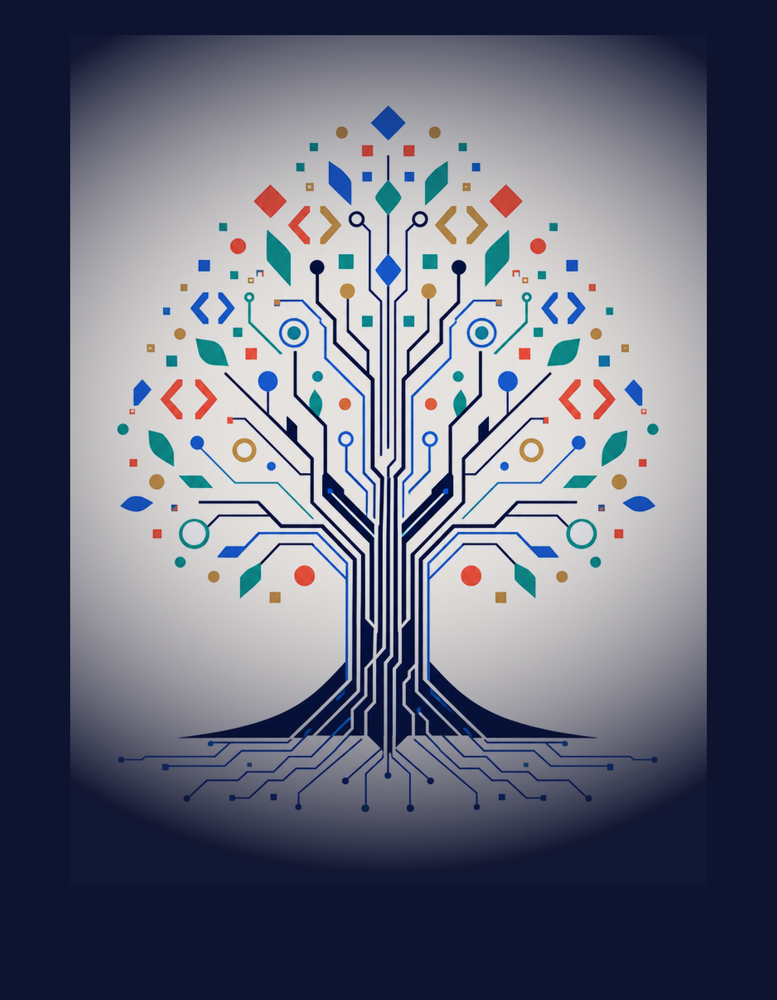
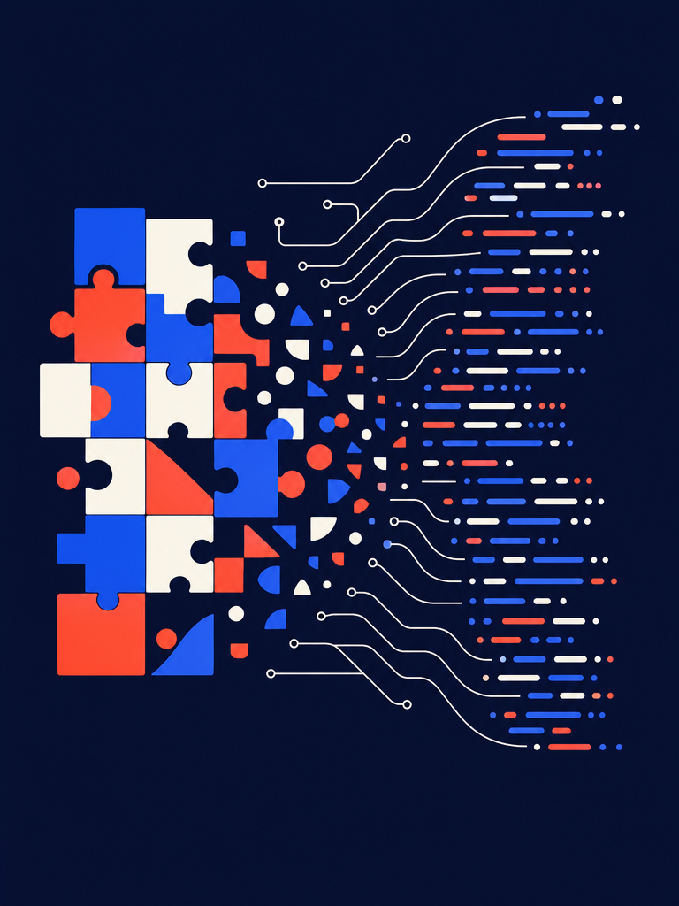
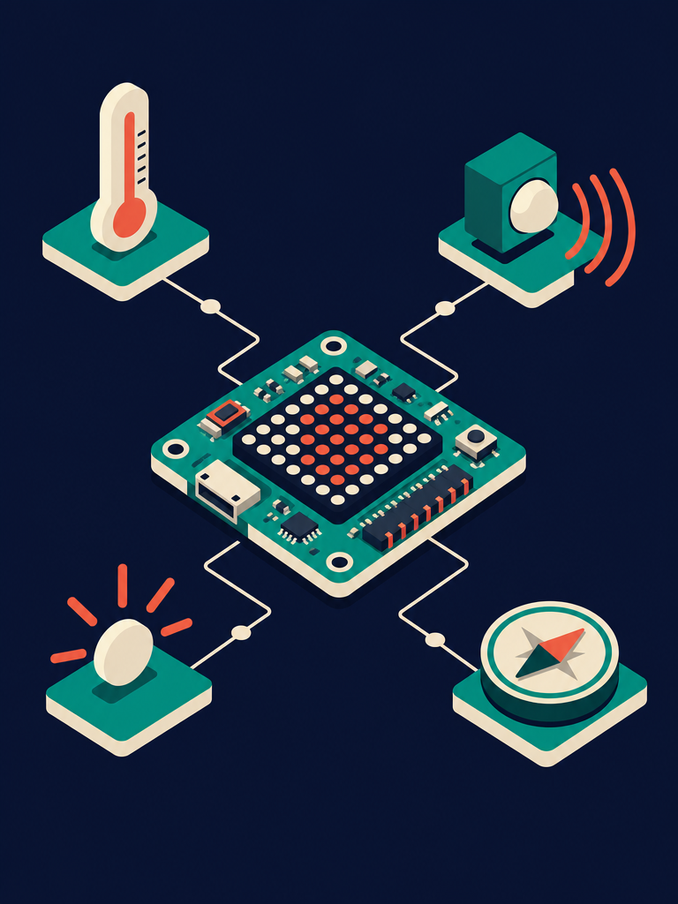

# Cambridge Computing Year 07
## Prime Books · Prime School 2026 · Student's Book

Source Markdown for the whole book. Edit here, then rebuild with:

```
cd Output/_build && python build.py
```


<!-- ================= 00_cover.md ================= -->

<!-- unit: u1 -->
<!--html
<section class="sheet cover-sheet">
  
  <div class="cov-grid">
    <header class="cov-top">
      <div class="cov-mark">
        <span class="cov-star">✦</span>
        <span class="cov-wordmark">PRIME BOOKS</span>
      </div>
      <div class="cov-stage">Cambridge Lower Secondary</div>
    </header>

    <div class="cov-mid">
      <div class="cov-eyebrow">Computing &amp; Robotics</div>
      <h1 class="cov-title">Computing<span class="cov-year">7</span></h1>
      <div class="cov-rule"></div>
      <p class="cov-sub">Programming, data and digital systems<br>for curious minds. Ages 11–14.</p>
    </div>

    <footer class="cov-bottom">
      <div class="cov-authors">Student&rsquo;s Book &middot; First edition</div>
      <div class="cov-imprint">
        <span class="cov-school">PRIME SCHOOL</span>
        <span class="cov-dot">•</span>
        <span class="cov-web">primeschool.pt</span>
      </div>
    </footer>
  </div>
</section>

<style>
.cover-sheet{background:#0E1330;color:#fff;position:relative}
/* Full-bleed flat bitmap. The vignette is BAKED INTO the PNG by PIL rather
   than drawn with a CSS gradient: Chromium exports CSS gradients as nested
   tiling patterns that pdf.js 3.11 mis-decodes, which rendered this navy
   cover bright pink inside the flipbook. A flat image always renders true. */
.cov-art{position:absolute;inset:0;width:210mm;height:270mm;object-fit:cover}
.cov-grid{position:absolute;inset:0;padding:20mm 20mm 22mm;
  display:flex;flex-direction:column;justify-content:space-between}
.cov-top{display:flex;align-items:flex-start;justify-content:space-between}
.cov-mark{display:flex;align-items:center;gap:2.6mm}
.cov-star{color:#C9A35C;font-size:13pt;line-height:1}
.cov-wordmark{font-family:'Space Grotesk',sans-serif;font-weight:600;
  font-size:10pt;letter-spacing:.30em;color:#fff}
.cov-stage{font-family:'Space Grotesk',sans-serif;font-weight:500;font-size:8.2pt;
  letter-spacing:.20em;text-transform:uppercase;color:rgba(255,255,255,.72);
  text-align:right;padding-top:1mm}
.cov-mid{margin-top:auto;margin-bottom:auto;padding-bottom:6mm}
.cov-eyebrow{font-family:'Space Grotesk',sans-serif;font-weight:600;font-size:9pt;
  letter-spacing:.26em;text-transform:uppercase;color:#FFD9A8;margin-bottom:5mm;
  text-shadow:0 1px 6px rgba(14,19,48,.85)}
.cov-title{font-family:'Fraunces',serif;
  font-variation-settings:'opsz' 144,'SOFT' 22,'WONK' 1;
  font-weight:600;font-size:64pt;line-height:60pt;letter-spacing:-.035em;
  margin:0;color:#fff;display:flex;align-items:flex-start;gap:5mm}
.cov-year{font-family:'Fraunces',serif;
  font-variation-settings:'opsz' 144,'SOFT' 40,'WONK' 1;
  font-weight:700;font-size:64pt;line-height:60pt;color:#FF5A47}
.cov-rule{width:38mm;height:1.5mm;background:#C9A35C;border-radius:1mm;margin:7mm 0 6mm}
.cov-sub{font-family:'Source Sans 3',sans-serif;font-weight:300;
  font-size:13pt;line-height:18pt;color:rgba(255,255,255,.90);margin:0;max-width:120mm}
.cov-bottom{display:flex;align-items:flex-end;justify-content:space-between;
  border-top:.5pt solid rgba(255,255,255,.28);padding-top:5mm}
.cov-authors{font-family:'Space Grotesk',sans-serif;font-weight:400;font-size:8.6pt;
  letter-spacing:.10em;color:rgba(255,255,255,.74)}
.cov-imprint{display:flex;align-items:center;gap:2.6mm}
.cov-school{font-family:'Space Grotesk',sans-serif;font-weight:600;font-size:9.4pt;
  letter-spacing:.22em;color:#fff}
.cov-dot{color:#C9A35C;font-size:8pt}
.cov-web{font-family:'Space Grotesk',sans-serif;font-weight:400;font-size:8.4pt;
  letter-spacing:.08em;color:rgba(255,255,255,.68)}
</style>
-->


<!-- ================= 01_imprint.md ================= -->

<!-- unit: u1 -->
<!--html
<section class="sheet imp-sheet"><div class="pad imp-pad">

  <div class="imp-mark">
    <span class="imp-star">✦</span>
    <span class="imp-word">PRIME BOOKS</span>
  </div>

  <h1 class="imp-title">Computing 7</h1>
  <p class="imp-strap">Student&rsquo;s Book &middot; Cambridge Lower Secondary &middot; Ages 11–14</p>

  <div class="imp-rule"></div>

  <div class="imp-cols">
    <div>
      <p class="imp-h">Published by</p>
      <p>Prime Books, the publishing imprint of Prime School.<br>
      Cascais, Portugal.<br>
      primeschool.pt</p>

      <p class="imp-h">Edition</p>
      <p>First edition, published 2026.<br>
      Impression 1.</p>

      <p class="imp-h">Copyright</p>
      <p>&copy; Prime School 2026. All rights reserved.</p>
      <p>No part of this publication may be reproduced, stored in a retrieval system or
      transmitted in any form or by any means, electronic, mechanical, photocopying,
      recording or otherwise, without the prior written permission of the publisher.
      Pages marked as photocopiable may be duplicated by the purchasing institution for
      classroom use only.</p>

      <p class="imp-h">Editorial team</p>
      <p>Written and edited by the Prime School Computing &amp; Robotics faculty.
      Design, typesetting and illustration by the Prime Books studio.</p>
    </div>

    <div>
      <p class="imp-h">Independent publication</p>
      <p>This is an independent publication produced by Prime School for use within its own
      programmes of study. It is not affiliated with, licensed by, endorsed by or otherwise
      approved by Cambridge University Press &amp; Assessment or by Cambridge Assessment
      International Education.</p>
      <p>References to the Cambridge Lower Secondary Computing curriculum framework represent
      the interpretation of the authors and may not fully reflect the approach of Cambridge
      Assessment International Education. Schools should always consult the current published
      framework and use a range of teaching resources based on their own professional judgement.</p>

      <p class="imp-h">Trademarks</p>
      <p>Cambridge Lower Secondary is a trademark of Cambridge University Press &amp; Assessment.
      Python is a trademark of the Python Software Foundation. micro:bit and the micro:bit logo
      are trademarks of the Micro:bit Educational Foundation. Microsoft, Excel and Access are
      trademarks of Microsoft Corporation. Scratch is a trademark of the Scratch Team at the MIT
      Media Lab. All trademarks are the property of their respective owners and are used here for
      identification and educational purposes only.</p>

      <p class="imp-h">Third-party websites</p>
      <p>Web addresses were correct at the time of going to press. Prime School accepts no
      responsibility for the content of external websites, nor are such sites endorsed by
      Prime School.</p>

      <p class="imp-h">Safety and safeguarding</p>
      <p>Practical tasks in this book have been checked for foreseeable hazards. Schools remain
      responsible for their own risk assessments and for supervising pupils online.</p>

      <p class="imp-h">Language</p>
      <p>This book is written in British English.</p>
    </div>
  </div>

  <div class="imp-foot">
    <div class="imp-isbn">
      <span class="imp-h2">ISBN</span>
      <span class="imp-mono">978-989-0000-07-1</span>
    </div>
    <div class="imp-isbn">
      <span class="imp-h2">Paper</span>
      <span>FSC-certified stock from responsibly managed forests</span>
    </div>
    <div class="imp-isbn">
      <span class="imp-h2">Printed in</span>
      <span>Portugal</span>
    </div>
  </div>

</div></section>

<style>
.imp-sheet{background:var(--paper);color:var(--ink)}
.imp-pad{display:flex;flex-direction:column;height:100%}
.imp-mark{display:flex;align-items:center;gap:2.4mm;margin-bottom:12mm}
.imp-star{color:var(--gold);font-size:11pt;line-height:1}
.imp-word{font-family:'Space Grotesk',sans-serif;font-weight:600;font-size:8.6pt;
  letter-spacing:.28em;color:var(--ink)}
.imp-title{font-family:'Fraunces',serif;
  font-variation-settings:'opsz' 120,'SOFT' 26,'WONK' 1;
  font-weight:600;font-size:34pt;line-height:36pt;letter-spacing:-.02em;margin:0}
.imp-strap{font-family:'Space Grotesk',sans-serif;font-weight:400;font-size:9pt;
  letter-spacing:.10em;color:var(--ink-soft);margin:2.5mm 0 0}
.imp-rule{width:100%;height:.5pt;background:var(--rule);margin:7mm 0 7mm}
.imp-cols{display:grid;grid-template-columns:1fr 1fr;gap:10mm;flex:1}
.imp-cols p{font-size:8.3pt;line-height:11.4pt;color:var(--ink-soft);margin:0 0 3.6mm}
.imp-h{font-family:'Space Grotesk',sans-serif !important;font-weight:600 !important;
  font-size:7.6pt !important;letter-spacing:.16em;text-transform:uppercase;
  color:var(--sig) !important;margin:0 0 1.4mm !important}
.imp-foot{border-top:.5pt solid var(--rule);padding-top:4.5mm;margin-top:4mm;
  display:flex;gap:12mm}
.imp-isbn{display:flex;flex-direction:column;gap:1mm}
.imp-h2{font-family:'Space Grotesk',sans-serif;font-weight:600;font-size:7.2pt;
  letter-spacing:.16em;text-transform:uppercase;color:var(--ink-mute)}
.imp-isbn span:last-child{font-size:8.2pt;color:var(--ink-soft);max-width:52mm}
.imp-mono{font-family:'JetBrains Mono',monospace;font-size:8.6pt !important;
  color:var(--ink) !important;letter-spacing:.02em}
</style>
-->


<!-- ================= 02_contents.md ================= -->

<!-- unit: u1 -->
<!--html
<section class="sheet"><div class="pad" style="display:flex;flex-direction:column;height:100%">

  <div class="imp-mark" style="display:flex;align-items:center;gap:2.4mm;margin-bottom:9mm">
    <span style="color:var(--gold);font-size:11pt;line-height:1">✦</span>
    <span style="font-family:'Space Grotesk',sans-serif;font-weight:600;font-size:8.6pt;letter-spacing:.28em">PRIME BOOKS</span>
  </div>

  <h1 style="font-family:'Fraunces',serif;font-variation-settings:'opsz' 120,'SOFT' 26,'WONK' 1;font-weight:600;font-size:30pt;line-height:32pt;letter-spacing:-.02em;margin:0 0 2mm">Contents</h1>
  <div style="width:100%;height:.5pt;background:var(--rule);margin:5mm 0 7mm"></div>

  <div class="toc">
    <div class="toc-row toc-fm"><span class="toc-t">Introduction</span><span class="toc-d"></span><span class="toc-p">4</span></div>
    <div class="toc-row toc-fm"><span class="toc-t">How to use this book</span><span class="toc-d"></span><span class="toc-p">5</span></div>
    <div class="toc-row toc-fm"><span class="toc-t">Getting set up</span><span class="toc-d"></span><span class="toc-p">6</span></div>

    <div class="toc-unit u1">
      <div class="toc-head"><span class="toc-chip">7.1</span>
        <span class="toc-title">Block it out: Moving from blocks to text</span>
        <span class="toc-d"></span><span class="toc-p">8</span></div>
      <div class="toc-subs">From coloured blocks to typed lines · Meeting IDLE · Variables · Input and output ·
        Data types · Casting · Arithmetic operators and BIDMAS · Algorithms and flowcharts ·
        Selection · Errors, testing and debugging</div>
    </div>

    <div class="toc-unit u2">
      <div class="toc-head"><span class="toc-chip">7.2</span>
        <span class="toc-title">Decomposing problems: Creating a smart solution</span>
        <span class="toc-d"></span><span class="toc-p">28</span></div>
      <div class="toc-subs">All about software · Python with the micro:bit · The micro:bit environment ·
        Correcting errors with a flowchart · Using sensors · Flowcharts for planning ·
        Algorithmic solutions and data types · Planning a smart solution · Effective testing ·
        Evaluating a program</div>
    </div>

    <div class="toc-unit u3">
      <div class="toc-head"><span class="toc-chip">7.3</span>
        <span class="toc-title">Connections are made: Accessing the internet</span>
        <span class="toc-d"></span><span class="toc-p">56</span></div>
      <div class="toc-subs">Getting online · Transmission methods · Transmission characteristics ·
        IP addresses · URLs · The Domain Name System · Padlocks and HTTPS · Insecure websites ·
        Keeping it all secure · Intelligent search engines</div>
    </div>

    <div class="toc-unit u4">
      <div class="toc-head"><span class="toc-chip">7.4</span>
        <span class="toc-title">The power of data: Using data modelling</span>
        <span class="toc-d"></span><span class="toc-p">84</span></div>
      <div class="toc-subs">Models, simulations and real scenarios · Spreadsheets and formulae ·
        Databases, records and keys · Collecting user data · Highlighting what matters ·
        Choosing the right modelling software</div>
    </div>

    <div class="toc-unit u5">
      <div class="toc-head"><span class="toc-chip">7.5</span>
        <span class="toc-title">Living with AI: Digital data</span>
        <span class="toc-d"></span><span class="toc-p">112</span></div>
      <div class="toc-subs">Applications and systems software · AI around us · Designing your own AI system ·
        Representing images · Vector graphics · Representing sound and text ·
        Introduction to logic gates</div>
    </div>

    <div class="toc-unit u6">
      <div class="toc-head"><span class="toc-chip">7.6</span>
        <span class="toc-title">Sequencing and pattern recognition: Getting the message across</span>
        <span class="toc-d"></span><span class="toc-p">140</span></div>
      <div class="toc-subs">Pattern recognition · Patterns between languages · Project plans and test plans ·
        Identifying errors and debugging · Sequences and lights · Light brightness</div>
    </div>

    <div class="toc-row toc-fm" style="margin-top:5mm"><span class="toc-t">Glossary</span><span class="toc-d"></span><span class="toc-p">168</span></div>
  </div>

</div></section>

<style>
.toc{display:flex;flex-direction:column;gap:0}
.toc-row{display:flex;align-items:baseline;gap:2mm;padding:2.4mm 0;
  border-bottom:.4pt solid var(--rule)}
.toc-t{font-family:'Space Grotesk',sans-serif;font-weight:500;font-size:10.4pt;color:var(--ink)}
.toc-d{flex:1;border-bottom:.4pt dotted var(--rule);transform:translateY(-1mm)}
.toc-p{font-family:'Space Grotesk',sans-serif;font-weight:600;font-size:10pt;color:var(--ink-mute)}
.toc-unit{margin-top:5.2mm}
.toc-head{display:flex;align-items:baseline;gap:3mm}
.toc-chip{font-family:'Space Grotesk',sans-serif;font-weight:700;font-size:9.4pt;
  color:#fff;background:var(--sig);border-radius:1.4mm;padding:1.1mm 2.4mm;
  letter-spacing:.02em}
.toc-title{font-family:'Fraunces',serif;font-variation-settings:'opsz' 60,'SOFT' 26,'WONK' 1;
  font-weight:600;font-size:13.2pt;line-height:16pt;color:var(--ink);max-width:120mm}
.toc-subs{font-size:8.4pt;line-height:11.6pt;color:var(--ink-mute);
  margin:1.8mm 0 0 13mm;max-width:150mm}
</style>
-->


<!-- ================= 03_introduction.md ================= -->

<!-- unit: u1 -->
<!--html
<section class="sheet"><div class="pad" style="display:flex;flex-direction:column;height:100%">

  <div style="display:flex;align-items:center;gap:2.4mm;margin-bottom:9mm">
    <span style="color:var(--gold);font-size:11pt;line-height:1">✦</span>
    <span style="font-family:'Space Grotesk',sans-serif;font-weight:600;font-size:8.6pt;letter-spacing:.28em">PRIME BOOKS</span>
  </div>

  <h1 style="font-family:'Fraunces',serif;font-variation-settings:'opsz' 120,'SOFT' 26,'WONK' 1;font-weight:600;font-size:30pt;line-height:32pt;letter-spacing:-.02em;margin:0 0 2mm">Introduction</h1>
  <div style="width:100%;height:.5pt;background:var(--rule);margin:5mm 0 7mm"></div>

  <div style="display:grid;grid-template-columns:1fr 1fr;gap:10mm;flex:1">
    <div>
      <p style="font-family:'Fraunces',serif;font-variation-settings:'opsz' 44,'SOFT' 34;font-style:italic;font-size:13pt;line-height:18pt;color:var(--ink);margin-bottom:5mm">Somebody had to write the software in your pocket. This year, that somebody starts to be you.</p>

      <p>Computing is the study of how machines store information, how they process it, and how people and machines work together. It is a young subject, and an unusually practical one. Almost everything you learn in this book can be tried out within minutes of reading about it.</p>

      <p>You already live surrounded by computing. The card reader on the 15E tram, the app that tells you when the next ferry leaves Cais do Sodré, the model that predicts whether the swell at Guincho will be worth the bus ride: each one is a program that somebody designed, wrote, tested and improved.</p>

      <p>This book will show you how that is done, and then ask you to do it yourself.</p>

      <h3 class="sub" style="margin-top:6mm">What you will learn</h3>
      <p>Across six units you will build a foundation in four connected areas.</p>
      <ul class="dot">
        <li><b>Programming.</b> Moving from Scratch blocks to typed Python, then on to physical computing with the micro:bit.</li>
        <li><b>Computational thinking.</b> Breaking hard problems into smaller ones, spotting patterns, and planning solutions as algorithms before you write any code.</li>
        <li><b>Networks and the internet.</b> How a request leaves your laptop and comes back as a web page, and how to stay safe while it happens.</li>
        <li><b>Data and intelligence.</b> How computers represent pictures, sound and text as numbers, how data is modelled, and how artificial intelligence learns from examples.</li>
      </ul>
    </div>

    <div>
      <h3 class="sub" style="margin-top:0">How the units are built</h3>
      <p>Every unit opens with a real situation and closes with a project that solves it. In between, short bursts of explanation alternate with things for you to try. You are not expected to read a unit straight through: keep a computer beside you and stop often.</p>

      <p>The habits matter as much as the knowledge. Plan before you type. Name things clearly. Test with values chosen to break your own work. When something fails, read the error message properly before changing anything. These habits are what separate a programmer from somebody who merely knows some Python.</p>

      <h3 class="sub">A word about mistakes</h3>
      <p>Your programs will not work the first time. This is not a sign that you are bad at computing: it is what computing actually looks like, for everybody, permanently. Professional engineers spend far more time reading errors and fixing faults than they spend writing new lines.</p>
      <p>Treat every bug as a small puzzle with a guaranteed solution, because that is exactly what it is.</p>

      <div class="feat f-know" style="margin-top:6mm">
        <div class="feat-lab"><span class="gl">✧</span>Did you know?</div>
        <p style="margin:0">The word <b>bug</b> for a computer fault was popularised in 1947, when engineers working on the Harvard Mark II found a moth caught in a relay. They taped the moth into the logbook and noted that they had been "debugging" the machine. The logbook, moth included, still survives.</p>
      </div>

      <div style="margin-top:auto;padding-top:7mm">
        <p class="small" style="margin:0">Prime School &middot; Computing &amp; Robotics faculty<br>Cascais, 2026</p>
      </div>
    </div>
  </div>

</div></section>
-->

<!--html
<section class="sheet"><div class="pad htu" style="display:flex;flex-direction:column;height:100%">

  <style>.htu .feat{padding:3.6mm 4.4mm !important}.htu .feat-lab{margin-bottom:1.3mm;font-size:7.8pt}</style>
  <h1 style="font-family:'Fraunces',serif;font-variation-settings:'opsz' 120,'SOFT' 26,'WONK' 1;font-weight:600;font-size:30pt;line-height:32pt;letter-spacing:-.02em;margin:0 0 2mm">How to use this book</h1>
  <p style="font-family:'Space Grotesk',sans-serif;font-size:9.4pt;color:var(--ink-soft);margin:0">Every unit uses the same set of features. Once you recognise them, you can navigate any page at a glance.</p>
  <div style="width:100%;height:.5pt;background:var(--rule);margin:4mm 0 4.5mm"></div>

  <div style="display:grid;grid-template-columns:1fr 1fr;gap:4.2mm;flex:1;align-content:start">

    <div class="feat f-scenario" style="margin:0">
      <div class="feat-lab"><span class="gl">◆</span>Get started &amp; Scenario</div>
      <p style="margin:0;font-size:8.4pt;line-height:11pt">Opens the unit with a real situation, usually somewhere in Portugal, and the questions it raises. Discuss these before reading on.</p>
    </div>

    <div class="feat f-warm" style="margin:0">
      <div class="feat-lab"><span class="gl">✦</span>Warm up</div>
      <p style="margin:0;font-size:8.4pt;line-height:11pt">A short puzzle to wake up the right part of your brain. No computer needed, and no marks at stake.</p>
    </div>

    <div class="feat f-remember" style="margin:0">
      <div class="feat-lab"><span class="gl">↺</span>Do you remember?</div>
      <p style="margin:0;font-size:8.4pt;line-height:11pt">Connects the new unit to what you already learned in earlier years. Read it even if you feel confident.</p>
    </div>

    <div class="feat" style="margin:0;border-top:.9pt solid var(--sig);padding-top:3mm">
      <div class="feat-lab" style="color:var(--sig)"><span class="gl">▤</span>Learn</div>
      <p style="margin:0;font-size:8.4pt;line-height:11pt">The explanation itself, with worked examples, tables and code. Terms printed in <b>bold</b> are defined in the keyword strips and in the glossary.</p>
    </div>

    <div class="feat f-practise" style="margin:0">
      <div class="feat-lab"><span class="gl">●</span>Practise</div>
      <p style="margin:0;font-size:8.4pt;line-height:11pt">Tasks to try immediately after reading. Attempt every one: skipping practice is the fastest way to fall behind in computing.</p>
    </div>

    <div class="feat f-know" style="margin:0">
      <div class="feat-lab"><span class="gl">✧</span>Did you know?</div>
      <p style="margin:0;font-size:8.4pt;line-height:11pt">A piece of history or an odd fact. Not examined, but the sort of thing worth knowing.</p>
    </div>

    <div class="feat f-further" style="margin:0">
      <div class="feat-lab"><span class="gl">→</span>Go further</div>
      <p style="margin:0;font-size:8.4pt;line-height:11pt">An extra idea beyond the core material, for when you have finished and want more.</p>
    </div>

    <div class="feat f-challenge" style="margin:0">
      <div class="feat-lab"><span class="gl">▲</span>Challenge yourself</div>
      <p style="margin:0;font-size:8.4pt;line-height:11pt">A harder problem that pulls several ideas together. Expect to need more than one attempt.</p>
    </div>

    <div class="feat f-keywords" style="margin:0">
      <div class="feat-lab"><span class="gl">▮</span>Keywords</div>
      <p style="margin:0;font-size:8.4pt;line-height:11pt">Definitions of the important terms, right where you meet them. All of them reappear in the glossary at the back.</p>
    </div>

    <div class="feat" style="margin:0;background:var(--sig);color:#fff;border-radius:2.5mm;padding:5mm 6mm">
      <div class="feat-lab" style="color:#fff;opacity:.86"><span class="gl">★</span>Final project</div>
      <p style="margin:0;font-size:8.4pt;line-height:11pt">A full page at the end of each unit: a brief, numbered milestones, a worked example to check against, and the marking grid your teacher will use.</p>
    </div>

    <div class="feat f-remember" style="margin:0">
      <div class="feat-lab"><span class="gl">◈</span>Evaluation</div>
      <p style="margin:0;font-size:8.4pt;line-height:11pt">A traffic-light grid. Colour green if you could teach it, amber if you need your notes, red if you want another look.</p>
    </div>

    <div class="feat" style="margin:0;background:var(--sig-wash);border-radius:2.5mm;padding:5mm 6mm">
      <div class="feat-lab" style="color:var(--sig-ink)"><span class="gl">✓</span>What can you do?</div>
      <p style="margin:0;font-size:8.4pt;line-height:11pt">A checklist of everything the unit covered. Tick each box only when you genuinely can do it.</p>
    </div>

  </div>

  <div style="margin-top:4.5mm;border-top:.5pt solid var(--rule);padding-top:3.5mm;display:flex;gap:7mm">
    <div style="flex:1">
      <p class="small" style="margin:0"><b style="font-family:'Space Grotesk',sans-serif;color:var(--sig-ink)">Code blocks</b><br>
      Dark panels show Python exactly as you should type it. Comments begin with <code>#</code>.</p>
    </div>
    <div style="flex:1">
      <p class="small" style="margin:0"><b style="font-family:'Space Grotesk',sans-serif;color:var(--sig-ink)">Output panels</b><br>
      Dashed panels show what appears on screen when that code runs. Compare yours against them.</p>
    </div>
    <div style="flex:1">
      <p class="small" style="margin:0"><b style="font-family:'Space Grotesk',sans-serif;color:var(--sig-ink)">Flowcharts</b><br>
      Rounded box = start or stop. Slanted box = input or output. Rectangle = process. Diamond = decision.</p>
    </div>
  </div>

</div></section>
-->


<!-- ================= 05_gettingsetup.md ================= -->

<!-- unit: u1 -->
<!--html
<section class="sheet"><div class="pad gsu" style="display:flex;flex-direction:column;height:100%">

  <style>.gsu p{font-size:9.2pt;line-height:12.2pt;margin-bottom:2.6mm}
  .gsu li{font-size:9.2pt;line-height:12.2pt;margin-bottom:1.7mm}
  .gsu h3.sub{font-size:10.6pt;margin:3.6mm 0 1.6mm}
  .gsu .out{font-size:7.8pt;line-height:10.6pt;padding:2.4mm 3mm}
  .gsu pre.code{font-size:8pt;padding:3mm 4mm}
  .gsu .feat{padding:3.6mm 4.6mm}
  .gsu .specs .sp{padding:2.8mm 3.4mm}
  .gsu .specs .sp span{font-size:8.2pt;line-height:10.6pt}
  .gsu .specs{margin-bottom:0}
  .gsu ol.ol-sig>li{margin-bottom:1.5mm}
  .gsu ul.tick li{margin-bottom:1.6mm}
  .gsu ol.alpha li{margin-bottom:1.2mm}
  .gsu .specs{margin-top:4mm !important;padding-top:0 !important}
  .gsu > div:nth-of-type(1){padding-bottom:2mm}</style>

  <h1 style="font-family:'Fraunces',serif;font-variation-settings:'opsz' 120,'SOFT' 26,'WONK' 1;font-weight:600;font-size:30pt;line-height:32pt;letter-spacing:-.02em;margin:0 0 2mm">Getting set up</h1>
  <p style="font-family:'Space Grotesk',sans-serif;font-size:9.4pt;color:var(--ink-soft);margin:0">Everything you need for this book is free. Work through this page once, at the start of the year, and you will not have to think about it again.</p>
  <div style="width:100%;height:.5pt;background:var(--rule);margin:3.5mm 0 4mm"></div>

  <div style="display:grid;grid-template-columns:1fr 1fr;gap:8mm;flex:1;align-content:start">

    <div>
      <h3 class="sub" style="margin-top:0">1. Installing Python</h3>
      <p>Go to <b>python.org</b>, choose <b>Downloads</b>, and take the latest version 3 release for your operating system.</p>
      <ol class="ol-sig">
        <li>Run the installer you downloaded.</li>
        <li><b>On Windows</b>, tick <b>Add python.exe to PATH</b> on the first screen before you click Install. This one tick prevents a great many problems later.</li>
        <li><b>On macOS</b>, run the installer package and accept the defaults.</li>
        <li>When it finishes, find <b>IDLE</b> in your applications and open it.</li>
      </ol>
      <p>You should see a window with the <code>&gt;&gt;&gt;</code> prompt. Type the line below and press Enter.</p>
      <pre class="code"><span class="f">print</span>(<span class="s">"Prime School, ready"</span>)</pre>
      <div class="out">Prime School, ready</div>
      <p>If that worked, Python is installed correctly.</p>

      <h3 class="sub">2. Where to keep your work</h3>
      <p>Make one folder for the whole year, with a subfolder for each unit. Save every program inside it.</p>
      <div class="out" style="font-size:8pt">Computing 7/
  Unit 7.1/
    fare.py
    trip_calculator.py
  Unit 7.2/
  Unit 7.3/</div>
      <p>File names should use lower case letters, digits and underscores only, and must end in <code>.py</code>. Never put a space or an accented character in a Python file name.</p>
    </div>

    <div>
      <h3 class="sub" style="margin-top:0">3. The micro:bit (Units 7.2 and 7.6)</h3>
      <p>The BBC micro:bit is a small circuit board with buttons, lights and sensors built in. You will program it in Python from your browser at <b>python.microbit.org</b>, so nothing needs installing.</p>
      <ol class="ol-sig">
        <li>Connect the micro:bit to your computer with a USB cable.</li>
        <li>Open the editor in your browser and write your program.</li>
        <li>Click <b>Send to micro:bit</b>, or click <b>Download</b> and drag the file onto the MICROBIT drive that appears.</li>
        <li>The yellow light on the back flashes while the program transfers, then the micro:bit restarts and runs it.</li>
      </ol>
      <p class="small">Always unplug the micro:bit by ejecting the drive first, exactly as you would with a memory stick.</p>

      <h3 class="sub">4. Staying safe and sensible</h3>
      <ul class="tick">
        <li>Handle boards by the edges. Static electricity from a jumper can damage the electronics.</li>
        <li>Never connect anything to the micro:bit pins other than the components your teacher provides.</li>
        <li>Save your work often. Press <b>Ctrl</b> and <b>S</b> together, every few minutes, until it becomes a reflex.</li>
        <li>Keep a backup of your year folder in your school cloud storage.</li>
        <li>Never share passwords, and never type a password into a page you reached from a link in a message.</li>
      </ul>

      <div class="feat f-further" style="margin-top:4mm">
        <div class="feat-lab"><span class="gl">→</span>If something will not work</div>
        <ol class="alpha" style="margin-top:0">
          <li>Read the error message from the bottom line upwards.</li>
          <li>Check capital letters, colons, brackets and quotation marks.</li>
          <li>Check the indentation of every block.</li>
          <li>Close IDLE completely and reopen it.</li>
          <li>Ask a partner to read your screen aloud. Saying code out loud finds faults that staring at it will not.</li>
        </ol>
      </div>
    </div>

  </div>

  <div class="specs" style="margin-top:auto;padding-top:4mm">
    <div class="sp"><b>Python</b><span>Version 3, from python.org, with IDLE included</span></div>
    <div class="sp"><b>micro:bit</b><span>python.microbit.org, no installation needed</span></div>
    <div class="sp"><b>Data work</b><span>A spreadsheet and a database tool, for Unit 7.4</span></div>
  </div>

</div></section>
-->


<!-- ================= 10_unit71.md ================= -->

<!-- unit: u1 -->
<!--html
<section class="sheet opener">
  
  <div class="veil"></div>
  <div class="inner">
    <div>
      <div class="ulab">Unit</div>
      <div class="unum">7.1</div>
      <h1>Block it out<span class="thin">Moving from blocks to text</span></h1>
      <div class="rule"></div>
    </div>
    <div class="lo">
      <div class="feat-lab"><span class="gl">✓</span>Learning outcomes</div>
      <p style="margin:0 0 3mm;font-size:9.4pt;color:var(--ink-soft)">In this unit you will learn to:</p>
      <ul class="tick">
        <li>name the main data types used in Python and choose the right one for a value</li>
        <li>write programs that take input from a user and display clear output</li>
        <li>store values in variables and use them inside calculations</li>
        <li>use the arithmetic operators, including whole-number division and remainder</li>
        <li>convert values between data types using casting</li>
        <li>draw algorithms as flowcharts using the standard symbols</li>
        <li>predict what a flowchart will do when it contains a decision</li>
        <li>write selection statements with the comparison operators</li>
        <li>build a test plan and use it to prove a program works</li>
        <li>recognise syntax, runtime and logic errors, then debug them</li>
      </ul>
    </div>
  </div>
</section>
-->

<!--html
<div class="flow">
-->

::: raw
<div class="feat f-scenario" style="border-left-color:var(--sig)">
<div class="feat-lab"><span class="gl">◆</span>Get started</div>
<p style="font-family:'Fraunces',serif;font-style:italic;font-size:11.4pt;line-height:15.4pt;margin-bottom:3mm">Have you ever wondered what a vending machine is really thinking?</p>
<p>Find the drinks machine in the school hall, or picture one you have used. Talk about these questions with the person next to you.</p>
<ul class="dot">
<li>What does the machine need you to give it before it will do anything?</li>
<li>Which buttons make it work something out on its own, such as your change?</li>
<li>How does it tell you what is happening?</li>
</ul>
<p>A vending machine is a computer program wearing a metal coat. It waits for input, stores what it is given, performs a calculation, then produces output. It only feels reliable because somebody tested it very thoroughly before it was bolted to the wall.</p>
<p>In this unit you will move from the coloured blocks of Scratch to <b>text-based programming</b> in Python. You will write programs that ask questions, remember answers, do sums with them and make decisions, and you will learn how to prove that your programs are right.</p>
</div>
:::

::: keywords
**text-based programming** writing a program by typing instructions as words and symbols
rather than dragging ready-made blocks

**Python** a widely used text-based programming language, popular in schools, science and
industry
:::

::: warmup Warm up
Gonçalo has written a shopping list for a school picnic at Praia do Guincho. Sort each item
into one of three groups: **a whole number**, **a number with a decimal part**, or **text**.

1. The number of baguettes to buy: 12
2. The price of one baguette: €1.35
3. The name of the bakery: Padaria do Mar
4. The number of pupils travelling: 28
5. The total weight of the cool box in kilograms: 4.7
6. The bus registration: 42-BC-19

Now answer this. Item 6 contains digits, so why can it never be stored as a number?
:::

::: remember
In Year 6 you built projects in Scratch. You already know more than you think.

- An orange **variable** block such as *set score to 0* keeps a value for later.
- A blue **input** block such as *ask and wait* collects something from the user.
- A purple **output** block such as *say Hello* shows a result on the screen.
- A yellow **control** block such as *if ... then* chooses between two paths.

Python has all four of these ideas. The difference is that you type them instead of
dragging them.
:::

## [Unit 7.1 · Topic 1] From coloured blocks to typed lines

Scratch is a **block-based** language. Every instruction is a shape you drag into place, and
shapes that would not make sense simply refuse to click together. That is a friendly way to
start, because the language stops you making many mistakes.

Python is a **text-based** language. You type each instruction as a line of text. Nothing
stops you typing something impossible, so you have to be precise. In return you get speed,
power and a language used by real engineers.

### The same idea in two languages

Imagine a program that greets a pupil by name. In Scratch you would drag an *ask* block, then
a *say* block. In Python it is two typed lines.

```python
name = input("What is your name? ")
print("Bom dia, " + name + "!")
```

```out
What is your name? Matilde
Bom dia, Matilde!
```

Both versions do exactly the same job. The Python version is shorter to write once you can
type it, and it fits on a single line of a printed page.

| Idea | In Scratch | In Python |
|---|---|---|
| Show something | *say Hello* | `print("Hello")` |
| Ask a question | *ask What is your name? and wait* | `input("What is your name? ")` |
| Store a value | *set score to 0* | `score = 0` |
| Add to a value | *change score by 1* | `score = score + 1` |
| Make a choice | *if ... then ... else* | `if ...: ... else: ...` |

### Why the switch is worth it

- Text is compact. A program that fills a whole screen in Scratch may be twelve typed lines.
- Text can be searched, copied and shared as a simple file.
- Almost every professional language is text-based, so the habits transfer.
- Python reads a little like English, which makes it a kind first text language.

::: know
Python was released in 1991 by Guido van Rossum, a Dutch programmer. He named it after the
television comedy *Monty Python's Flying Circus*, not after the snake. The snake logo arrived
later, because a snake is much easier to draw than a comedy sketch.
:::

::: practise Practise 1
Work with a partner.

1. Write down three things Scratch does that you would miss in Python.
2. Write down three things you think typed code will let you do more easily.
3. Look at the table above. Which single row do you think will be hardest to remember, and why?
:::

## [Unit 7.1 · Topic 2] Meeting IDLE

Python usually arrives with a small program called **IDLE**, which stands for Integrated
Development and Learning Environment. IDLE gives you two ways to work, and knowing which one
you are in saves a great deal of confusion.

### The shell: thinking out loud

The **shell** runs one line at a time and answers immediately. You will recognise it by the
three arrows, `>>>`, called the prompt. The shell is perfect for trying an idea.

```out
>>> 7 * 6
42
>>> print("Olá, Cascais")
Olá, Cascais
>>> 15 + 27
42
```

The shell forgets nothing while it is open, but it saves nothing when it closes. It is a
workbench, not a filing cabinet.

### Script mode: writing something to keep

**Script mode** is a plain editor window. You type a whole program, save it as a file ending
in `.py`, then run the lot in one go. Every program you hand in will be written this way.

To create, save and run a program:

1. In IDLE choose **File**, then **New File**. An empty editor window opens.
2. Type your program.
3. Choose **File**, then **Save**. Give the file a sensible name such as `fare.py`.
4. Choose **Run**, then **Run Module**, or simply press **F5**.
5. The results appear in the shell window.

#### Getting the case right

Python cares about capital letters. `print` is a command; `Print` is not. This single detail
causes more first-week errors than anything else.

```out
>>> Print("Hello")
Traceback (most recent call last):
  File "<pyshell#0>", line 1, in <module>
    Print("Hello")
NameError: name 'Print' is not defined
```

#### Leaving notes with comments

Anything after a `#` is a **comment**. Python ignores it completely, so comments are for the
humans who read your work, including you in three weeks' time.

```python
# Ferry timetable helper
# Inês, Year 7, Prime School
crossings = 14        # sailings each weekday
print(crossings)
```

::: keywords
**IDLE** the editor and shell that comes with Python

**shell** a window that runs one instruction at a time and shows the result straight away

**script mode** writing a complete program in a file so it can be saved and run again

**comment** a note in the code, starting with `#`, that Python ignores
:::

::: practise Practise 2
1. Open the IDLE shell and work out `48 * 27` without touching a calculator app.
2. In the shell, make Python print your favourite place in Portugal.
3. Open a new file, save it as `hello.py`, and make it print two lines: a greeting and today's date as text.
4. Add a comment at the top of `hello.py` giving your name and the date.
5. Deliberately type `print` with a capital `P`, run the file, and write down the exact error message you see.
:::

## [Unit 7.1 · Topic 3] Variables: giving values a name

A **variable** is a named box in memory. You put a value in it, and afterwards you can use the
name instead of the value. When the value needs to change, you change it in one place.

The `=` sign does not mean "equals" in the mathematical sense. It means "put the value on the
right into the name on the left".

```python
# Tram 28 fare calculator
passengers = 4
fare = 3.20
total = passengers * fare
print("Total fare:", total)
```

```out
Total fare: 12.8
```

Four passengers at €3.20 each comes to €12.80. Python displays `12.8` because a trailing zero
adds nothing to the value of a number. You will learn to format money properly later in the unit.

### Rules for naming

- Start with a letter or an underscore, never a digit.
- Use letters, digits and underscores only. No spaces and no accents.
- Choose a name that says what the value is: `fare` beats `f`, and `total_cost` beats `x`.
- Remember that `fare` and `Fare` are two different variables.

| Name | Allowed? | Why |
|---|---|---|
| `ticket_price` | Yes | clear, lower case, underscore |
| `2ndPrice` | No | begins with a digit |
| `total cost` | No | contains a space |
| `preço` | No | contains an accented character |
| `n` | Yes, but poor | legal yet tells the reader nothing |

### Changing what is in the box

A variable holds one value at a time. Assigning again replaces what was there.

```python
lisbon_temp = 18
print(lisbon_temp)
lisbon_temp = 24
print(lisbon_temp)
```

```out
18
24
```

::: keywords
**variable** a named place in memory that holds a value which can change while the program runs

**assignment** using `=` to put a value into a variable
:::

::: practise Practise 3
1. Create variables for a pupil's name, their year group and their house colour, then print all three on one line.
2. Beatriz cycles 4.5 km to school each way. Use variables to calculate and print the distance she cycles in a five-day week.
3. Explain in one sentence why `distance = distance + 2` is not nonsense, even though it would be in maths.
4. Which of these are legal variable names? `bus_number`, `3rd_place`, `Total`, `mean value`, `_count`
:::

## [Unit 7.1 · Topic 4] Input and output

A program that always does exactly the same thing is not much use. **Input** lets the user
supply the values; **output** shows the result.

### Talking to the user

`print()` sends text to the screen. You can pass it several items separated by commas, and
Python puts a single space between them.

```python
name = "Rodrigo"
house = "Atlântico"
print("Pupil:", name, "House:", house)
```

```out
Pupil: Rodrigo House: Atlântico
```

### Listening to the user

`input()` shows a message, waits for the user to type something and press Enter, then hands
back what was typed.

```python
city = input("Which city do you live in? ")
print("There is a lot to explore in " + city + ".")
```

```out
Which city do you live in? Porto
There is a lot to explore in Porto.
```

Notice the space at the end of `"Which city do you live in? "`. Without it the user's typing
would begin immediately after the question mark, which looks careless.

#### The trap that catches everybody

`input()` **always** gives you text, even when the user types digits. Adding two pieces of text
joins them end to end instead of adding them up.

```python
a = input("First number: ")
b = input("Second number: ")
print(a + b)
```

```out
First number: 20
Second number: 22
2022
```

Python did exactly what was asked: it joined the text `"20"` to the text `"22"`. Topic 6 shows
how to fix this properly.

::: keywords
**input** data given to a program by the user or by a sensor

**output** information the program sends out, usually to the screen

**concatenation** joining two pieces of text end to end with `+`
:::

::: practise Practise 4
1. Write a program that asks for a pupil's first name and their favourite subject, then prints one friendly sentence using both.
2. Write a program that asks for the name of a Lisbon tram route and prints `Route 28 runs to Campo Ourique.` with the route number the user typed.
3. Predict the output of the program below, then run it to check.
   ```python
   x = input("Type 5: ")
   y = input("Type 3: ")
   print(x + y)
   ```
4. Explain in your own words why question 3 does not print `8`.
:::

## [Unit 7.1 · Topic 5] Data types

Every value in Python has a **data type**. The type decides what the value means and what you
are allowed to do with it.

| Data type | Python name | Examples | Typical use |
|---|---|---|---|
| String | `str` | `"Sintra"`, `"42-BC-19"`, `"7"` | names, codes, anything typed |
| Integer | `int` | `28`, `0`, `-6` | counts of whole things |
| Real | `float` | `3.20`, `-0.5`, `19.75` | money, measurements, averages |
| Boolean | `bool` | `True`, `False` | answers to yes or no questions |

Strings are always written inside quotation marks. Single and double quotes both work, as long
as you use the same one at each end.

### Asking Python what it is holding

The `type()` command reports the data type of any value.

```python
print(type(28))
print(type(3.20))
print(type("Sintra"))
print(type(True))
```

```out
<class 'int'>
<class 'float'>
<class 'str'>
<class 'bool'>
```

### Choosing the right type

- A house number such as `14` is a count, so use an integer.
- A postcode such as `2750-642` contains a hyphen, so it must be a string.
- A temperature of `19.4` degrees has a decimal part, so use a real number.
- Whether a pupil is present is yes or no, so use a Boolean.

::: know
Computers store real numbers as approximations, which is why `0.1 + 0.2` prints
`0.30000000000000004` in Python. It is not a bug in Python: it is the price of squeezing an
infinite number line into a fixed amount of memory. For money, careful programmers work in
whole cents.
:::

::: keywords
**data type** the kind of value being stored, such as string, integer, real or Boolean

**string** a sequence of characters treated as text

**integer** a whole number, positive, negative or zero

**real** a number with a decimal part, called a `float` in Python

**Boolean** a value that is either `True` or `False`
:::

::: practise Practise 5
1. State the most suitable data type for each: a pupil's surname; the number of goals scored; the price of a bus ticket; whether homework is complete; a mobile telephone number.
2. Use `type()` in the shell to check three values of your own choosing.
3. Explain why a telephone number should be stored as a string even though it looks like a number.
:::

## [Unit 7.1 · Topic 6] Casting: changing type on purpose

**Casting** converts a value from one data type to another. It is the cure for the input trap
you met in Topic 4.

| Command | What it does | Example | Result |
|---|---|---|---|
| `int(x)` | turns `x` into a whole number | `int("20")` | `20` |
| `float(x)` | turns `x` into a real number | `float("3.5")` | `3.5` |
| `str(x)` | turns `x` into text | `str(42)` | `"42"` |

### Fixing the adding-up problem

Wrap `input()` in `int()` and Python converts the text before storing it.

```python
a = int(input("First number: "))
b = int(input("Second number: "))
print("Total:", a + b)
```

```out
First number: 20
Second number: 22
Total: 42
```

### Casting the other way

To join a number onto a string with `+`, the number must first become text.

```python
goals = 7
print("Leonor scored " + str(goals) + " goals.")
```

```out
Leonor scored 7 goals.
```

Using commas in `print()` avoids the need to cast at all, because `print` converts each item
for you.

```python
goals = 7
print("Leonor scored", goals, "goals.")
```

```out
Leonor scored 7 goals.
```

### When casting fails

`int()` can only convert text that really is a whole number.

```out
>>> int("seven")
Traceback (most recent call last):
  File "<pyshell#0>", line 1, in <module>
    int("seven")
ValueError: invalid literal for int() with base 10: 'seven'
```

::: keywords
**casting** converting a value from one data type to another, for example `int("20")`
:::

::: practise Practise 6
1. Write a program that asks for two whole numbers and prints their sum, their difference and their product.
2. Duarte buys `n` pastéis de nata at €1.20 each. Ask for `n`, then print the total cost.
3. Predict what `int("4.8")` does, then try it and explain the result.
4. Rewrite `print("Age: " + age)` so it works when `age` holds the integer `12`.
:::

## [Unit 7.1 · Topic 7] Arithmetic operators and BIDMAS

Python uses familiar symbols for arithmetic, plus three that may be new.

| Operator | Meaning | Example | Result |
|---|---|---|---|
| `+` | add | `9 + 4` | `13` |
| `-` | subtract | `9 - 4` | `5` |
| `*` | multiply | `9 * 4` | `36` |
| `/` | divide | `9 / 4` | `2.25` |
| `//` | integer division, whole part only | `9 // 4` | `2` |
| `%` | modulus, the remainder | `9 % 4` | `1` |
| `**` | raise to a power | `9 ** 2` | `81` |

`/` always produces a real number, even when the division is exact. `10 / 2` gives `5.0`, not
`5`.

### Why `//` and `%` are so useful

Together they answer the question "how many whole groups, and how many left over?".

```python
# Seating pupils in minibuses
pupils = 47
seats = 8
buses = pupils // seats
spare = pupils % seats
print("Full minibuses:", buses)
print("Pupils in the last bus:", spare)
```

```out
Full minibuses: 5
Pupils in the last bus: 7
```

Check the arithmetic: 5 full minibuses carry 40 pupils, leaving 7. A sixth vehicle is still
needed for those 7, which is exactly the kind of detail a good programmer notices.

### BIDMAS

Python follows the usual order of operations: **B**rackets, **I**ndices, **D**ivision and
**M**ultiplication, then **A**ddition and **S**ubtraction.

| Calculation | Result | Reason |
|---|---|---|
| `4 + 3 * 5` | `19` | multiplication happens before addition |
| `(4 + 3) * 5` | `35` | brackets force the addition first |
| `20 - 6 / 3` | `18.0` | division first, then subtraction |
| `2 ** 3 + 1` | `9` | the index is evaluated first |
| `(8 + 4) / (5 - 2)` | `4.0` | both brackets first, then divide |

Use brackets whenever they make your intention clearer, even where BIDMAS would already give
the right answer. Code is read far more often than it is written.

::: know
The `%` operator is how a program knows whether a number is even. If `n % 2` gives `0`, the
number divides exactly by two. Programmers use the same trick to work out whether a year is a
leap year, and to make a clock roll over from 23:59 to 00:00.
:::

::: practise Practise 7
1. Work out each of these on paper, then check in the shell: `7 + 2 * 6`, `(7 + 2) * 6`, `25 // 4`, `25 % 4`, `3 ** 4`.
2. A box holds 12 pastéis. Write a program that asks how many pastéis were baked and prints how many full boxes can be filled and how many are left over.
3. Write a program that asks for a number of minutes and prints the equivalent in hours and minutes. Test it with 195 minutes: it should print 3 hours and 15 minutes.
4. Explain why `10 / 2` prints `5.0` while `10 // 2` prints `5`.
:::

## [Unit 7.1 · Topic 8] Algorithms and flowcharts

An **algorithm** is a precise sequence of steps that solves a problem. Before you type a single
line of Python, it pays to plan the algorithm. A **flowchart** is a picture of that plan, and it
uses a small set of standard symbols so that any programmer can read it.

| Symbol | Name | Used for |
|---|---|---|
| Rounded box | Terminator | the START and the STOP of the algorithm |
| Parallelogram | Input or output | reading a value in, or displaying one |
| Rectangle | Process | a calculation or an assignment |
| Diamond | Decision | a question with two possible answers |
| Arrow | Flow line | the order in which steps happen |

### A flowchart for the minibus problem

::: raw
<div class="fchart">
  <div class="nd term">START</div>
  <div class="arw"></div>
  <div class="nd io"><span>INPUT number of pupils</span></div>
  <div class="arw"></div>
  <div class="nd proc">buses = pupils // 8</div>
  <div class="arw"></div>
  <div class="nd proc">spare = pupils % 8</div>
  <div class="arw"></div>
  <div class="nd io"><span>OUTPUT buses and spare</span></div>
  <div class="arw"></div>
  <div class="nd term">STOP</div>
  <div class="caption">Figure 1.1 A sequence algorithm: every step runs once, in order.</div>
</div>
:::

Each step follows the one before it. This arrangement is called a **sequence**, and it is the
simplest of the three program structures.

::: keywords
**algorithm** a precise, ordered set of steps that solves a problem

**flowchart** a diagram that shows an algorithm using standard symbols

**sequence** program steps carried out one after another in a fixed order
:::

::: practise Practise 8
1. Draw a flowchart for an algorithm that asks for the length and width of a classroom and outputs its area.
2. Draw a flowchart for making a cup of tea. Use at least six symbols and include one decision.
3. Explain why a diamond must always have two arrows leaving it.
:::

## [Unit 7.1 · Topic 9] Selection: making decisions

**Selection** means choosing between two or more paths. In a flowchart it is the diamond; in
Python it is the `if` statement.

### The comparison operators

| Operator | Meaning | True example |
|---|---|---|
| `==` | is equal to | `7 == 7` |
| `!=` | is not equal to | `7 != 4` |
| `<` | is less than | `4 < 7` |
| `>` | is greater than | `7 > 4` |
| `<=` | is less than or equal to | `7 <= 7` |
| `>=` | is greater than or equal to | `7 >= 4` |

Take great care with `=` and `==`. A single `=` stores a value; a double `==` asks a question.

### Writing an if statement

```python
mark = int(input("Enter the test mark: "))
if mark >= 50:
    print("Pass")
else:
    print("Needs another attempt")
```

```out
Enter the test mark: 63
Pass
```

Two details matter enormously.

- The line ending in `:` opens a block.
- Everything belonging to that block is **indented** by four spaces. Indentation is not
  decoration in Python: it is how the language knows which lines belong together.

### Choosing between more than two paths

`elif`, short for "else if", adds further questions. Python checks each in turn and runs the
first one that is true.

```python
temp = float(input("Water temperature in C: "))
if temp >= 25:
    print("Warm enough for a long swim")
elif temp >= 18:
    print("Bracing but pleasant")
else:
    print("The Atlantic wins today")
```

```out
Water temperature in C: 19.5
Bracing but pleasant
```

### The same decision as a flowchart

::: raw
<div class="fchart">
  <div class="nd term">START</div>
  <div class="arw"></div>
  <div class="nd io"><span>INPUT mark</span></div>
  <div class="arw"></div>
  <div class="nd dec">Is mark 50 or more?</div>
  <div class="branch" style="margin-top:0">
    <div class="limb">
      <div class="arw"><span class="lbl">Yes</span></div>
      <div class="nd io"><span>OUTPUT "Pass"</span></div>
    </div>
    <div class="limb">
      <div class="arw"><span class="lbl">No</span></div>
      <div class="nd io"><span>OUTPUT "Needs another attempt"</span></div>
    </div>
  </div>
  <div class="arw"></div>
  <div class="nd term">STOP</div>
  <div class="caption">Figure 1.2 A selection algorithm: the diamond sends the flow down one of two branches.</div>
</div>
:::

::: keywords
**selection** choosing between different paths through a program depending on a condition

**condition** an expression that is either True or False

**indentation** the spaces at the start of a line that show which block a statement belongs to
:::

::: practise Practise 9
1. Write a program that asks for a pupil's age and prints `Lower Secondary` if the age is between 11 and 14 inclusive, and `Check the year group` otherwise.
2. Write a program that asks for a number and reports whether it is even or odd. Use the `%` operator.
3. Extend the swimming program with a fourth message for temperatures below 12 degrees.
4. Find the mistake: `if mark = 50:` Explain what is wrong and correct it.
:::

## [Unit 7.1 · Topic 10] Errors, testing and debugging

Every programmer writes bugs. What separates a good programmer from a frustrated one is a
calm, systematic way of finding them.

### Three families of error

| Type | What happens | Example | How you spot it |
|---|---|---|---|
| Syntax error | Python cannot understand the line, so nothing runs | `print("Hello"` | an error message appears before the program starts |
| Runtime error | the program starts, then stops part way | `int("seven")` | a `Traceback` appears mid-run |
| Logic error | the program runs happily and gives the wrong answer | using `+` where you meant `*` | only testing reveals it |

Logic errors are the most dangerous, because the computer never complains.

### Reading a traceback

```out
Traceback (most recent call last):
  File "fare.py", line 3, in <module>
    total = passengers * fare
NameError: name 'passenger' is not defined
```

Read a traceback from the bottom upwards. The last line names the problem, and the line above
tells you where to look. Here the variable was created as `passengers` but used as `passenger`.

### Building a test plan

A **test plan** decides, before you run anything, what you will type in and what should come
out. Good plans include three kinds of data.

- **Normal data**: sensible values the program will usually meet.
- **Boundary data**: values right at the edge of what is allowed.
- **Erroneous data**: values that should be rejected.

Here is a test plan for the pass mark program from Topic 9, where the pass mark is 50.

| Test | Type of data | Input | Expected output | Reason |
|---|---|---|---|---|
| 1 | Normal | `63` | `Pass` | comfortably above the pass mark |
| 2 | Normal | `31` | `Needs another attempt` | comfortably below |
| 3 | Boundary | `50` | `Pass` | 50 must count as a pass |
| 4 | Boundary | `49` | `Needs another attempt` | one below the pass mark |
| 5 | Erroneous | `fifty` | an error, or a polite message | not a whole number |

Test 3 is the one that catches the classic mistake of writing `>` when you meant `>=`.

### A debugging routine that works

1. Read the error message properly, from the bottom up.
2. Go to the line it names, and look at the line above it too.
3. Check spelling, capital letters, brackets, colons and quotation marks.
4. Check the indentation of every block.
5. Add temporary `print()` lines to see what your variables actually contain.
6. Change one thing at a time, then test again.

::: keywords
**syntax error** a mistake in the rules of the language that stops the program running

**runtime error** an error that appears while the program is running

**logic error** a fault that lets the program run but produces the wrong result

**test plan** a prepared table of inputs and expected outputs used to check a program

**debugging** finding and correcting errors in a program
:::

::: practise Practise 10
1. Classify each fault as syntax, runtime or logic: a missing closing bracket; dividing by a variable that holds zero; calculating an average by dividing by 3 when there are 4 values.
2. Write a test plan with five rows for a program that decides whether a parcel weighing up to 20 kg can be posted.
3. The program below should print the area of a rectangle but prints something else. Find and fix the bug.
   ```python
   length = int(input("Length: "))
   width = int(input("Width: "))
   area = length + width
   print("Area:", area)
   ```
:::

::: further Go further: sub-routines
As programs grow, repeating the same lines becomes tiresome and error-prone. A **sub-routine**
is a named piece of code you write once and call whenever you need it. In Python you create one
with `def`.

```python
def show_fare(people, price):
    total = people * price
    print("Fare for", people, "people:", total)

show_fare(2, 3.20)
show_fare(5, 3.20)
```

```out
Fare for 2 people: 6.4
Fare for 5 people: 16.0
```

The sub-routine is defined once and used twice. If the fare rules change, you edit one place.
In a flowchart a sub-routine is drawn as a rectangle with a double line at each side.
:::

::: challenge Challenge yourself
Build a **ferry ticket machine** for the crossing from Cais do Sodré to Cacilhas.

The rules are these. A single adult ticket costs €1.55. Passengers aged 12 or under, and those
aged 65 or over, pay half price. A group of 10 or more passengers receives a further 20 per
cent off the whole order, applied after any age reductions.

Your program should ask for the number of passengers, ask for the age of each one, then print
the total to the nearest cent.

Prove it works with this test plan.

| Test | Passengers | Ages | Expected total | Working |
|---|---|---|---|---|
| 1 | 2 | 30, 41 | €3.10 | 2 × 1.55 |
| 2 | 3 | 30, 10, 70 | €3.10 | 1.55 + 0.775 + 0.775 |
| 3 | 10 | ten adults | €12.40 | 15.50 less 20 per cent |
:::

<!--html
</div>
-->

<!--html
<section class="sheet"><div class="pad" style="display:flex;flex-direction:column;height:100%">
  <div class="brief">
    <div class="feat-lab"><span class="gl">★</span>Final project</div>
    <h3>The Prime School trip calculator</h3>
    <p>The Geography department is taking Year 7 to the Serra da Arrábida. They need a Python
    program that works out what the trip will cost each pupil, and they need to be certain the
    figures are right. That program is your job.</p>
  </div>

  <div style="display:grid;grid-template-columns:1.15fr .85fr;gap:9mm;flex:1">
    <div>
      <div class="feat-lab" style="color:var(--sig-ink)"><span class="gl">▮</span>The brief</div>
      <p style="margin-bottom:4mm">Your program must:</p>
      <ul class="dot" style="margin-bottom:5mm">
        <li>ask how many pupils are going</li>
        <li>ask the coach hire cost for the day</li>
        <li>ask the entry fee for one pupil</li>
        <li>divide the coach cost evenly between the pupils</li>
        <li>add the entry fee to give the cost per pupil</li>
        <li>print the cost per pupil and the total cost of the trip</li>
        <li>print a warning if the cost per pupil goes above €15.00</li>
      </ul>

      <div class="feat-lab" style="color:var(--sig-ink)"><span class="gl">▮</span>Milestones</div>
      <ol class="mile">
        <li><b>Plan the algorithm</b>Draw a flowchart using the standard symbols. Include the decision that produces the warning.</li>
        <li><b>Write a test plan</b>Prepare at least six rows covering normal, boundary and erroneous data. Work out every expected answer by hand first.</li>
        <li><b>Build the program</b>Use sensible variable names, cast every input, and comment the tricky lines.</li>
        <li><b>Test and debug</b>Run every row of your plan. Record what actually happened next to what you expected.</li>
        <li><b>Evaluate</b>Write a short paragraph: what works, what you would improve, and what you found hardest.</li>
      </ol>
    </div>

    <div>
      <div class="feat-lab" style="color:var(--sig-ink)"><span class="gl">▮</span>Worked example to check against</div>
      <div class="out" style="margin-bottom:5mm">Pupils: <b>25</b>
Coach hire: <b>250</b>
Entry fee: <b>4.50</b>

Cost per pupil: 14.50
Total cost: 362.50</div>
      <p class="small" style="margin-bottom:5mm">Coach: 250 ÷ 25 = 10.00 per pupil.
      Plus 4.50 entry = 14.50 each. Total 25 × 14.50 = 362.50. No warning, because
      14.50 is below 15.00.</p>

      <div class="feat-lab" style="color:var(--sig-ink)"><span class="gl">▮</span>How your work will be judged</div>
      <table class="plain">
        <thead><tr><th>Strand</th><th>Secure</th></tr></thead>
        <tbody>
          <tr><td>Algorithm</td><td>flowchart uses correct symbols and shows the decision</td></tr>
          <tr><td>Program</td><td>runs without errors and gives correct figures</td></tr>
          <tr><td>Data types</td><td>inputs cast correctly; money handled as a real number</td></tr>
          <tr><td>Testing</td><td>six or more rows including boundary values at €15.00</td></tr>
          <tr><td>Clarity</td><td>helpful names, useful comments, tidy output</td></tr>
          <tr><td>Evaluation</td><td>honest, specific and suggests real improvements</td></tr>
        </tbody>
      </table>
    </div>
  </div>
</div></section>
-->

<!--html
<section class="sheet"><div class="pad" style="display:flex;flex-direction:column;height:100%">
  <h2 class="topic"><span class="num">Unit 7.1</span>Evaluation and review</h2>
  <p style="max-width:150mm;margin-bottom:6mm">Think carefully about your work in this unit.
  For each statement, colour the circle that matches how confident you feel. Green means you
  could teach it to somebody else, amber means you can do it with your notes open, and red
  means you would like to go over it again.</p>

  <table class="evalg" style="margin-bottom:7mm">
    <thead><tr><th>I can ...</th><th>Green</th><th>Amber</th><th>Red</th></tr></thead>
    <tbody>
      <tr><td>explain the difference between block-based and text-based programming</td><td><span class="dotc g"></span></td><td><span class="dotc a"></span></td><td><span class="dotc r"></span></td></tr>
      <tr><td>use the IDLE shell and script mode for the right jobs</td><td><span class="dotc g"></span></td><td><span class="dotc a"></span></td><td><span class="dotc r"></span></td></tr>
      <tr><td>create variables with clear names and change their values</td><td><span class="dotc g"></span></td><td><span class="dotc a"></span></td><td><span class="dotc r"></span></td></tr>
      <tr><td>collect input and display well-presented output</td><td><span class="dotc g"></span></td><td><span class="dotc a"></span></td><td><span class="dotc r"></span></td></tr>
      <tr><td>name the four data types and choose the right one</td><td><span class="dotc g"></span></td><td><span class="dotc a"></span></td><td><span class="dotc r"></span></td></tr>
      <tr><td>cast values between types, and explain why input needs casting</td><td><span class="dotc g"></span></td><td><span class="dotc a"></span></td><td><span class="dotc r"></span></td></tr>
      <tr><td>use all seven arithmetic operators, including <code>//</code> and <code>%</code></td><td><span class="dotc g"></span></td><td><span class="dotc a"></span></td><td><span class="dotc r"></span></td></tr>
      <tr><td>apply BIDMAS and use brackets to make my intention clear</td><td><span class="dotc g"></span></td><td><span class="dotc a"></span></td><td><span class="dotc r"></span></td></tr>
      <tr><td>draw a flowchart with the correct standard symbols</td><td><span class="dotc g"></span></td><td><span class="dotc a"></span></td><td><span class="dotc r"></span></td></tr>
      <tr><td>write selection statements using the comparison operators</td><td><span class="dotc g"></span></td><td><span class="dotc a"></span></td><td><span class="dotc r"></span></td></tr>
      <tr><td>tell syntax, runtime and logic errors apart</td><td><span class="dotc g"></span></td><td><span class="dotc a"></span></td><td><span class="dotc r"></span></td></tr>
      <tr><td>write a test plan with normal, boundary and erroneous data</td><td><span class="dotc g"></span></td><td><span class="dotc a"></span></td><td><span class="dotc r"></span></td></tr>
    </tbody>
  </table>

  <div class="wcyd">
    <div class="feat-lab"><span class="gl">✓</span>What can you do?</div>
    <ul>
      <li>Move confidently from Scratch blocks to typed Python</li>
      <li>Save, run and reopen a program in script mode</li>
      <li>Store values in well-named variables</li>
      <li>Ask the user questions and cast their answers</li>
      <li>Work with strings, integers, reals and Booleans</li>
      <li>Calculate using <code>+ - * / // % **</code></li>
      <li>Predict results using BIDMAS</li>
      <li>Plan an algorithm as a flowchart</li>
      <li>Branch a program with <code>if</code>, <code>elif</code> and <code>else</code></li>
      <li>Build and follow a test plan</li>
      <li>Read a traceback and debug calmly</li>
      <li>Write a sub-routine with <code>def</code></li>
    </ul>
  </div>
</div></section>
-->


<!-- ================= 20_unit72.md ================= -->

<!-- unit: u2 -->
<!--html
<section class="sheet opener">
  
  <div class="veil"></div>
  <div class="inner">
    <div>
      <div class="ulab">Unit</div>
      <div class="unum">7.2</div>
      <h1>Decomposing problems<span class="thin">Creating a smart solution</span></h1>
      <div class="rule"></div>
    </div>
    <div class="lo">
      <div class="feat-lab"><span class="gl">✓</span>Learning outcomes</div>
      <p style="margin:0 0 3mm;font-size:9.4pt;color:var(--ink-soft)">In this unit you will learn to:</p>
      <ul class="tick">
        <li>explain the difference between systems software and application software</li>
        <li>break a large problem into smaller parts through decomposition</li>
        <li>write and transfer Python programs for the micro:bit</li>
        <li>use the display, buttons and sensors of a physical device</li>
        <li>read values from the temperature, light and accelerometer sensors</li>
        <li>use a flowchart to locate a fault in an algorithm</li>
        <li>plan an algorithm with a flowchart before writing any code</li>
        <li>choose sensible data types for sensor readings</li>
        <li>build a test plan with normal, boundary and erroneous data</li>
        <li>evaluate a finished program honestly against its original brief</li>
      </ul>
    </div>
  </div>
</section>
-->

<!--html
<div class="flow">
-->

::: raw
<div class="feat f-scenario" style="border-left-color:var(--sig)">
<div class="feat-lab"><span class="gl">◆</span>Get started</div>
<p style="font-family:'Fraunces',serif;font-style:italic;font-size:11.4pt;line-height:15.4pt;margin-bottom:3mm">A greenhouse in the Alentejo waters itself at four in the morning. Nobody is awake. How does it decide?</p>
<p>Think about a device that acts without being told each time. Discuss with a partner.</p>
<ul class="dot">
<li>What does the device need to measure before it can decide anything?</li>
<li>What does it do with that measurement?</li>
<li>What should happen if the measurement looks impossible, perhaps a temperature of 300 degrees?</li>
</ul>
<p>Any device like this follows the same three-step loop: <b>sense</b>, <b>decide</b>, <b>act</b>. A sensor turns something physical into a number. A program compares that number against a rule. An output does something about it.</p>
<p>In this unit you will build such devices yourself using the BBC micro:bit. Before that, you will learn the single most useful skill in computing: taking a problem that feels too big and cutting it into parts small enough to solve.</p>
</div>
:::

::: keywords
**decomposition** breaking a large problem into smaller problems that can each be solved separately

**sensor** a component that measures something physical and reports it as a number

**embedded system** a computer built into a device to control it, rather than a general-purpose computer
:::

::: warmup Warm up
Beatriz wants a device that reminds her to drink water during the school day.

1. Write down three things the device must be able to measure or keep track of.
2. Write down two things it could do to get her attention.
3. Break the whole problem into four smaller problems, each of which could be solved on its own.
4. Which of your four parts do you think is hardest? Say why.
:::

::: remember
Unit 7.1 gave you everything you need to start.

- A **variable** stores a value: `temp = 21`
- **Casting** converts between types: `int("21")`
- **Selection** chooses a path: `if temp > 25:`
- **Indentation** shows which lines belong to a block.
- A **flowchart** plans the algorithm before you type it.

The only new idea in this unit is that the numbers now come from the physical world instead
of from a keyboard.
:::

## [Unit 7.2 · Topic 1] All about software

Software falls into two families, and the difference explains what happens when things go wrong.

**Systems software** runs the machine. **Application software** does a job for you.

| | Systems software | Application software |
|---|---|---|
| Purpose | operates and maintains the computer | completes a task for the user |
| Started by | the machine, automatically | the user, deliberately |
| Examples | operating system, drivers, utilities | browser, spreadsheet, IDLE, games |
| If it fails | the whole machine may stop | usually just that program stops |

### Software on a device with no screen

The micro:bit has no operating system in the ordinary sense. It runs a small piece of systems
software called **firmware**, which starts the board and then hands control to your program.
This arrangement is called an **embedded system**: a computer built into a device to control it.

Embedded systems are everywhere. A washing machine, a car's braking system, a traffic light and
a heart monitor all contain one. They usually do a single job, run the same program for years,
and must never crash.

::: know
There are far more embedded computers in the world than laptops and phones combined. A modern
car contains somewhere between fifty and a hundred separate processors, controlling everything
from the engine timing to the windows. Most of them run software that will never be updated
once the car leaves the factory.
:::

::: practise Practise 1
1. Sort these into systems or application software: a printer driver, a photo editor, firmware, Android, a spreadsheet, a disc backup tool.
2. Give three examples of embedded systems in your own home, and say what each one senses.
3. Explain why an embedded system in a lift must be more reliable than a game on a phone.
:::

## [Unit 7.2 · Topic 2] Decomposition: cutting a problem down

**Decomposition** means breaking a problem into smaller problems. It is the most useful habit in
computing, because a small problem can be solved, tested and understood, while a large one
cannot.

### Decomposing a smart bicycle light

Gonçalo wants a light that switches on by itself when it gets dark and flashes when he brakes.
Written like that, it is one intimidating problem. Decomposed, it becomes five easy ones.

| Part | The smaller problem | Solved by |
|---|---|---|
| 1 | Measure how bright it is | read the light sensor |
| 2 | Decide whether that counts as dark | compare against a threshold |
| 3 | Turn the light on or off | write to the display |
| 4 | Detect braking | read the accelerometer |
| 5 | Flash while braking | a loop with pauses |

Each row can be built and tested on its own. When all five work, joining them is
straightforward.

### The three questions of decomposition

1. **What are the inputs?** What must the system measure or be told?
2. **What are the outputs?** What must it produce or change?
3. **What steps connect them?** What has to happen in between, in what order?

::: keywords
**decomposition** breaking a problem into smaller sub-problems

**threshold** a value used as the dividing line in a decision

**firmware** systems software stored permanently in a device to start and control it
:::

::: practise Practise 2
1. Decompose the problem of a device that counts how many people enter the school library. Give at least four parts.
2. For each part, say whether it is an input, an output or a step in between.
3. Decompose a device that warns when a classroom is too noisy. Which sensor would you need?
:::

## [Unit 7.2 · Topic 3] The micro:bit and its Python environment

The BBC micro:bit is a small board with a 5 by 5 grid of red LEDs, two buttons, and sensors for
temperature, light and movement, all built in.

::: raw
<div class="specs">
  <div class="sp"><b>Display</b><span>25 LEDs in a 5 × 5 grid, each with 10 brightness levels</span></div>
  <div class="sp"><b>Buttons</b><span>Button A and button B, plus a reset on the back</span></div>
  <div class="sp"><b>Sensors</b><span>Temperature, light, accelerometer, compass</span></div>
</div>
:::

### Writing and transferring a program

You write micro:bit Python in a browser editor, then send the finished program to the board.

1. Open the editor and start a new project.
2. Type your program.
3. Connect the micro:bit with a USB cable.
4. Click **Send to micro:bit**, or **Download** and drag the file onto the MICROBIT drive.
5. The yellow light on the back flashes while it transfers, then the board restarts and runs.

Every micro:bit program begins with the same line, which brings in all the commands for the
display, buttons and sensors.

```python
from microbit import *

display.scroll("Ola!")
```

The board scrolls the message across the LED grid once, then stops.

### The display

| Command | What it does |
|---|---|
| `display.scroll("text")` | slides text across the grid |
| `display.show(Image.HEART)` | shows a built-in picture |
| `display.show(7)` | shows a single character or digit |
| `display.clear()` | turns every LED off |
| `display.set_pixel(x, y, b)` | sets one LED, brightness `b` from 0 to 9 |

The grid is numbered from 0, with `x` running left to right and `y` running top to bottom. The
centre LED is therefore `(2, 2)`, not `(3, 3)`.

```python
from microbit import *

display.clear()
display.set_pixel(0, 0, 9)
display.set_pixel(2, 2, 5)
display.set_pixel(4, 4, 9)
```

This lights the top left corner brightly, the centre at half brightness, and the bottom right
corner brightly.

### Waiting, and repeating for ever

`sleep(ms)` pauses the program for a number of milliseconds. `while True:` repeats for ever,
which is exactly what an embedded device usually needs to do.

```python
from microbit import *

while True:
    display.show(Image.HEART)
    sleep(500)
    display.clear()
    sleep(500)
```

The heart flashes on for half a second, off for half a second, until the board is unplugged.

::: keywords
**LED** a small light, twenty-five of which form the micro:bit display

**millisecond** one thousandth of a second, the unit used by `sleep()`

**infinite loop** a loop such as `while True:` that repeats until the device is switched off
:::

::: practise Practise 3
1. Write a program that scrolls your name, then shows a heart for two seconds.
2. Write a program that lights only the four corners of the display.
3. Write a program that flashes an image on for 200 ms and off for 800 ms, for ever.
4. Explain why the centre pixel is `(2, 2)` rather than `(3, 3)`.
:::

## [Unit 7.2 · Topic 4] Buttons: responding to a user

A button gives your program its first real input from the outside world.

| Command | What it reports |
|---|---|
| `button_a.is_pressed()` | `True` while button A is held down |
| `button_b.is_pressed()` | `True` while button B is held down |
| `button_a.was_pressed()` | `True` once if A has been pressed since you last asked |

`is_pressed()` asks about right now. `was_pressed()` remembers a press that has already
finished, which is far more useful for counting things.

### A tally counter for the library door

```python
from microbit import *

count = 0
while True:
    if button_a.was_pressed():
        count = count + 1
        display.show(count)
    if button_b.was_pressed():
        count = 0
        display.show(Image.NO)
        sleep(500)
        display.clear()
```

Button A adds one to the count and shows it. Button B resets the count to zero, shows a cross
for half a second, then clears the display.

Notice that `count` is created **before** the loop. Putting it inside would reset it to zero on
every pass, and the counter would never climb above one.

::: further Go further: numbers above nine
`display.show(count)` can only show one character at a time, so a count of 12 appears as a
`1` followed by a `2`, which is easy to misread. Use `display.scroll(count)` once the count
passes nine, and the number slides across clearly.

```python
if count > 9:
    display.scroll(count)
else:
    display.show(count)
```
:::

::: practise Practise 4
1. Write a program that shows `A` when button A is held and `B` when button B is held.
2. Modify the tally counter so it counts down from 10 instead of up from 0.
3. Explain what would go wrong if `count = 0` were written inside the `while True:` loop.
4. Write a program where pressing A and B together clears the display.
:::

## [Unit 7.2 · Topic 5] Using sensors

A **sensor** turns something physical into a number your program can compare.

| Sensor | Command | Returns |
|---|---|---|
| Temperature | `temperature()` | degrees Celsius, a whole number |
| Light | `display.read_light_level()` | 0 (dark) to 255 (bright) |
| Movement | `accelerometer.get_x()` | roughly −1024 to 1024 |
| Gesture | `accelerometer.was_gesture("shake")` | `True` if shaken |

### A classroom thermometer

```python
from microbit import *

while True:
    temp = temperature()
    if temp >= 26:
        display.show(Image.ANGRY)
    elif temp <= 17:
        display.show(Image.ASLEEP)
    else:
        display.show(Image.HAPPY)
    sleep(2000)
```

The board checks the temperature every two seconds and shows a face for hot, cold or
comfortable.

### Choosing a threshold honestly

A threshold should come from measurement, not from a guess. To set the dark threshold for
Gonçalo's bicycle light, record real readings first.

| Situation | Light reading | Conclusion |
|---|---|---|
| Bright sunshine outdoors | 245 | clearly daylight |
| Overcast afternoon | 160 | still daylight |
| Classroom with lights on | 95 | indoors, lamp needed |
| Dusk outdoors | 40 | light should switch on |
| Covered with a hand | 2 | dark |

A threshold of 50 sits comfortably between dusk and the lit classroom, so the light comes on at
dusk without flickering on indoors.

### Data types for sensor readings

| Reading | Sensible type | Why |
|---|---|---|
| Temperature in whole degrees | integer | the sensor reports whole numbers |
| A calculated average temperature | real | dividing produces a decimal |
| Light level | integer | always a whole number from 0 to 255 |
| Is it dark? | Boolean | the answer is yes or no |

::: know
The micro:bit has no separate light sensor. It measures light using the LEDs of the display
itself, run briefly in reverse. An LED that normally emits light will generate a tiny current
when light falls on it, and the board measures that current. This is why the reading changes if
you cover the display with your thumb.
:::

::: practise Practise 5
1. Write a program that scrolls the current temperature every three seconds.
2. Record five light readings in different places around your school and build a table like the one above.
3. Using your own readings, choose a threshold for a corridor light and justify it in one sentence.
4. Write a program that shows a different image when the board is shaken.
:::

## [Unit 7.2 · Topic 6] Planning with flowcharts

A flowchart shows the algorithm before you type it. Planning first is quicker overall, because
mistakes are far cheaper to fix in a diagram than in code.

### The sense, decide, act loop

::: raw
<div class="fchart">
  <div class="nd term">START</div>
  <div class="arw"></div>
  <div class="nd io"><span>READ light sensor</span></div>
  <div class="arw"></div>
  <div class="nd dec">Is the reading below 50?</div>
  <div class="branch">
    <div class="limb">
      <div class="arw"><span class="lbl">Yes</span></div>
      <div class="nd proc">Switch the lamp on</div>
    </div>
    <div class="limb">
      <div class="arw"><span class="lbl">No</span></div>
      <div class="nd proc">Switch the lamp off</div>
    </div>
  </div>
  <div class="arw"></div>
  <div class="nd proc">Wait 1 second, then repeat</div>
  <div class="caption">Figure 2.1 The sense, decide, act loop that sits behind almost every smart device.</div>
</div>
:::

Turning that diagram into code is now mechanical.

```python
from microbit import *

while True:
    level = display.read_light_level()
    if level < 50:
        display.show(Image.SQUARE)
    else:
        display.clear()
    sleep(1000)
```

### Finding a fault with a flowchart

A flowchart is also a debugging tool. When a program misbehaves, draw what it actually does and
compare it against what it should do. The difference is almost always visible.

Inês wrote a program to warn when a greenhouse is too cold. It never warns, even at 5 degrees.

```python
from microbit import *

while True:
    temp = temperature()
    if temp > 10:
        display.show(Image.SAD)
    sleep(1000)
```

Tracing the diamond makes the fault obvious. Her condition asks whether the temperature is
**above** 10, so the warning appears when the greenhouse is warm and stays hidden when it is
cold. The comparison operator is the wrong way round, and it should be `temp < 10`.

This is a **logic error**: the program runs perfectly and produces the wrong answer.

::: practise Practise 6
1. Draw a flowchart for a device that shows a tick when the temperature is between 18 and 24 degrees inclusive, and a cross otherwise.
2. Convert your flowchart into Python and test it.
3. A program should flash a warning when a light reading rises above 200 but flashes constantly in a dark room. Suggest the likely fault.
4. Explain why drawing the flowchart first usually saves time.
:::

## [Unit 7.2 · Topic 7] Testing a physical device

Testing a device that senses the real world needs more care than testing a calculator, because
you cannot always type the value you want to test.

### Normal, boundary and erroneous data

Here is a test plan for the greenhouse warning, where the alert should appear below 10 degrees.

| Test | Type | Input | Expected | How to produce it |
|---|---|---|---|---|
| 1 | Normal | 21 °C | no warning | ordinary room |
| 2 | Normal | 4 °C | warning | put the board in a fridge |
| 3 | Boundary | 10 °C | no warning | 10 is not below 10 |
| 4 | Boundary | 9 °C | warning | one degree below |
| 5 | Erroneous | sensor disconnected | no crash | unplug and observe |

Rows 3 and 4 matter most. They are the only tests that catch the difference between `<` and
`<=`, which is the single most common mistake in this kind of program.

### Testing without a fridge

You cannot always reach a boundary value in the real world. The professional answer is to test
the **decision** separately from the **sensor**, by writing the rule as a function and calling
it with any value you like.

```python
def is_too_cold(temp):
    return temp < 10

print(is_too_cold(21))
print(is_too_cold(10))
print(is_too_cold(9))
print(is_too_cold(4))
```

```out
False
False
True
True
```

Every boundary is now testable in a second, with no fridge required. Once the function is
proved correct, the device simply calls it with the real reading.

::: keywords
**normal data** typical values the program will usually meet

**boundary data** values at the very edge of a decision, where behaviour changes

**erroneous data** values that should be rejected or handled safely

**logic error** a fault that lets the program run but produces the wrong result
:::

::: practise Practise 7
1. Write a test plan of six rows for a device that warns when a room is louder than a set level.
2. Write `is_too_bright(level)` returning `True` above 200, and test the boundaries 199, 200 and 201.
3. Explain why the boundary rows of a test plan are more valuable than the normal rows.
4. Suggest how you would test a device meant to detect a fall, without dropping it.
:::

## [Unit 7.2 · Topic 8] Evaluating a program

**Evaluation** means judging honestly whether the finished thing solves the original problem. It
is not a summary of what you did, and it is not an apology.

### What a good evaluation contains

- **Against the brief.** Take each requirement in turn and say whether it is met, with evidence.
- **Evidence from testing.** Refer to specific rows of your test plan and their real results.
- **Weaknesses.** What does it still do badly, and in what situation?
- **Improvements.** What would you change, and what difference would it make?

### Two evaluations of the same project

> "I made the bike light and it works well. I like it. If I had more time I would make it better."

That says nothing checkable. Compare it with this.

> "The light meets three of the four requirements. It switches on below a reading of 50, proved
> by tests 3 and 4, and it flashes when braking, proved by test 6. It does not meet the
> requirement to stay off in a lit garage, because a garage reads 55 and the threshold is too
> close. I would raise the threshold to 35 and re-run tests 3 to 5. The battery lasts about six
> hours, which is short for a winter week, so I would also increase the sleep between readings
> from 100 ms to 500 ms."

The second is specific, references evidence, admits a failure and proposes a measurable fix.

::: further Go further: measure before you improve
Any claim in an evaluation should be measurable. "It is slow" is an opinion; "it takes 1.4
seconds to react, and it should react within 0.5 seconds" is a fact that tells you what to fix
and lets you prove you fixed it.
:::

::: practise Practise 8
1. Rewrite this evaluation so it is specific: "My counter is quite good but sometimes it goes wrong."
2. List four requirements for a device that reminds you to drink water, then write an honest evaluation sentence for each.
3. Explain the difference between testing and evaluating.
:::

::: challenge Challenge yourself
Build a **frost alarm for the Douro vineyards**.

Vines are damaged when the temperature drops to 2 °C or below. Growers need warning before the
temperature actually reaches freezing.

Your device must:

- read the temperature every 5 seconds
- show a happy face **above** 5 °C
- show a warning image **from above 2 °C up to and including 5 °C**
- flash a cross continuously at **2 °C or below**
- keep a count of how many readings have been at or below 2 °C, shown when button A is pressed

Notice that the three bands must cover every possible temperature with no gaps and no overlaps.
Check the edges carefully: a reading of 2.9 °C has to land in exactly one band.

Write the decision as a function `frost_state(temp)` returning the text `"safe"`, `"watch"` or
`"alarm"`, then prove it with this plan.

| Test | Temperature | Expected | Why |
|---|---|---|---|
| 1 | 12 | safe | comfortably warm |
| 2 | 5.1 | safe | just above the watch band |
| 3 | 5 | watch | exactly on the upper edge |
| 4 | 3 | watch | inside the band |
| 5 | 2.9 | watch | just above the alarm edge |
| 6 | 2 | alarm | exactly on the alarm edge |
| 7 | −4 | alarm | hard frost |
:::

<!--html
</div>
-->

<!--html
<section class="sheet"><div class="pad" style="display:flex;flex-direction:column;height:100%">
  <div class="brief">
    <div class="feat-lab"><span class="gl">★</span>Final project</div>
    <h3>A smart solution for Prime School</h3>
    <p>Choose one real problem in your school and solve it with a micro:bit. The device must sense
    something, decide something, and act on that decision. You will be judged as much on your
    planning and testing as on the finished program.</p>
  </div>

  <div style="display:grid;grid-template-columns:1.15fr .85fr;gap:9mm;flex:1">
    <div>
      <div class="feat-lab" style="color:var(--sig-ink)"><span class="gl">▮</span>Choose one</div>
      <ul class="dot" style="margin-bottom:4mm">
        <li>a corridor light that switches on only when it is genuinely dark</li>
        <li>a greenhouse monitor for the school garden</li>
        <li>a noise meter for the library</li>
        <li>a step counter for the sports department</li>
        <li>a queue counter for the canteen door</li>
      </ul>

      <div class="feat-lab" style="color:var(--sig-ink)"><span class="gl">▮</span>Milestones</div>
      <ol class="mile">
        <li><b>Decompose</b>Split your problem into at least four parts. State the inputs, the outputs and the steps between.</li>
        <li><b>Plan the algorithm</b>Draw a flowchart with correct symbols, including every decision.</li>
        <li><b>Gather real readings</b>Record at least five sensor readings in different conditions, and use them to choose your threshold. Justify the number you picked.</li>
        <li><b>Write the decision as a function</b>So you can test every boundary without a fridge or a dark room.</li>
        <li><b>Build and test</b>Six or more rows including boundaries. Record what actually happened beside what you expected.</li>
        <li><b>Evaluate</b>Each requirement met or not, with evidence, one honest weakness and one measurable improvement.</li>
      </ol>
    </div>

    <div>
      <div class="feat-lab" style="color:var(--sig-ink)"><span class="gl">▮</span>Skeleton to build on</div>
      <pre class="code" style="font-size:7.6pt;line-height:11pt"><span class="k">from</span> microbit <span class="k">import</span> *

<span class="c"># The decision, kept separate so</span>
<span class="c"># it can be tested on its own.</span>
<span class="k">def</span> <span class="f">state</span>(reading):
    <span class="k">if</span> reading &lt; <span class="n">50</span>:
        <span class="k">return</span> <span class="s">"on"</span>
    <span class="k">return</span> <span class="s">"off"</span>

<span class="k">while</span> <span class="k">True</span>:
    level = display.<span class="f">read_light_level</span>()
    <span class="k">if</span> <span class="f">state</span>(level) == <span class="s">"on"</span>:
        display.<span class="f">show</span>(Image.SQUARE)
    <span class="k">else</span>:
        display.<span class="f">clear</span>()
    <span class="f">sleep</span>(<span class="n">1000</span>)</pre>

      <div class="feat-lab" style="color:var(--sig-ink)"><span class="gl">▮</span>How your work will be judged</div>
      <table class="plain">
        <thead><tr><th>Strand</th><th>Secure</th></tr></thead>
        <tbody>
          <tr><td>Decomposition</td><td>four or more sensible parts, inputs and outputs identified</td></tr>
          <tr><td>Algorithm</td><td>flowchart uses correct symbols and matches the code</td></tr>
          <tr><td>Threshold</td><td>chosen from real recorded readings, and justified</td></tr>
          <tr><td>Program</td><td>runs on the board and behaves as planned</td></tr>
          <tr><td>Testing</td><td>six or more rows, boundaries included, real results recorded</td></tr>
          <tr><td>Evaluation</td><td>specific, evidenced, admits a weakness, proposes a measurable fix</td></tr>
        </tbody>
      </table>
    </div>
  </div>
</div></section>
-->

<!--html
<section class="sheet"><div class="pad" style="display:flex;flex-direction:column;height:100%">
  <h2 class="topic"><span class="num">Unit 7.2</span>Evaluation and review</h2>
  <p style="max-width:150mm;margin-bottom:6mm">Think carefully about your work in this unit.
  For each statement, colour the circle that matches how confident you feel. Green means you
  could teach it to somebody else, amber means you can do it with your notes open, and red
  means you would like to go over it again.</p>

  <table class="evalg" style="margin-bottom:7mm">
    <thead><tr><th>I can ...</th><th>Green</th><th>Amber</th><th>Red</th></tr></thead>
    <tbody>
      <tr><td>explain the difference between systems and application software</td><td><span class="dotc g"></span></td><td><span class="dotc a"></span></td><td><span class="dotc r"></span></td></tr>
      <tr><td>describe what an embedded system is and give examples</td><td><span class="dotc g"></span></td><td><span class="dotc a"></span></td><td><span class="dotc r"></span></td></tr>
      <tr><td>decompose a large problem into smaller solvable parts</td><td><span class="dotc g"></span></td><td><span class="dotc a"></span></td><td><span class="dotc r"></span></td></tr>
      <tr><td>write a micro:bit program and transfer it to the board</td><td><span class="dotc g"></span></td><td><span class="dotc a"></span></td><td><span class="dotc r"></span></td></tr>
      <tr><td>control the display, including individual pixels</td><td><span class="dotc g"></span></td><td><span class="dotc a"></span></td><td><span class="dotc r"></span></td></tr>
      <tr><td>respond to button presses, and know when to use was_pressed</td><td><span class="dotc g"></span></td><td><span class="dotc a"></span></td><td><span class="dotc r"></span></td></tr>
      <tr><td>read the temperature, light and accelerometer sensors</td><td><span class="dotc g"></span></td><td><span class="dotc a"></span></td><td><span class="dotc r"></span></td></tr>
      <tr><td>choose a threshold from real recorded readings</td><td><span class="dotc g"></span></td><td><span class="dotc a"></span></td><td><span class="dotc r"></span></td></tr>
      <tr><td>select sensible data types for sensor values</td><td><span class="dotc g"></span></td><td><span class="dotc a"></span></td><td><span class="dotc r"></span></td></tr>
      <tr><td>plan an algorithm as a flowchart before coding</td><td><span class="dotc g"></span></td><td><span class="dotc a"></span></td><td><span class="dotc r"></span></td></tr>
      <tr><td>use a flowchart to locate a logic error</td><td><span class="dotc g"></span></td><td><span class="dotc a"></span></td><td><span class="dotc r"></span></td></tr>
      <tr><td>build a test plan with normal, boundary and erroneous data</td><td><span class="dotc g"></span></td><td><span class="dotc a"></span></td><td><span class="dotc r"></span></td></tr>
      <tr><td>write an honest, specific and evidenced evaluation</td><td><span class="dotc g"></span></td><td><span class="dotc a"></span></td><td><span class="dotc r"></span></td></tr>
    </tbody>
  </table>

  <div class="wcyd">
    <div class="feat-lab"><span class="gl">✓</span>What can you do?</div>
    <ul>
      <li>Classify software as systems or application</li>
      <li>Recognise embedded systems around you</li>
      <li>Break a big problem into small ones</li>
      <li>Send a Python program to a micro:bit</li>
      <li>Scroll text, show images and set single pixels</li>
      <li>Read and respond to both buttons</li>
      <li>Take readings from three different sensors</li>
      <li>Justify a threshold with recorded evidence</li>
      <li>Plan with a flowchart, then code from it</li>
      <li>Separate the decision from the sensor to test it</li>
      <li>Test boundaries deliberately</li>
      <li>Evaluate your own work honestly</li>
    </ul>
  </div>
</div></section>
-->


<!-- ================= 30_unit73.md ================= -->

<!-- unit: u3 -->
<!--html
<section class="sheet opener">
  
  <div class="veil"></div>
  <div class="inner">
    <div>
      <div class="ulab">Unit</div>
      <div class="unum">7.3</div>
      <h1>Connections are made<span class="thin">Accessing the internet</span></h1>
      <div class="rule"></div>
    </div>
    <div class="lo">
      <div class="feat-lab"><span class="gl">✓</span>Learning outcomes</div>
      <p style="margin:0 0 3mm;font-size:9.4pt;color:var(--ink-soft)">In this unit you will learn to:</p>
      <ul class="tick">
        <li>describe what the internet is, and how it differs from the web</li>
        <li>compare wired, wireless and fibre transmission methods</li>
        <li>explain bandwidth, latency and bit rate, and tell them apart</li>
        <li>calculate how long a file takes to download at a given speed</li>
        <li>explain what an IP address is and why every device needs one</li>
        <li>break a URL into its parts and say what each part does</li>
        <li>describe how the Domain Name System finds a web server</li>
        <li>explain what HTTPS protects, and what the padlock does not promise</li>
        <li>recognise the warning signs of an insecure or fraudulent website</li>
        <li>use search engines precisely, and judge whether a source is reliable</li>
      </ul>
    </div>
  </div>
</section>
-->

<!--html
<div class="flow">
-->

::: raw
<div class="feat f-scenario" style="border-left-color:var(--sig)">
<div class="feat-lab"><span class="gl">◆</span>Get started</div>
<p style="font-family:'Fraunces',serif;font-style:italic;font-size:11.4pt;line-height:15.4pt;margin-bottom:3mm">You type six letters and press Enter. Somewhere, a machine you will never see answers you in less time than a blink.</p>
<p>Think about what happens when you load a page. Discuss with a partner.</p>
<ul class="dot">
<li>Where is the page actually stored before it appears on your screen?</li>
<li>How does your laptop know where to look?</li>
<li>What physically carries the page to you: wires, radio, light, or all three?</li>
</ul>
<p>The honest answer is that a request leaves your device, crosses a chain of machines that may include a fibre cable on the floor of the Atlantic, finds one specific computer among billions, and comes back. All of it happens in well under a second.</p>
<p>In this unit you will follow that journey step by step. You will also learn how to travel it safely, because the same network that delivers a library delivers people who would like your password.</p>
</div>
:::

::: keywords
**internet** the global network of connected networks that carries data between devices

**World Wide Web** the collection of linked pages and files that travels over the internet

**server** a computer that stores information and sends it out when another computer asks
:::

::: warmup Warm up
Put these in the order they happen when Beatriz loads a web page. One is a distractor and does
not belong at all.

1. The browser displays the page.
2. The server sends the page back.
3. Beatriz types the address and presses Enter.
4. The printer warms up.
5. The browser asks the DNS for the server's address.
6. The browser sends a request to that address.

Now answer this: which step would fail first if the school's internet connection were unplugged?
:::

::: remember
You already know more than you expect.

- From Unit 7.1: data has **types**, and everything is ultimately numbers.
- From Unit 7.2: a **sensor** turns something physical into a number a program can use.
- A **bit** is a single 1 or 0. Eight bits make a **byte**.

This unit adds one idea: those bits can travel, and the journey has rules.
:::

## [Unit 7.3 · Topic 1] Getting online

The **internet** is a network of networks. No single company owns it. It is millions of separate
networks that have agreed to pass each other's data using shared rules called **protocols**.

The **World Wide Web** is not the same thing. The web is one service that runs on the internet,
made of pages and links. Email, video calls and app updates also use the internet but are not
part of the web. The internet is the road; the web is one kind of traffic.

### The chain from your desk to the world

::: raw
<div class="fchart">
  <div class="nd term">Your device</div>
  <div class="arw"></div>
  <div class="nd proc">Router in the building</div>
  <div class="arw"></div>
  <div class="nd proc">Internet Service Provider</div>
  <div class="arw"></div>
  <div class="nd proc">Backbone cables, including undersea fibre</div>
  <div class="arw"></div>
  <div class="nd term">The web server holding the page</div>
  <div class="caption">Figure 3.1 Every request travels this chain, and the reply travels back along it.</div>
</div>
:::

- A **router** joins your local network to the wider internet and directs traffic to the right device.
- An **Internet Service Provider**, or ISP, is the company that connects your building to the rest of the internet.
- The **backbone** is the set of very high capacity cables linking cities and continents.

### Data travels in packets

Large files are not sent in one piece. They are chopped into small **packets**, each carrying
the destination address and its position in the sequence. Packets may take different routes and
arrive out of order, and the receiving device puts them back in the right order.

This sounds fussy but it is why the internet is so robust. If one route fails, packets simply go
another way, and nothing needs to start again from the beginning.

::: know
About 99 per cent of international internet traffic travels through undersea fibre optic cables,
not satellites. Portugal is a major landing point: cables from Brazil, west Africa and North
America come ashore near Lisbon and in the Algarve. Some of those cables are barely thicker than
a garden hose, and they carry the traffic of entire continents.
:::

::: keywords
**protocol** an agreed set of rules that lets different systems communicate

**router** a device that directs data between networks and to the correct device

**ISP** Internet Service Provider, the company connecting you to the internet

**packet** a small block of data with an address, part of a larger transmission
:::

::: practise Practise 1
1. Explain in your own words the difference between the internet and the World Wide Web.
2. Name three services that use the internet but are not part of the web.
3. Explain one advantage of splitting a file into packets rather than sending it whole.
4. Draw the chain from your device to a web server, labelling every stage.
:::

## [Unit 7.3 · Topic 2] Transmission methods

Data travels as electrical signals along copper, as pulses of light along glass, or as radio
waves through the air.

| Method | Carries data as | Typical use | Strengths | Weaknesses |
|---|---|---|---|---|
| Copper cable | electrical signals | office and school wiring | cheap, reliable, no interference from walls | signal fades over distance, slower than fibre |
| Fibre optic | pulses of light in glass | backbone, undersea, modern homes | very fast, very long distances, immune to electrical interference | costly to install, fragile if bent sharply |
| Wireless (Wi-Fi) | radio waves | laptops and phones in a building | no cables, easy to move about | walls weaken it, shared between users, easier to intercept |
| Mobile (4G, 5G) | radio waves to masts | phones out and about | works almost anywhere | depends on signal strength, data may be charged |

### Why fibre is so much faster

In copper, the signal is a changing voltage that weakens as it travels and picks up interference
from nearby electrical equipment. In fibre, the signal is light bouncing along a glass strand
thinner than a hair. Light loses very little energy over distance and is completely unaffected
by electrical noise, so a fibre can carry far more data, far further, with fewer repeaters.

### Choosing sensibly

- A school computer room should be **wired**: dozens of machines in one place, all needing steady speed.
- A tablet used around the building needs **wireless**: mobility matters more than raw speed.
- A cable between Lisbon and Brazil must be **fibre**: nothing else crosses an ocean.

::: practise Practise 2
1. Recommend a transmission method for each, with a reason: a school library's fixed desktops; a teacher's tablet; the link between two school buildings 400 m apart; a phone on the 28 tram.
2. Explain why fibre is used for undersea cables rather than copper.
3. Give two reasons a wireless connection might be slower at 15:00 than at 08:00 in a school.
4. Inês says wireless is always more convenient than wired. Give one situation where she is wrong.
:::

## [Unit 7.3 · Topic 3] Transmission characteristics

Three measurements describe a connection. People confuse them constantly, so learn the
difference properly.

::: raw
<div class="specs">
  <div class="sp"><b>Bandwidth</b><span>How much data can travel per second. Measured in Mbps.</span></div>
  <div class="sp"><b>Latency</b><span>How long one message takes to make the round trip. Measured in ms.</span></div>
  <div class="sp"><b>Bit rate</b><span>The actual rate achieved right now, often below the bandwidth.</span></div>
</div>
:::

A useful picture: bandwidth is how many lanes the motorway has, latency is how long the journey
takes, and bit rate is how fast the traffic is genuinely moving today.

### Bits and bytes: the trap

Connection speeds are quoted in **megabits** per second (Mbps). File sizes are given in
**megabytes** (MB). One byte is eight bits, so:

**time in seconds = file size in MB × 8 ÷ speed in Mbps**

Forgetting the 8 makes every answer eight times too optimistic, which is why downloads always
feel slower than advertised.

### Worked example

Gonçalo downloads a 600 MB documentary about the Douro on a 50 Mbps connection.

- Convert the file to megabits: 600 × 8 = 4800 Mb
- Divide by the speed: 4800 ÷ 50 = 96 seconds
- That is 1 minute 36 seconds.

On the school's older 10 Mbps line the same file takes 4800 ÷ 10 = 480 seconds, which is
8 minutes exactly.

| File | Speed | Working | Time |
|---|---|---|---|
| 150 MB | 20 Mbps | 150 × 8 ÷ 20 | 60 s |
| 600 MB | 50 Mbps | 600 × 8 ÷ 50 | 96 s |
| 2000 MB | 100 Mbps | 2000 × 8 ÷ 100 | 160 s |
| 4500 MB | 200 Mbps | 4500 × 8 ÷ 200 | 180 s |

### Why latency matters separately

A satellite link can have enormous bandwidth and still feel dreadful, because the signal must
travel to orbit and back. Round trip times of roughly 600 ms make a video call painful even
though large files transfer quickly.

| Route | Typical round trip |
|---|---|
| Within Lisbon | about 8 ms |
| Lisbon to London | about 40 ms |
| Lisbon to Sydney | about 320 ms |
| Via geostationary satellite | about 600 ms |

For a video call or an online game, latency matters more than bandwidth. For downloading a large
file, bandwidth matters more than latency.

::: keywords
**bandwidth** the maximum amount of data a connection can carry each second

**latency** the delay before data begins to arrive, measured as a round trip in milliseconds

**bit rate** the rate at which data is actually transferred at a given moment

**Mbps** megabits per second, the usual unit of connection speed
:::

::: practise Practise 3
1. Calculate the download time for a 250 MB file at 25 Mbps.
2. Calculate the download time for a 750 MB file at 100 Mbps.
3. A 50 MB file downloads in 4 seconds. What speed is the connection?
4. Explain why a satellite connection with high bandwidth is still poor for video calls.
5. Matilde says her 100 Mbps connection should download a 100 MB file in 1 second. Explain her mistake and give the correct time.
:::

## [Unit 7.3 · Topic 4] IP addresses

Every device on a network needs a unique **IP address**, so data can be delivered to it and to
nothing else. It is the equivalent of a postal address.

### IPv4

An IPv4 address is four numbers separated by full stops, such as `192.0.2.146`. Each number is
one **octet**, stored in 8 bits, so it can be anything from 0 to 255.

Four octets of 8 bits gives 32 bits in total, which allows 2^32^ addresses, about 4.29 billion.
That sounded limitless in the 1980s. With phones, laptops, televisions, watches and doorbells all
online, it ran out.

### IPv6

IPv6 uses 128 bits, written as eight groups of hexadecimal digits, such as
`2001:0db8:85a3:0000:0000:8a2e:0370:7334`. That gives 2^128^ addresses, a number with 39 digits.
It is comfortably enough to give every grain of sand on Earth many addresses of its own.

| | IPv4 | IPv6 |
|---|---|---|
| Size | 32 bits | 128 bits |
| Written as | four numbers 0 to 255 | eight groups of hexadecimal |
| Total addresses | about 4.29 billion | about 3.4 × 10^38^ |
| Example | `192.0.2.146` | `2001:db8::7334` |

### Static and dynamic

A **static** address never changes and suits a server, which must always be findable at the same
place. A **dynamic** address is handed out temporarily by the router when a device joins and may
differ tomorrow. Most home and school devices are dynamic, which conserves addresses.

::: keywords
**IP address** a unique number identifying a device on a network

**octet** one of the four numbers in an IPv4 address, from 0 to 255

**static address** an IP address that stays the same

**dynamic address** an IP address assigned temporarily when a device joins a network
:::

::: practise Practise 4
1. Explain why `192.0.2.300` cannot be a valid IPv4 address.
2. Calculate how many different values one octet can hold, and show your working.
3. Explain why IPv6 was needed.
4. Should a school's web server use a static or a dynamic address? Justify your answer.
:::

## [Unit 7.3 · Topic 5] URLs

A **URL**, or Uniform Resource Locator, is the full address of one particular resource on the
web. Every part of it does a job.

Consider `https://www.primeschool.pt/computing/year7.html`

| Part | Example | What it does |
|---|---|---|
| Protocol | `https://` | the rules used, here secure web traffic |
| Subdomain | `www.` | which section of the domain to use |
| Domain name | `primeschool.pt` | the registered name of the organisation |
| Top-level domain | `.pt` | the category or country, here Portugal |
| Path | `/computing/` | the folder on the server |
| File | `year7.html` | the specific page requested |

### Reading a domain from the right

Domains are read right to left. In `www.primeschool.pt`, the `.pt` is decided first, then
`primeschool` within it, then `www` within that. This matters for spotting fraud, as you will see
in Topic 8.

Common top-level domains include `.pt` for Portugal, `.uk` for the United Kingdom, `.org`
usually for organisations, `.edu` for education, and `.com` for commercial use.

::: practise Practise 5
1. Break `https://news.example.org/science/oceans/tides.html` into all six parts.
2. What does a `.pt` ending tell you, and what does it not tell you?
3. Explain the difference between a domain name and a URL.
4. Write a URL for a page called `timetable.html` in a folder called `pupils` on a site called `primeschool.pt`, using secure protocol.
:::

## [Unit 7.3 · Topic 6] The Domain Name System

Computers route data using IP addresses, but people remember names. The **Domain Name System**,
or DNS, translates between the two. It is often called the phone book of the internet.

### What happens when you press Enter

::: raw
<div class="fchart">
  <div class="nd term">You type primeschool.pt</div>
  <div class="arw"></div>
  <div class="nd dec">Is the address already in the browser or computer cache?</div>
  <div class="branch">
    <div class="limb">
      <div class="arw"><span class="lbl">Yes</span></div>
      <div class="nd proc">Use the stored IP address</div>
    </div>
    <div class="limb">
      <div class="arw"><span class="lbl">No</span></div>
      <div class="nd proc">Ask a DNS server for the IP address</div>
    </div>
  </div>
  <div class="arw"></div>
  <div class="nd io"><span>Browser requests the page from that IP address</span></div>
  <div class="arw"></div>
  <div class="nd term">Server returns the page</div>
  <div class="caption">Figure 3.2 A DNS lookup. Caching the answer makes the next visit noticeably faster.</div>
</div>
:::

### Caching

Once your computer learns an address it **caches** it, storing it for a while. The next visit
skips the lookup entirely, which is one reason a site you use daily feels quicker than one you
have never opened.

### When DNS fails

If the DNS cannot find a name, the browser reports that the server could not be found. That
usually means a typing mistake in the name, a site that no longer exists, or a problem with the
DNS server itself rather than with the website.

::: know
The **404 error** is different and much more precise. A 404 means DNS worked perfectly, the
server was found, and the server is telling you that the particular page you asked for does not
exist on it. DNS failure means the building could not be located; 404 means the building is there
but that room is not.
:::

::: keywords
**DNS** the Domain Name System, which translates domain names into IP addresses

**cache** a temporary store of recently used data, kept to save fetching it again

**404 error** a message from a web server saying the requested page does not exist
:::

::: practise Practise 6
1. Explain in three steps what DNS does when you type a web address.
2. Explain why visiting a website a second time is often faster.
3. Distinguish between a DNS failure and a 404 error.
4. Suggest what you would check first if one website fails but every other site works normally.
:::

## [Unit 7.3 · Topic 7] Padlocks and HTTPS

**HTTP** is the protocol that carries web pages. **HTTPS** is the same protocol with
**encryption** added. The `s` stands for secure.

### What encryption does

Without HTTPS, data travels as readable text. Anyone able to observe the connection, for instance
on an open café network, could read a password as it passes. With HTTPS, the data is scrambled
using a key, so an observer sees only meaningless characters.

HTTPS provides three things:

- **Confidentiality.** Others cannot read what you send.
- **Integrity.** Others cannot alter it in transit without detection.
- **Authentication.** The site has a certificate proving it is the site the name refers to.

### What the padlock does NOT mean

This is the part most people get wrong. The padlock means the **connection** is secure. It says
nothing whatever about whether the **website** is honest.

A criminal can register a domain, obtain a certificate in minutes, and run a perfectly encrypted
fraudulent shop. The padlock guarantees that nobody else is listening while you are being
defrauded. It is necessary, but it is nowhere near sufficient.

| The padlock promises | The padlock does not promise |
|---|---|
| your data is encrypted in transit | the company is genuine |
| the certificate matches the domain | the goods exist |
| nobody has altered the page en route | your data will be handled responsibly |

::: keywords
**HTTP** the protocol used to transfer web pages

**HTTPS** HTTP with encryption, protecting data in transit

**encryption** scrambling data so only the intended recipient can read it

**certificate** a digital document proving a website belongs to the domain it claims
:::

::: practise Practise 7
1. Explain the difference between HTTP and HTTPS.
2. List the three protections HTTPS provides.
3. Duarte says a padlock means a shop is trustworthy. Explain carefully why he is mistaken.
4. Explain why HTTPS matters especially on a public café network.
:::

## [Unit 7.3 · Topic 8] Insecure and fraudulent websites

Since the padlock cannot tell you whether a site is honest, you need other checks.

### Warning signs

- The domain is misspelt or has extra words: `primeschool-pt-login.example.com` is not `primeschool.pt`.
- The page demands urgent action: your account will close today, act now.
- It asks for information the organisation would never need, such as a full password by email.
- The writing has obvious spelling and grammar errors.
- The offer is implausible: a new phone for €20.
- Links in a message do not match the text shown. Hover to see the real destination.

### Reading a domain safely

Remember that domains are read right to left, and the real domain is the part immediately before
the top-level domain.

| Address shown | Real domain | Genuine? |
|---|---|---|
| `www.primeschool.pt` | `primeschool.pt` | yes |
| `primeschool.pt.login-secure.example.com` | `example.com` | no |
| `www.primeschoo1.pt` | `primeschoo1.pt` | no, the l is a digit 1 |

The second row is the classic trick. Everything before `example.com` is decoration chosen to
reassure you.

### Phishing

**Phishing** is a message pretending to be from someone you trust, designed to make you hand over
information. The defence is simple and absolute: never follow a link in an unexpected message.
Go to the site yourself by typing the address you already know.

If you think you have been caught, tell an adult immediately and change the password from a
different device. Being embarrassed for five minutes is better than losing an account.

::: practise Practise 8
1. Identify the real domain in `secure.bank.pt.verify-account.example.net` and say whether it looks genuine.
2. List four warning signs of a fraudulent website.
3. A message says a parcel is held and asks for €2 to release it, with a link. Describe exactly what you should do.
4. Explain why "the site had a padlock" is not a defence against fraud.
:::

## [Unit 7.3 · Topic 9] Keeping it all secure

### Passwords

A strong password is **long**, **unique** and **unguessable**. Length matters most: each extra
character multiplies the work an attacker must do.

- Use a passphrase of several unrelated words, which is long yet memorable.
- Never reuse a password across sites. One breach then exposes everything.
- Never share a password, not even with a close friend.
- A password manager will remember unique passwords so you do not have to.

### Two-factor authentication

**Two-factor authentication**, or 2FA, requires a second proof besides the password, usually a
code from your phone. It means a stolen password alone is not enough to get in. Switch it on
wherever it is offered, especially for email, because email can reset everything else.

### Other sensible habits

| Habit | Why it matters |
|---|---|
| Install updates promptly | most attacks exploit faults that were already fixed |
| Lock your screen when you walk away | physical access defeats most other protections |
| Be careful on public Wi-Fi | others may be able to observe an unencrypted connection |
| Think before you post | information helps attackers guess security answers |
| Check the address before typing a password | the commonest way people are caught |

::: further Go further: why length beats complexity
A password of four random common words is far stronger than a short one full of symbols,
because the number of possibilities grows with every character added. `Tram!7q` is short enough
to attack by brute force; `sardine-lighthouse-copper-tuesday` is not, and you can actually
remember it. Modern advice therefore favours long passphrases over unmemorable symbol soup.
:::

::: practise Practise 9
1. Explain why reusing one password across many sites is dangerous.
2. Explain how two-factor authentication protects an account whose password has been stolen.
3. Suggest a memorable passphrase strategy, and explain why it is strong.
4. List three things you should never do on a public Wi-Fi network.
:::

## [Unit 7.3 · Topic 10] Searching well

A search engine visits pages continuously, stores what it finds in an index, and ranks the
results when you ask a question. Learning to ask precisely saves a great deal of time.

### Search operators

| Operator | Example | Effect |
|---|---|---|
| `"quotes"` | `"pattern recognition"` | finds that exact phrase |
| `-word` | `python -snake` | excludes results containing that word |
| `site:` | `site:gov.pt rainfall` | searches only that site |
| `filetype:` | `filetype:pdf tram map` | finds only that file type |
| `OR` | `lisbon OR porto` | finds either term |

### Judging a source

Finding an answer is easy. Deciding whether to trust it is the real skill.

- **Who wrote it?** A named author or organisation with relevant expertise.
- **When?** Computing changes fast, so a page from 2011 may be badly out of date.
- **Why does it exist?** To inform, or to sell you something?
- **Can it be corroborated?** Two independent sources agreeing is far stronger than one.
- **Does it cite evidence?** Claims with sources beat confident assertions without any.

Never rely on a single source, and be especially careful with an answer that simply confirms what
you already hoped was true.

::: keywords
**search engine** a system that indexes web pages and ranks them against a query

**index** the search engine's stored record of the pages it has visited

**corroboration** confirming information by checking an independent second source
:::

::: practise Practise 10
1. Write a search that finds PDF documents about rainfall on Portuguese government sites only.
2. Write a search for the exact phrase "undersea cable" that excludes results about television.
3. Evaluate a website of your choosing against the five questions above, writing one sentence for each.
4. Explain why two sources agreeing is stronger evidence than one source stating something confidently.
:::

::: challenge Challenge yourself
Your family is choosing a broadband package for a flat in Cascais. Three are offered.

| Package | Bandwidth | Latency | Monthly cost |
|---|---|---|---|
| Copper Basic | 20 Mbps | 25 ms | €22 |
| Fibre Home | 200 Mbps | 8 ms | €35 |
| Satellite Rural | 100 Mbps | 600 ms | €48 |

Answer all four parts, showing your working.

1. Calculate how long a 4500 MB film takes to download on each package.
2. Your sister plays online games where a delay above 100 ms makes play unfair. Which packages are usable, and why does bandwidth not rescue the others?
3. Two people stream video while a third downloads a 2000 MB update. Explain what happens to the bit rate each person experiences, and why it falls below the advertised bandwidth.
4. Recommend one package for a flat where two people work from home with daily video calls. Justify your choice using both bandwidth and latency, and say what you would give up.
:::

<!--html
</div>
-->

<!--html
<section class="sheet"><div class="pad" style="display:flex;flex-direction:column;height:100%">
  <div class="brief">
    <div class="feat-lab"><span class="gl">★</span>Final project</div>
    <h3>A connection guide for Prime School families</h3>
    <p>The school wants a two-page guide helping families choose an internet connection and stay
    safe online. It must be accurate, genuinely useful, and written so that somebody who has never
    heard the word bandwidth can follow it.</p>
  </div>

  <div style="display:grid;grid-template-columns:1.15fr .85fr;gap:9mm;flex:1">
    <div>
      <div class="feat-lab" style="color:var(--sig-ink)"><span class="gl">▮</span>The brief</div>
      <p style="margin-bottom:4mm">Your guide must include:</p>
      <ul class="dot" style="margin-bottom:5mm">
        <li>a plain-language explanation of bandwidth, latency and bit rate</li>
        <li>a comparison of at least three transmission methods</li>
        <li>a worked download-time calculation, with the working shown</li>
        <li>a table recommending a connection for three different households</li>
        <li>a diagram of what happens when someone types an address</li>
        <li>five safety rules, each with a one-sentence reason</li>
        <li>a clear explanation of what the padlock does and does not promise</li>
      </ul>

      <div class="feat-lab" style="color:var(--sig-ink)"><span class="gl">▮</span>Milestones</div>
      <ol class="mile">
        <li><b>Research</b>Find three real packages available in Portugal. Record the source and date for each.</li>
        <li><b>Calculate</b>Work out download times for a common file size on each. Show every step.</li>
        <li><b>Draw</b>Produce the DNS diagram using the correct flowchart symbols.</li>
        <li><b>Write</b>Draft the guide. Explain every technical term the first time you use it.</li>
        <li><b>Test it on a reader</b>Give it to somebody who does not study computing. Note every question they ask, then fix those parts.</li>
        <li><b>Evaluate</b>State which requirements are met, with evidence, plus one weakness and one improvement.</li>
      </ol>
    </div>

    <div>
      <div class="feat-lab" style="color:var(--sig-ink)"><span class="gl">▮</span>Worked example to check against</div>
      <div class="out" style="margin-bottom:4mm">File:  600 MB
Speed: 50 Mbps

600 MB x 8 = 4800 Mb
4800 / 50  = 96 seconds
           = 1 min 36 s

Same file at 10 Mbps:
4800 / 10  = 480 seconds
           = 8 minutes</div>
      <p class="small" style="margin-bottom:5mm">The multiply by 8 is the step everybody forgets.
      File sizes are in bytes; connection speeds are in bits. Always convert before dividing.</p>

      <div class="feat-lab" style="color:var(--sig-ink)"><span class="gl">▮</span>How your work will be judged</div>
      <table class="plain">
        <thead><tr><th>Strand</th><th>Secure</th></tr></thead>
        <tbody>
          <tr><td>Accuracy</td><td>every technical statement is correct</td></tr>
          <tr><td>Calculation</td><td>bits and bytes handled correctly, working shown</td></tr>
          <tr><td>Diagram</td><td>DNS process drawn with correct symbols</td></tr>
          <tr><td>Recommendations</td><td>justified using both bandwidth and latency</td></tr>
          <tr><td>Safety</td><td>five rules, each with a real reason</td></tr>
          <tr><td>Clarity</td><td>a non-specialist can follow it without help</td></tr>
          <tr><td>Sources</td><td>research is cited with dates</td></tr>
        </tbody>
      </table>
    </div>
  </div>
</div></section>
-->

<!--html
<section class="sheet"><div class="pad" style="display:flex;flex-direction:column;height:100%">
  <h2 class="topic"><span class="num">Unit 7.3</span>Evaluation and review</h2>
  <p style="max-width:150mm;margin-bottom:6mm">Think carefully about your work in this unit.
  For each statement, colour the circle that matches how confident you feel. Green means you
  could teach it to somebody else, amber means you can do it with your notes open, and red
  means you would like to go over it again.</p>

  <table class="evalg" style="margin-bottom:7mm">
    <thead><tr><th>I can ...</th><th>Green</th><th>Amber</th><th>Red</th></tr></thead>
    <tbody>
      <tr><td>explain the difference between the internet and the web</td><td><span class="dotc g"></span></td><td><span class="dotc a"></span></td><td><span class="dotc r"></span></td></tr>
      <tr><td>describe the chain from my device to a web server</td><td><span class="dotc g"></span></td><td><span class="dotc a"></span></td><td><span class="dotc r"></span></td></tr>
      <tr><td>explain why data travels in packets</td><td><span class="dotc g"></span></td><td><span class="dotc a"></span></td><td><span class="dotc r"></span></td></tr>
      <tr><td>compare copper, fibre and wireless transmission</td><td><span class="dotc g"></span></td><td><span class="dotc a"></span></td><td><span class="dotc r"></span></td></tr>
      <tr><td>define bandwidth, latency and bit rate, and tell them apart</td><td><span class="dotc g"></span></td><td><span class="dotc a"></span></td><td><span class="dotc r"></span></td></tr>
      <tr><td>calculate a download time, converting bytes to bits</td><td><span class="dotc g"></span></td><td><span class="dotc a"></span></td><td><span class="dotc r"></span></td></tr>
      <tr><td>explain what an IP address is and why IPv6 was needed</td><td><span class="dotc g"></span></td><td><span class="dotc a"></span></td><td><span class="dotc r"></span></td></tr>
      <tr><td>break a URL into its component parts</td><td><span class="dotc g"></span></td><td><span class="dotc a"></span></td><td><span class="dotc r"></span></td></tr>
      <tr><td>describe how DNS finds a web server</td><td><span class="dotc g"></span></td><td><span class="dotc a"></span></td><td><span class="dotc r"></span></td></tr>
      <tr><td>explain what HTTPS protects</td><td><span class="dotc g"></span></td><td><span class="dotc a"></span></td><td><span class="dotc r"></span></td></tr>
      <tr><td>explain what the padlock does not promise</td><td><span class="dotc g"></span></td><td><span class="dotc a"></span></td><td><span class="dotc r"></span></td></tr>
      <tr><td>read a domain from the right and spot a fake</td><td><span class="dotc g"></span></td><td><span class="dotc a"></span></td><td><span class="dotc r"></span></td></tr>
      <tr><td>recognise phishing and respond correctly</td><td><span class="dotc g"></span></td><td><span class="dotc a"></span></td><td><span class="dotc r"></span></td></tr>
      <tr><td>explain why passphrase length beats symbol complexity</td><td><span class="dotc g"></span></td><td><span class="dotc a"></span></td><td><span class="dotc r"></span></td></tr>
      <tr><td>search precisely and judge whether a source is reliable</td><td><span class="dotc g"></span></td><td><span class="dotc a"></span></td><td><span class="dotc r"></span></td></tr>
    </tbody>
  </table>

  <div class="wcyd">
    <div class="feat-lab"><span class="gl">✓</span>What can you do?</div>
    <ul>
      <li>Separate the internet from the web</li>
      <li>Trace a request from desk to server</li>
      <li>Explain packets and why they help</li>
      <li>Choose a transmission method with reasons</li>
      <li>Distinguish bandwidth from latency</li>
      <li>Convert MB to Mb and calculate download times</li>
      <li>Explain IPv4, IPv6, static and dynamic</li>
      <li>Dissect any URL into its parts</li>
      <li>Describe a DNS lookup and caching</li>
      <li>Say exactly what HTTPS does and does not do</li>
      <li>Spot a fraudulent domain</li>
      <li>Respond correctly to a phishing message</li>
      <li>Build strong, unique passphrases</li>
      <li>Use search operators precisely</li>
      <li>Judge a source before trusting it</li>
    </ul>
  </div>
</div></section>
-->


<!-- ================= 40_unit74.md ================= -->

<!-- unit: u4 -->
<!--html
<section class="sheet opener">
  
  <div class="veil"></div>
  <div class="inner">
    <div>
      <div class="ulab">Unit</div>
      <div class="unum">7.4</div>
      <h1>The power of data<span class="thin">Using data modelling</span></h1>
      <div class="rule"></div>
    </div>
    <div class="lo">
      <div class="feat-lab"><span class="gl">✓</span>Learning outcomes</div>
      <p style="margin:0 0 3mm;font-size:9.4pt;color:var(--ink-soft)">In this unit you will learn to:</p>
      <ul class="tick">
        <li>explain what a data model is and why simplification is useful</li>
        <li>use a spreadsheet model to answer "what if" questions</li>
        <li>write formulae using cell references and the common functions</li>
        <li>tell relative and absolute cell referencing apart, and use each correctly</li>
        <li>describe a database in terms of tables, records, fields and primary keys</li>
        <li>choose sensible data types and field sizes for a database</li>
        <li>design a query that answers a specific question</li>
        <li>design a data collection form with validation and verification</li>
        <li>sort, filter and conditionally format data to reveal what matters</li>
        <li>choose the right chart, and the right software, for a given task</li>
      </ul>
    </div>
  </div>
</section>
-->

<!--html
<div class="flow">
-->

::: raw
<div class="feat f-scenario" style="border-left-color:var(--sig)">
<div class="feat-lab"><span class="gl">◆</span>Get started</div>
<p style="font-family:'Fraunces',serif;font-style:italic;font-size:11.4pt;line-height:15.4pt;margin-bottom:3mm">Should the tuck shop raise the price of a pastel de nata by ten cents?</p>
<p>Nobody can answer that by arguing. You need numbers. Discuss with a partner.</p>
<ul class="dot">
<li>What would you need to know before you could answer confidently?</li>
<li>How could you work out the effect without actually changing the price and risking a bad month?</li>
<li>What might the numbers fail to tell you about how pupils would react?</li>
</ul>
<p>A <b>model</b> is a simplified version of something real, built so you can experiment safely. Change a number, and the model shows the consequences instantly. Nobody loses money while you find out.</p>
<p>In this unit you will build models in spreadsheets, organise information in databases, collect data without letting rubbish in, and present findings so a busy reader grasps them at a glance.</p>
</div>
:::

::: keywords
**data model** a simplified representation of a real situation, built so it can be tested and explored

**simulation** running a model to see what would happen under particular conditions

**what if question** changing an input in a model to see the effect on the results
:::

::: warmup Warm up
The school runs a trip. The coach costs €250 for the day, and each pupil pays an entry fee of
€4.50 on top of their share of the coach.

1. Work out the cost per pupil if 25 go.
2. Work out the cost per pupil if 50 go.
3. Explain why doubling the number of pupils does not halve the total cost per pupil.
4. Which single number would you most want to change to reduce the cost, and why?
:::

::: remember
You have the tools already.

- Unit 7.1: **data types** and why a phone number is text, not a number.
- Unit 7.1: **BIDMAS**, which spreadsheets obey exactly as Python does.
- Unit 7.3: judging whether a **source** is reliable, which matters just as much for data.

A spreadsheet formula is simply an expression, of the kind you already write in Python, attached
to a cell.
:::

## [Unit 7.4 · Topic 1] Models, simulations and real scenarios

A model keeps the parts of a situation that matter and throws away the rest. A weather model
ignores the colour of your coat. A tuck shop model ignores which pupil bought which biscuit.

### Why models are worth building

| Benefit | Explanation |
|---|---|
| Safe | test a price rise without losing real money |
| Fast | try twenty possibilities in a minute |
| Cheap | no need to build anything physical |
| Repeatable | run the same scenario again and get the same answer |
| Dangerous situations | model a fire evacuation without a fire |

### The limits of a model

A model is only as good as its assumptions and its data. It cannot know what it was never told.

- The tuck shop model assumes pupils buy the same amount after a price rise. They may not.
- A traffic model assuming normal weather will be wrong during an Atlantic storm.
- A model built on last year's figures cannot know about this year's new café next door.

Always ask two questions of any model: what has it assumed, and where did the data come from?

::: know
Weather forecasting was the first great use of computer modelling. In 1922 Lewis Fry Richardson
calculated a single six-hour forecast by hand. It took him six weeks, and the answer was wrong.
His method, however, was right, and it is essentially what supercomputers run today, only rather
more quickly.
:::

::: practise Practise 1
1. Give three situations where modelling is safer than trying the real thing.
2. State two assumptions a model of the school canteen queue would have to make.
3. Explain why a model can be perfectly calculated and still give a misleading answer.
4. Suggest one thing a model of the tuck shop could never tell you.
:::

## [Unit 7.4 · Topic 2] Spreadsheets

A spreadsheet is a grid of **cells**. Each cell has an address made of its column letter and row
number, such as `B4`. A cell holds a number, some text, or a **formula**.

### Formulae always begin with =

A formula tells the spreadsheet to calculate rather than to display text. Referring to cells
rather than typing numbers is the whole point: change the cell, and every formula updates.

| Formula | Meaning |
|---|---|
| `=B2*C2` | multiply the value in B2 by the value in C2 |
| `=B2+B3+B4` | add three cells |
| `=SUM(D2:D6)` | add everything from D2 to D6 |
| `=AVERAGE(D2:D6)` | the mean of that range |
| `=MAX(D2:D6)` | the largest value |
| `=MIN(D2:D6)` | the smallest value |
| `=COUNT(D2:D6)` | how many cells hold numbers |

### A worked model: the school tuck shop

Here is one week of sales. Column D is not typed in: it is calculated by `=B2*C2`, filled down.

| | A: Item | B: Price € | C: Sold | D: Income € |
|---|---|---|---|---|
| 2 | Pastel de nata | 1.20 | 148 | 177.60 |
| 3 | Water 500 ml | 0.80 | 210 | 168.00 |
| 4 | Fruit bag | 0.95 | 96 | 91.20 |
| 5 | Cheese roll | 1.60 | 132 | 211.20 |
| 6 | Oat biscuit | 0.70 | 174 | 121.80 |
| 7 | **Total** | | **760** | **769.80** |

Check one row by hand: 1.20 × 148 = 177.60. The totals in row 7 use `=SUM(C2:C6)` and
`=SUM(D2:D6)`.

The summary statistics come from the same range.

| Statistic | Formula | Result |
|---|---|---|
| Total income | `=SUM(D2:D6)` | 769.80 |
| Mean income per line | `=AVERAGE(D2:D6)` | 153.96 |
| Best-selling line | `=MAX(D2:D6)` | 211.20 |
| Weakest line | `=MIN(D2:D6)` | 91.20 |
| Number of lines | `=COUNT(D2:D6)` | 5 |

Notice something interesting. The cheese roll earns most money, at €211.20, yet water sells most
units, at 210. Asking "which sells best" is not one question but two, and a good model answers
both.

### Relative and absolute referencing

When you copy `=B2*C2` from row 2 down to row 3, it becomes `=B3*C3`. The references moved with
it. That is **relative referencing**, and it is usually exactly what you want.

Sometimes it is exactly what you do not want. Suppose cell `B1` holds the school fund
percentage, 15%, and you want each line's contribution.

Writing `=D2*B1` in row 2 and copying it down gives `=D3*B2` in row 3, which points at the wrong
cell and produces nonsense. The fix is a **absolute reference**: `$B$1`. The dollar signs lock
the column and the row so they never shift.

| Row | Formula `=D2*$B$1` copied down | Income | 15% share |
|---|---|---|---|
| 2 | `=D2*$B$1` | 177.60 | 26.64 |
| 3 | `=D3*$B$1` | 168.00 | 25.20 |
| 4 | `=D4*$B$1` | 91.20 | 13.68 |
| 5 | `=D5*$B$1` | 211.20 | 31.68 |
| 6 | `=D6*$B$1` | 121.80 | 18.27 |

The row number changes, as it should, but `$B$1` stays put. Total contribution to the school fund
is €115.47, which is 15% of €769.80.

### Asking a what if question

The model now earns its keep. Change the price of a pastel de nata in `B2` from 1.20 to 1.30 and
every dependent cell updates instantly. If sales stayed at 148, income for that line would rise
to €192.40, and the total would become €784.60.

That "if sales stayed the same" is the assumption doing the heavy lifting, and it is precisely
the sort of assumption you must state out loud.

::: keywords
**cell** a single box in a spreadsheet, identified by column letter and row number

**formula** an instruction beginning with `=` that calculates a value

**relative reference** a reference that shifts when the formula is copied, such as `B2`

**absolute reference** a reference locked with dollar signs so it never shifts, such as `$B$1`

**range** a block of cells written as two corners, such as `D2:D6`
:::

::: practise Practise 2
1. Write the formula for the income of a line where the price is in `B9` and the quantity in `C9`.
2. Write the formula for the mean of `E2:E20`.
3. Explain what happens when `=A1*B1` is copied from row 1 to row 5, and give the resulting formula.
4. A VAT rate sits in `F1`. Write a formula for row 3 that can be safely copied down the column.
5. Using the tuck shop table, calculate by hand the income if oat biscuits rose to €0.85 and still sold 174. Show your working.
:::

## [Unit 7.4 · Topic 3] Databases

A spreadsheet is excellent for calculating. A **database** is better for storing large amounts of
structured information and asking questions of it.

### The vocabulary

| Term | Meaning | Example |
|---|---|---|
| Table | a collection of data about one kind of thing | Pupils |
| Record | one row, all the data about one item | one pupil |
| Field | one column, one piece of information | Surname |
| Primary key | a field whose value is unique for every record | PupilID |

### A pupil table

| PupilID | Surname | Forename | Year | House |
|---|---|---|---|---|
| P7001 | Almeida | Beatriz | 7 | Atlântico |
| P7002 | Carvalho | Gonçalo | 7 | Tejo |
| P7003 | Dias | Inês | 7 | Atlântico |
| P7004 | Esteves | Tomás | 8 | Serra |

There are four records and five fields. `PupilID` is the primary key.

### Why a primary key must be unique

Two pupils can share a surname, a forename, a year and a house. If your key were `Surname`, the
database could not tell two Almeidas apart, and updating one might change the other. A primary
key guarantees that every record can be identified exactly.

This is also why a primary key should be something that never needs to change. A pupil's surname
can change; their PupilID should not.

### Field types and sizes

Choosing types carefully saves space and prevents errors.

| Field | Type | Why |
|---|---|---|
| PupilID | text, 5 characters | contains a letter, so not a number |
| Surname | text, 30 characters | long enough for real names |
| Year | integer | whole number, used for sorting |
| DateOfBirth | date | allows age calculations |
| BusPass | Boolean | yes or no |

`Year` is a number because you may want to sort or filter by it. `PupilID` is text even though it
contains digits, for the same reason a telephone number is text: you would never do arithmetic
with it.

### Queries

A **query** asks a question of the data and returns only the matching records.

| Question | Criteria |
|---|---|
| Which pupils are in Year 7? | `Year = 7` |
| Who is in Atlântico house? | `House = "Atlântico"` |
| Year 7 pupils in Atlântico? | `Year = 7 AND House = "Atlântico"` |
| Anyone in Year 7 or Year 8? | `Year = 7 OR Year = 8` |
| Anyone not in Year 7? | `Year <> 7` |

Running the third query on the table above returns two records: Beatriz Almeida and Inês Dias.

::: keywords
**database** an organised collection of structured data

**table** a set of records about one kind of thing

**record** one complete entry, shown as a row

**field** one item of information, shown as a column

**primary key** a field that uniquely identifies every record

**query** a request that returns only the records matching stated criteria
:::

::: practise Practise 3
1. Design a table for the school library with at least five fields. State the primary key and justify it.
2. Give the type and a sensible size for each of your fields.
3. Write criteria for a query finding all books borrowed before a given date and not yet returned.
4. Explain why `Surname` would be a poor primary key.
5. How many records and how many fields are in the pupil table above?
:::

## [Unit 7.4 · Topic 4] Collecting data

A model built on bad data gives confident, precise, wrong answers. Collection is where quality is
won or lost.

### Validation: can this be right?

**Validation** is an automatic check the computer performs as data is entered. It cannot tell
whether data is true, only whether it is possible.

| Check | What it does | Example |
|---|---|---|
| Range | value must fall between limits | Year between 7 and 13 |
| Type | value must be the right data type | Quantity must be a whole number |
| Presence | the field cannot be left empty | Surname is required |
| Format | must match a pattern | postcode as `0000-000` |
| Length | a set number of characters | PupilID exactly 5 characters |
| Lookup | must be chosen from a list | House from a drop-down |

### Verification: is this what was meant?

**Verification** checks that data was entered accurately, usually by comparing two entries.

- **Double entry**: type a password twice and the computer compares them.
- **Visual check**: a human reads the entry against the original document.

The difference matters. If Gonçalo's year is typed as 8 instead of 7, validation is perfectly
happy, because 8 is a legal year. Only verification catches it.

### Designing a good form

- Ask only for what you genuinely need.
- Use drop-down lists rather than free text wherever the options are known.
- Make the required fields obvious before the user starts.
- Give a clear, specific error message: "Year must be between 7 and 13", not "invalid input".
- Never collect personal information without a good reason and permission.

::: further Go further: garbage in, garbage out
Programmers have a saying: garbage in, garbage out. A spreadsheet will happily calculate the mean
of a column containing a mistyped 5000 that should have been 50, and will report the answer to
two decimal places with total confidence. Precision is not the same thing as accuracy. Always
look at your data before you trust a statistic drawn from it.
:::

::: practise Practise 4
1. Suggest a validation check for each: a pupil's age; an email address; a house name; a lunch order quantity.
2. Explain the difference between validation and verification, with an example that only verification would catch.
3. Design a form for a school trip booking. List every field, its type, and its validation check.
4. Explain why a drop-down list is usually better than a free text box.
:::

## [Unit 7.4 · Topic 5] Highlighting what matters

A table of 400 rows hides its meaning. These tools reveal it.

### Sorting

Sorting reorders records by a field, ascending or descending. Sorting the tuck shop data by
income descending puts the cheese roll first, immediately showing where the money comes from.

Always sort the whole table, never one column on its own. Sorting a single column detaches it
from its row and destroys the data, silently.

### Filtering

Filtering hides records that do not match a condition, without deleting anything. Filter the
pupil table to `Year = 7` and only Year 7 records show. Remove the filter and everything returns.

### Conditional formatting

Conditional formatting changes a cell's appearance based on its value, so patterns jump out.

| Rule | Effect on the tuck shop data |
|---|---|
| Income greater than 200, green | highlights the cheese roll |
| Income less than 100, red | highlights the fruit bag |
| Colour scale across D2:D6 | shades every line from weakest to strongest |

### Choosing the right chart

| Chart | Best for | Tuck shop example |
|---|---|---|
| Bar or column | comparing separate categories | income by product |
| Line | change over time | daily sales across a term |
| Pie | parts of one whole | share of total income |
| Scatter | relationship between two variables | price against quantity sold |

A pie chart of income shares would show the cheese roll at 27.4%, pastel de nata at 23.1%, water
at 21.8%, oat biscuit at 15.8% and fruit bag at 11.8%.

Add those up and you get 99.9%, not 100%. Nothing is wrong: each figure was rounded to one
decimal place, and the roundings do not perfectly cancel. Reporting this honestly is better
practice than quietly adjusting a number to force a tidy total.

### Rules for honest charts

- Label both axes, always, including units.
- Start a bar chart's value axis at zero. Starting elsewhere exaggerates differences dishonestly.
- Do not use a pie chart for more than about six categories, or for things that are not parts of one whole.
- Give the chart a title that states the finding, not just the topic.

::: practise Practise 5
1. Choose the best chart type for: monthly rainfall in Sintra across a year; the share of pupils in each house; heights of pupils plotted against shoe size; income by tuck shop item.
2. Explain why sorting a single column is dangerous.
3. Describe a conditional formatting rule that would highlight every pupil in Year 7.
4. Explain why a bar chart starting at 60 rather than 0 can mislead a reader.
5. Explain why the five percentages above total 99.9%.
:::

## [Unit 7.4 · Topic 6] Choosing the right tool

Spreadsheets and databases overlap, and picking wrongly makes work far harder than it needs to be.

| | Spreadsheet | Database |
|---|---|---|
| Best at | calculating, modelling, charting | storing and querying large structured data |
| Size | hundreds or thousands of rows | millions of records |
| Relationships | poor, data is repeated | strong, tables link together |
| Validation | limited | thorough, enforced by the design |
| Multiple users | awkward | designed for it |
| Learning | quick | slower |

### A simple test

- Will you mostly **calculate**? Choose a spreadsheet.
- Will you mostly **look things up** among many records? Choose a database.
- Is the same information typed in repeatedly on many rows? That repetition is the classic sign you need a database.

The tuck shop week, with five products, is clearly spreadsheet work. A record of every purchase
by every pupil across a whole year is database work, because the pupil details would otherwise be
repeated thousands of times.

::: practise Practise 6
1. Recommend a tool for each, with a reason: modelling next year's trip costs; storing every library loan; a class's test results; the national census.
2. Explain what repeated data in a spreadsheet suggests, and why it causes problems.
3. Give one task a spreadsheet does better than a database, and one the database does better.
:::

::: challenge Challenge yourself
The tuck shop must raise **€900** in a week to fund new sports equipment.

Using the week's figures on the previous pages, where total income was €769.80:

1. Calculate how much more is needed, and express it as a percentage increase on the current total. Give your answer to one decimal place.
2. If every price rose by 10% and quantities stayed the same, calculate the new total income. Would that alone meet the target?
3. If instead every quantity rose by 20% and prices stayed the same, calculate the new total. Compare the two strategies.
4. Write the formula you would put in a spreadsheet cell so the school fund percentage in `B1` can be changed once and update every row.
5. State two assumptions in your model, and explain how each might be wrong in real life.
:::

<!--html
</div>
-->

<!--html
<section class="sheet"><div class="pad" style="display:flex;flex-direction:column;height:100%">
  <div class="brief">
    <div class="feat-lab"><span class="gl">★</span>Final project</div>
    <h3>The Prime School data study</h3>
    <p>Choose something real in your school, collect genuine data about it, model it, and present
    a finding somebody could act on. Anyone can make a chart. Your task is to produce a
    recommendation that stands up to questioning.</p>
  </div>

  <div style="display:grid;grid-template-columns:1.15fr .85fr;gap:9mm;flex:1">
    <div>
      <div class="feat-lab" style="color:var(--sig-ink)"><span class="gl">▮</span>Choose one</div>
      <ul class="dot" style="margin-bottom:4mm">
        <li>tuck shop sales, and whether prices should change</li>
        <li>how pupils travel to school, and what would reduce car journeys</li>
        <li>library borrowing, and which subjects need more books</li>
        <li>lunch queue times, and how to shorten them</li>
        <li>classroom temperatures across the day, and where fans are needed</li>
      </ul>

      <div class="feat-lab" style="color:var(--sig-ink)"><span class="gl">▮</span>Milestones</div>
      <ol class="mile">
        <li><b>Ask a precise question</b>Not "look at the tuck shop" but "which two items should change price, and by how much".</li>
        <li><b>Design the collection</b>Build a form. State every field, its data type, and its validation rule.</li>
        <li><b>Collect real data</b>At least 20 records, genuinely gathered. Record when and how.</li>
        <li><b>Build the model</b>Use formulae with cell references, at least one absolute reference, and at least four functions.</li>
        <li><b>Reveal the pattern</b>Sort, filter, apply conditional formatting, and produce two charts of different types. Justify each choice.</li>
        <li><b>Answer the question</b>State your recommendation in one sentence, then support it with figures.</li>
        <li><b>Challenge yourself</b>List two assumptions and one way your data could be misleading.</li>
      </ol>
    </div>

    <div>
      <div class="feat-lab" style="color:var(--sig-ink)"><span class="gl">▮</span>Worked example to check against</div>
      <div class="out" style="margin-bottom:4mm">Income  =B2*C2   -> 177.60
Total   =SUM(D2:D6)
        -> 769.80
Mean    =AVERAGE(D2:D6)
        -> 153.96
Best    =MAX(D2:D6)
        -> 211.20
Fund    =D2*$B$1   (B1 = 15%)
        -> 26.64
Total fund = 115.47</div>
      <p class="small" style="margin-bottom:5mm">Every figure above was checked by hand.
      Do the same with yours: calculate one row manually and confirm the spreadsheet agrees
      before you trust the other nineteen.</p>

      <div class="feat-lab" style="color:var(--sig-ink)"><span class="gl">▮</span>How your work will be judged</div>
      <table class="plain">
        <thead><tr><th>Strand</th><th>Secure</th></tr></thead>
        <tbody>
          <tr><td>Question</td><td>precise enough to have a checkable answer</td></tr>
          <tr><td>Collection</td><td>form has types and validation for every field</td></tr>
          <tr><td>Data</td><td>20 or more genuine records, source recorded</td></tr>
          <tr><td>Model</td><td>cell references used, absolute where needed, four functions</td></tr>
          <tr><td>Presentation</td><td>two chart types, axes labelled, choices justified</td></tr>
          <tr><td>Finding</td><td>a clear recommendation supported by figures</td></tr>
          <tr><td>Honesty</td><td>assumptions and weaknesses stated openly</td></tr>
        </tbody>
      </table>
    </div>
  </div>
</div></section>
-->

<!--html
<section class="sheet"><div class="pad" style="display:flex;flex-direction:column;height:100%">
  <h2 class="topic"><span class="num">Unit 7.4</span>Evaluation and review</h2>
  <p style="max-width:150mm;margin-bottom:6mm">Think carefully about your work in this unit.
  For each statement, colour the circle that matches how confident you feel. Green means you
  could teach it to somebody else, amber means you can do it with your notes open, and red
  means you would like to go over it again.</p>

  <table class="evalg" style="margin-bottom:7mm">
    <thead><tr><th>I can ...</th><th>Green</th><th>Amber</th><th>Red</th></tr></thead>
    <tbody>
      <tr><td>explain what a data model is and why it simplifies</td><td><span class="dotc g"></span></td><td><span class="dotc a"></span></td><td><span class="dotc r"></span></td></tr>
      <tr><td>state the assumptions a model depends on</td><td><span class="dotc g"></span></td><td><span class="dotc a"></span></td><td><span class="dotc r"></span></td></tr>
      <tr><td>write formulae using cell references</td><td><span class="dotc g"></span></td><td><span class="dotc a"></span></td><td><span class="dotc r"></span></td></tr>
      <tr><td>use SUM, AVERAGE, MAX, MIN and COUNT</td><td><span class="dotc g"></span></td><td><span class="dotc a"></span></td><td><span class="dotc r"></span></td></tr>
      <tr><td>explain relative and absolute referencing, and use $ correctly</td><td><span class="dotc g"></span></td><td><span class="dotc a"></span></td><td><span class="dotc r"></span></td></tr>
      <tr><td>answer a what if question using a spreadsheet model</td><td><span class="dotc g"></span></td><td><span class="dotc a"></span></td><td><span class="dotc r"></span></td></tr>
      <tr><td>define table, record, field and primary key</td><td><span class="dotc g"></span></td><td><span class="dotc a"></span></td><td><span class="dotc r"></span></td></tr>
      <tr><td>explain why a primary key must be unique and stable</td><td><span class="dotc g"></span></td><td><span class="dotc a"></span></td><td><span class="dotc r"></span></td></tr>
      <tr><td>choose sensible field types and sizes</td><td><span class="dotc g"></span></td><td><span class="dotc a"></span></td><td><span class="dotc r"></span></td></tr>
      <tr><td>write query criteria using AND, OR and not equal to</td><td><span class="dotc g"></span></td><td><span class="dotc a"></span></td><td><span class="dotc r"></span></td></tr>
      <tr><td>choose validation checks for a field</td><td><span class="dotc g"></span></td><td><span class="dotc a"></span></td><td><span class="dotc r"></span></td></tr>
      <tr><td>explain the difference between validation and verification</td><td><span class="dotc g"></span></td><td><span class="dotc a"></span></td><td><span class="dotc r"></span></td></tr>
      <tr><td>sort, filter and conditionally format safely</td><td><span class="dotc g"></span></td><td><span class="dotc a"></span></td><td><span class="dotc r"></span></td></tr>
      <tr><td>choose an appropriate chart and label it honestly</td><td><span class="dotc g"></span></td><td><span class="dotc a"></span></td><td><span class="dotc r"></span></td></tr>
      <tr><td>decide whether a task needs a spreadsheet or a database</td><td><span class="dotc g"></span></td><td><span class="dotc a"></span></td><td><span class="dotc r"></span></td></tr>
    </tbody>
  </table>

  <div class="wcyd">
    <div class="feat-lab"><span class="gl">✓</span>What can you do?</div>
    <ul>
      <li>Explain what a model is and what it ignores</li>
      <li>Question a model's assumptions</li>
      <li>Build a working spreadsheet model</li>
      <li>Use the five core functions confidently</li>
      <li>Lock a reference with $ when copying</li>
      <li>Run what if scenarios</li>
      <li>Describe a database in correct terms</li>
      <li>Pick a sound primary key</li>
      <li>Assign field types and sizes</li>
      <li>Write queries with multiple criteria</li>
      <li>Design a form that resists bad data</li>
      <li>Tell validation from verification</li>
      <li>Sort and filter without destroying data</li>
      <li>Choose and label a chart honestly</li>
      <li>Pick the right tool for the job</li>
    </ul>
  </div>
</div></section>
-->


<!-- ================= 50_unit75.md ================= -->

<!-- unit: u5 -->
<!--html
<section class="sheet opener">
  
  <div class="veil"></div>
  <div class="inner">
    <div>
      <div class="ulab">Unit</div>
      <div class="unum">7.5</div>
      <h1>Living with AI<span class="thin">Digital data</span></h1>
      <div class="rule"></div>
    </div>
    <div class="lo">
      <div class="feat-lab"><span class="gl">✓</span>Learning outcomes</div>
      <p style="margin:0 0 3mm;font-size:9.4pt;color:var(--ink-soft)">In this unit you will learn to:</p>
      <ul class="tick">
        <li>tell systems software and application software apart, and say what each is for</li>
        <li>describe where artificial intelligence already appears in daily life</li>
        <li>explain how a machine learning system is trained on example data</li>
        <li>design a simple rule-based AI system for a problem you choose</li>
        <li>recognise bias in training data and suggest how to reduce it</li>
        <li>explain how a bitmap image is stored using pixels and colour depth</li>
        <li>calculate the file size of a bitmap image</li>
        <li>compare bitmap and vector graphics, and choose between them</li>
        <li>explain how sound is sampled, and how text is stored using character sets</li>
        <li>use AND, OR and NOT gates, and complete a truth table</li>
      </ul>
    </div>
  </div>
</section>
-->

<!--html
<div class="flow">
-->

::: raw
<div class="feat f-scenario" style="border-left-color:var(--sig)">
<div class="feat-lab"><span class="gl">◆</span>Get started</div>
<p style="font-family:'Fraunces',serif;font-style:italic;font-size:11.4pt;line-height:15.4pt;margin-bottom:3mm">Your phone unlocked when it saw your face. How did it know it was you?</p>
<p>Think about the last hour of your day. Talk about these questions with a partner.</p>
<ul class="dot">
<li>Which devices recognised something: your face, your voice, your handwriting?</li>
<li>Which app suggested something to you before you asked for it?</li>
<li>Did any of those suggestions get it wrong? What happened?</li>
</ul>
<p>None of those systems were given a rule that describes your face. Instead they were shown a great many examples until they could spot the pattern. That approach is called <b>machine learning</b>, and it is the engine behind most of what we now call artificial intelligence.</p>
<p>In this unit you will look inside these systems. You will see how a picture, a sound and a sentence all become numbers, because a computer can only ever work with numbers. Then you will design an AI system of your own, and think carefully about how such systems can go wrong.</p>
</div>
:::

::: keywords
**artificial intelligence** computer systems that carry out tasks which normally need human
intelligence, such as recognising a face or understanding speech

**machine learning** a way of building an AI system by training it on many examples rather
than by writing a rule for every case
:::

::: warmup Warm up
Carolina is teaching a computer to tell a sardine from a sea bass using only photographs.

1. Write down four features the computer could measure from a photograph.
2. Carolina collects 300 photographs of sardines and 12 of sea bass. Explain why her system will probably work badly.
3. She takes every photograph at the fish market in Setúbal, on the same grey morning. Suggest one problem that might cause.
4. Suggest one situation where a wrong answer from this system would genuinely matter.
:::

::: remember
You have already met most of the building blocks.

- In Unit 7.1 you learned that everything a program stores has a **data type**.
- In Unit 7.3 you learned that data travels the internet as **bits**, the 1s and 0s.
- In Unit 7.4 you learned that a **model** is a simplified version of something real.

An AI system is a model built from data, running as software, on a machine that only
understands bits. This unit joins those three ideas together.
:::

## [Unit 7.5 · Topic 1] Systems software and application software

All software falls into two families. Knowing which is which explains a great deal about how a
computer behaves.

**Systems software** runs the machine itself. You rarely open it on purpose, but nothing works
without it. **Application software** is the software you choose to run in order to get
something done.

| | Systems software | Application software |
|---|---|---|
| Purpose | keeps the computer running | performs a task for the user |
| Started by | the machine, automatically | you, deliberately |
| Examples | operating system, device drivers, utilities | browser, spreadsheet, IDLE, games |
| If it fails | the whole machine may stop | usually only that one program stops |

### What an operating system actually does

The **operating system**, such as Windows, macOS, Linux, Android or iOS, sits between your
programs and the hardware. It has five main jobs.

- **Managing memory.** Deciding which program gets which part of the memory, and taking it back afterwards.
- **Managing processes.** Sharing the processor between programs so several appear to run at once.
- **Managing files.** Keeping track of where every file physically lives on the disc.
- **Managing devices.** Talking to the keyboard, screen, printer and network through drivers.
- **Managing users.** Handling logins, passwords and who is allowed to open what.

### Utilities: the quiet helpers

A **utility** is a small systems program that maintains the computer: antivirus scanners,
backup tools, disc clean-up, file compression. They are systems software because they look
after the machine rather than doing your work for you.

::: keywords
**systems software** software that runs and maintains the computer itself

**application software** software that helps the user carry out a particular task

**operating system** the systems software that manages memory, processes, files, devices and users

**utility** a small systems program that maintains or protects the computer
:::

::: practise Practise 1
1. Sort these into systems or application software: a photo editor, a printer driver, an antivirus scanner, a web browser, Android, IDLE, a disc backup tool.
2. Explain why a device driver counts as systems software even though it controls a printer you chose to buy.
3. Tomás complains that his laptop slows down when he opens fifteen browser tabs. Which operating system job is under strain, and why?
:::

## [Unit 7.5 · Topic 2] AI around us

Artificial intelligence is not one technology. It is a family of techniques that let a machine
do something we would call intelligent if a person did it.

### Where you already meet it

| System | What it does | How it learned |
|---|---|---|
| Face unlock | recognises your face in any light | trained on many images of faces |
| Voice assistant | turns speech into words, then into an action | trained on recordings of many speakers |
| Video suggestions | predicts what you will watch next | learns from what millions of people watched |
| Spam filtering | separates junk from real messages | learns from messages people marked as junk |
| Bus arrival prediction | estimates when the 728 will reach your stop | learns from thousands of past journeys |

### Two ways to build an intelligent system

A **rule-based system** follows rules a person wrote. If the temperature rises above 30 degrees
and the humidity is below 20 per cent, raise the fire risk. Rules are easy to explain and easy
to correct, but somebody must think of every case in advance.

A **machine learning system** is shown labelled examples and works out its own rules. Show it
ten thousand photographs, each labelled sardine or sea bass, and it discovers which
combinations of pixels matter. Nobody writes the rule, and often nobody can say precisely what
the rule became.

### How training works

::: raw
<div class="fchart">
  <div class="nd term">Collect labelled examples</div>
  <div class="arw"></div>
  <div class="nd proc">Split into training data and test data</div>
  <div class="arw"></div>
  <div class="nd proc">Train the model on the training data</div>
  <div class="arw"></div>
  <div class="nd dec">Does it score well on the unseen test data?</div>
  <div class="branch">
    <div class="limb">
      <div class="arw"><span class="lbl">No</span></div>
      <div class="nd proc">Add more or better data, adjust, retrain</div>
    </div>
    <div class="limb">
      <div class="arw"><span class="lbl">Yes</span></div>
      <div class="nd term">Deploy and keep monitoring</div>
    </div>
  </div>
  <div class="caption">Figure 5.1 The training loop. The test data must stay unseen, otherwise a good score proves nothing.</div>
</div>
:::

Keeping test data separate is essential. A model that has already seen the answers can score
perfectly and still be useless on anything new, rather like a pupil who memorised last year's
paper.

### When AI gets it wrong

An AI system learns from the data it is given, including the data's faults. This is called
**bias**.

- A voice system trained mostly on adult male speakers may struggle with a child's voice.
- A system trained only on photographs taken in bright sunshine will fail on a grey day.
- A model trained on last year's data will not know about anything that changed this year.

Bias is rarely deliberate. It usually comes from data that was easy to collect rather than data
that was representative.

::: know
In 1950 Alan Turing suggested a test: if a person holding a typed conversation cannot tell
whether they are talking to a machine or a human, the machine should count as intelligent.
Turing called it the imitation game. Seventy-five years later, people still argue about whether
passing it really proves anything at all.
:::

::: keywords
**rule-based system** an AI system that follows rules written by a person

**training data** the labelled examples used to teach a machine learning model

**test data** examples kept back from training, used to check whether the model really learned

**bias** unfairness in a system's results, usually caused by unrepresentative training data
:::

::: practise Practise 2
1. For each system, say whether rules or machine learning suits it better, and why: a chess timer; recognising handwriting; deciding whether a pupil is late; suggesting a song.
2. A school builds an AI that predicts which pupils need extra help, trained only on data from Year 11. Give two reasons the predictions may be poor for Year 7.
3. Explain why a model that scores 100 per cent on its training data might still be a bad model.
4. Suggest three ways to make the sardine and sea bass dataset from the Warm up more representative.
:::

## [Unit 7.5 · Topic 3] Designing your own AI system

Designing an AI system is mostly about asking good questions before writing any code.

### The five questions

1. **What decision must it make?** State it in one sentence, with the possible answers listed.
2. **What data would help?** Which measurements actually relate to the decision?
3. **Where will the data come from?** Who collects it, how often, and is that fair to those involved?
4. **How will you know it works?** Decide the test before you build the thing.
5. **What happens when it is wrong?** Every system is wrong sometimes. Plan for it.

### A worked design: the beach flag adviser

Cascais Council wants a system that suggests which flag to fly at a beach: green for safe,
yellow for caution, red for no swimming.

**The decision.** Given today's conditions, output green, yellow or red.

**The data.** Wave height in metres, wind speed in km/h, water temperature, number of lifeguards
on duty, and whether a storm warning is in force.

**A rule-based first attempt.**

```python
def flag_colour(wave_m, wind_kmh, lifeguards):
    if wave_m >= 2.5 or wind_kmh >= 45:
        return "Red"
    elif wave_m >= 1.2 or wind_kmh >= 25:
        return "Yellow"
    elif lifeguards == 0:
        return "Yellow"
    else:
        return "Green"

print(flag_colour(0.6, 12, 2))
print(flag_colour(1.4, 18, 2))
print(flag_colour(2.9, 30, 3))
print(flag_colour(0.5, 10, 0))
```

```out
Green
Yellow
Red
Yellow
```

Trace the fourth call. The waves and wind are both calm, so the first two conditions are false,
but there are no lifeguards, so the system sensibly advises caution.

**Testing it.** Boundary values matter most, because that is where rules disagree.

| Test | Wave (m) | Wind (km/h) | Lifeguards | Expected | Why |
|---|---|---|---|---|---|
| 1 | 1.2 | 10 | 2 | Yellow | exactly on the yellow boundary |
| 2 | 1.1 | 10 | 2 | Green | just below the yellow boundary |
| 3 | 2.5 | 10 | 2 | Red | exactly on the red boundary |
| 4 | 0.4 | 45 | 2 | Red | wind alone can force red |

**When it is wrong.** A flag that is too cautious costs the town visitors. A flag that is too
relaxed risks a life. The two errors are not equally serious, so the system should lean towards
caution, and a lifeguard must always be able to overrule it.

::: further Go further: from rules to learning
The rule-based adviser works, but it can only ever be as good as the numbers somebody chose.
A machine learning version would take ten years of records showing the conditions each day and
the flag an experienced lifeguard actually flew, then learn the boundaries from real decisions.

That approach captures judgement nobody wrote down, but it brings two costs. It needs a great
deal of reliable historical data, and it becomes much harder to explain why a particular flag
was chosen. In safety work, being able to explain a decision often matters more than being
slightly more accurate.
:::

::: practise Practise 3
1. Work through the five questions for a system that decides whether the school field is too wet for games.
2. Write the rule-based function for your system in Python, then test it with at least four values including two boundaries.
3. Describe one situation where your system being wrong would cause a real problem, and how you would reduce the harm.
:::

## [Unit 7.5 · Topic 4] Representing images

A computer stores no colours and no pictures. It stores numbers. A **bitmap** image is a grid of
tiny squares called **pixels**, and each pixel is stored as a number that stands for a colour.

### Resolution and colour depth

**Resolution** is how many pixels the image contains, given as width times height.
**Colour depth** is how many bits are used for each pixel. More bits means more available
colours.

| Colour depth | Colours available | Working |
|---|---|---|
| 1 bit | 2 | 2^1^ |
| 2 bits | 4 | 2^2^ |
| 4 bits | 16 | 2^4^ |
| 8 bits | 256 | 2^8^ |
| 24 bits | 16 777 216 | 2^24^, eight bits each for red, green and blue |

Twenty-four bit colour is called true colour, because it holds more shades than the human eye
can distinguish.

### Calculating a file size

The rule is short: **file size in bits = width × height × colour depth**.

A photograph of the Belém Tower is 800 pixels wide, 600 pixels tall, in 24-bit colour.

- Pixels: 800 × 600 = 480 000
- Bits: 480 000 × 24 = 11 520 000
- Bytes: 11 520 000 ÷ 8 = 1 440 000
- Kilobytes: 1 440 000 ÷ 1000 = 1440 kB
- Megabytes: 1440 ÷ 1000 = 1.44 MB

Doubling the resolution in both directions makes the image four times larger, because you double
the width and the height.

### The trade-off

| Choice | Advantage | Disadvantage |
|---|---|---|
| Higher resolution | more detail, prints larger | bigger file, slower to send |
| Lower resolution | small file, quick to load | looks blocky when enlarged |
| Greater colour depth | smoother shading | bigger file |
| Lower colour depth | small file | banding in skies and skin tones |

::: keywords
**pixel** the smallest single element of a bitmap image

**resolution** the number of pixels in an image, given as width by height

**colour depth** the number of bits used to store the colour of one pixel

**bitmap** an image stored as a grid of pixels
:::

::: practise Practise 4
1. Calculate the file size in kilobytes of a 400 × 300 image at 8-bit colour.
2. Calculate the file size in megabytes of a 1920 × 1080 image at 24-bit colour.
3. Inês halves both the width and the height of a photograph. By what factor does the file size change? Explain.
4. Explain why a photograph of a sunset looks worse at 4-bit colour than a black and white line drawing does.
:::

## [Unit 7.5 · Topic 5] Vector graphics

A **vector graphic** stores instructions rather than pixels. Instead of recording six hundred
thousand coloured squares, it records something closer to: a blue circle, centred here, with
this radius, and a red line from here to there.

### Why that matters

Because the image is a set of instructions, the computer redraws it at whatever size you ask
for. A vector logo is equally crisp on a business card and on the side of a building. Enlarge a
bitmap and you simply get bigger squares.

| | Bitmap | Vector |
|---|---|---|
| Stores | a colour for every pixel | shapes and their properties |
| Enlarging | becomes blocky | stays perfectly sharp |
| File size | grows with resolution | grows with number of shapes |
| Best for | photographs | logos, maps, diagrams, icons |
| Editing | change pixels | move or restyle whole objects |

### What a vector file records

For each object the file stores its type and its properties: the coordinates, the dimensions,
the fill colour, the line colour and the line thickness. A simple flag might be three
rectangles, each with a position, a size and a fill colour.

Vectors are unsuitable for photographs. A photograph of the Douro valley has no clean shapes to
describe, just millions of subtly different pixels, so a bitmap is the sensible choice.

::: know
The Prime School logo on the cover of this book is a vector graphic. That single file is used
for the badge on a blazer, the sign at the school gate and the icon in a browser tab. If it were
a bitmap, the school would need a separate file for every size, and the gate sign would look
like a mosaic.
:::

::: practise Practise 5
1. Choose bitmap or vector for each, with a reason: a class photograph; the school crest; a map of the school grounds; a scan of a handwritten letter; an app icon.
2. Explain why enlarging a bitmap makes it blurry but enlarging a vector does not.
3. List the properties a vector file would need to store in order to draw a yellow circle with a black outline.
4. Rodrigo says vector files are always smaller. Give one example where that is false, and explain why.
:::

## [Unit 7.5 · Topic 6] Representing sound and text

### Sound: taking samples

Sound reaches your ear as a continuous wave. A computer cannot store something continuous, so it
measures the wave's height many times per second. Each measurement is a **sample**.

- **Sample rate** is how many samples are taken per second, measured in hertz. Music on a CD uses 44 100 Hz.
- **Bit depth** is how many bits store each sample. CDs use 16 bits.

The rule mirrors the image one: **file size in bits = sample rate × bit depth × seconds × channels**.

A 30 second mono recording of the sea at Guincho, at 44 100 Hz and 16 bits:

- Samples: 44 100 × 30 = 1 323 000
- Bits: 1 323 000 × 16 = 21 168 000
- Bytes: 21 168 000 ÷ 8 = 2 646 000
- Megabytes: 2 646 000 ÷ 1 000 000 = 2.646 MB

In stereo it would be two channels, so 5.292 MB.

A higher sample rate captures higher frequencies and sounds closer to the original. A lower rate
saves space but makes music sound dull and muffled.

### Text: character sets

Text is stored by giving every character a number, using an agreed **character set**.

**ASCII** uses 7 bits, giving 128 codes: the English letters, digits, punctuation and some
control codes. It has no room for á, ç, ã or õ, which makes it useless for writing Portuguese.

**Unicode** was created to fix exactly that. It has codes for over 149 000 characters, covering
essentially every writing system, plus emoji. Portuguese, Greek, Japanese and Arabic all fit in
the same document.

| Character | ASCII code | Character | ASCII code |
|---|---|---|---|
| `A` | 65 | `a` | 97 |
| `B` | 66 | `b` | 98 |
| `Z` | 90 | `z` | 122 |
| `0` | 48 | space | 32 |

Notice that the codes run in order. `B` is one more than `A`, and every lower case letter is
exactly 32 more than its capital. That regularity lets a program sort words alphabetically with
simple arithmetic.

```python
print(ord("A"), ord("a"))
print(chr(67), chr(99))
print(ord("a") - ord("A"))
```

```out
65 97
C c
32
```

::: keywords
**sample** a single measurement of a sound wave's height

**sample rate** the number of samples taken each second, measured in hertz

**bit depth** the number of bits used to store one sample

**character set** an agreed list matching every character to a number

**ASCII** a 7-bit character set with 128 codes, covering English only

**Unicode** a character set covering the writing systems of the world
:::

::: practise Practise 6
1. Calculate the size in megabytes of a 60 second mono recording at 22 050 Hz and 8 bits.
2. Calculate the size in megabytes of the same recording in stereo at 44 100 Hz and 16 bits.
3. Use `ord()` to find the codes for `M` and `m`, and check the difference is 32.
4. Explain why a Portuguese school register could not safely be stored in ASCII.
5. A sound file is halved in size by changing one setting. Suggest two different settings that would achieve this, and describe how each affects quality.
:::

## [Unit 7.5 · Topic 7] Introduction to logic gates

Underneath everything, a computer is millions of tiny switches. A **logic gate** is a circuit
that takes one or two inputs, each 1 or 0, and produces a single output. Three gates are enough
to build a computer.

### The three gates

**AND** outputs 1 only when both inputs are 1. Think of two switches in a row: the current needs
both closed.

| A | B | A AND B |
|---|---|---|
| 0 | 0 | 0 |
| 0 | 1 | 0 |
| 1 | 0 | 0 |
| 1 | 1 | 1 |

**OR** outputs 1 when at least one input is 1.

| A | B | A OR B |
|---|---|---|
| 0 | 0 | 0 |
| 0 | 1 | 1 |
| 1 | 0 | 1 |
| 1 | 1 | 1 |

**NOT** takes a single input and reverses it.

| A | NOT A |
|---|---|
| 0 | 1 |
| 1 | 0 |

### Combining gates

Real circuits chain gates together. Consider a greenhouse fan in the Alentejo that should run
only when it is hot **and** the door is **not** open.

`Fan = Hot AND (NOT DoorOpen)`

| Hot | DoorOpen | NOT DoorOpen | Fan |
|---|---|---|---|
| 0 | 0 | 1 | 0 |
| 0 | 1 | 0 | 0 |
| 1 | 0 | 1 | 1 |
| 1 | 1 | 0 | 0 |

The fan runs in exactly one of the four situations, the third row, which is precisely what was
asked for.

### The same logic in Python

The comparison operators from Unit 7.1 combine with `and`, `or` and `not` in exactly this way.

```python
def fan_on(hot, door_open):
    return hot and not door_open

print(fan_on(True, False))
print(fan_on(True, True))
print(fan_on(False, False))
```

```out
True
False
False
```

::: keywords
**logic gate** a circuit that produces an output of 1 or 0 from its inputs

**truth table** a table listing every possible combination of inputs and the resulting output

**AND gate** outputs 1 only when both inputs are 1

**OR gate** outputs 1 when at least one input is 1

**NOT gate** reverses its single input
:::

::: practise Practise 7
1. Copy and complete a truth table for `A OR (NOT B)`.
2. A door alarm should sound when the door is open AND the alarm is armed. Write the expression and its truth table.
3. Write the Python function for question 2 and test all four combinations.
4. Explain why a truth table for three inputs needs eight rows.
:::

::: challenge Challenge yourself
Build a **museum climate monitor** for the Oceanário.

A tank room must trigger an alert when the water is too warm **or** too cold, but never while
maintenance mode is switched on. The safe range is 18 °C to 24 °C inclusive.

1. Write the logic expression using AND, OR and NOT.
2. Build the full truth table. Use TooWarm, TooCold and Maintenance as your three inputs, so your table needs eight rows.
3. Write a Python function `alert(temp, maintenance)` that takes the actual temperature and returns `True` or `False`.
4. Test it against this plan and confirm every row.

| Test | Temperature | Maintenance | Expected |
|---|---|---|---|
| 1 | 21.0 | False | False |
| 2 | 17.9 | False | True |
| 3 | 24.0 | False | False |
| 4 | 24.1 | False | True |
| 5 | 30.0 | True | False |
:::

<!--html
</div>
-->

<!--html
<section class="sheet"><div class="pad" style="display:flex;flex-direction:column;height:100%">
  <div class="brief">
    <div class="feat-lab"><span class="gl">★</span>Final project</div>
    <h3>An honest AI for the school library</h3>
    <p>The librarian wants a system that recommends a next book to each pupil. She is enthusiastic
    but wary: she has read about recommendation systems that trap people in a narrow rut, and she
    refuses to install anything she cannot explain to a parent. Design it properly.</p>
  </div>

  <div style="display:grid;grid-template-columns:1.15fr .85fr;gap:9mm;flex:1">
    <div>
      <div class="feat-lab" style="color:var(--sig-ink)"><span class="gl">▮</span>The brief</div>
      <p style="margin-bottom:4mm">Your design document must:</p>
      <ul class="dot" style="margin-bottom:5mm">
        <li>state in one sentence what decision the system makes</li>
        <li>list the data it would use, and say where each item comes from</li>
        <li>decide whether rules or machine learning suits it better, and justify the choice</li>
        <li>include a rule-based version written as a Python function</li>
        <li>include a test plan of at least six rows with boundary cases</li>
        <li>identify two ways the system could become biased, with a fix for each</li>
        <li>explain in plain language how a pupil could find out why a book was suggested</li>
      </ul>

      <div class="feat-lab" style="color:var(--sig-ink)"><span class="gl">▮</span>Milestones</div>
      <ol class="mile">
        <li><b>Frame the problem</b>Answer the five design questions from Topic 3 in full sentences.</li>
        <li><b>Design the data</b>List every field, its data type, and how it would be collected fairly.</li>
        <li><b>Write the rules</b>Build your Python function. Keep it readable and comment the thresholds.</li>
        <li><b>Test it</b>Run every row of your plan, including boundaries, and record real results.</li>
        <li><b>Interrogate it</b>Write half a page on bias, on who could be badly served, and on what you would monitor after launch.</li>
      </ol>
    </div>

    <div>
      <div class="feat-lab" style="color:var(--sig-ink)"><span class="gl">▮</span>A starting point</div>
      <div class="out" style="margin-bottom:4mm">Pupil: Leonor, Year 7
Last 3 books: 2 adventure, 1 history
Average pages read: 210
Reading level: secure

Suggested: adventure, 180-260 pages
Reason shown to pupil:
  "You finished 2 adventure books
   of a similar length."</div>
      <p class="small" style="margin-bottom:5mm">Notice that the reason is part of the output, not
      an afterthought. A system that cannot explain itself cannot be corrected.</p>

      <div class="feat-lab" style="color:var(--sig-ink)"><span class="gl">▮</span>How your work will be judged</div>
      <table class="plain">
        <thead><tr><th>Strand</th><th>Secure</th></tr></thead>
        <tbody>
          <tr><td>Framing</td><td>the decision and its answers are stated precisely</td></tr>
          <tr><td>Data</td><td>fields are sensible, typed, and fairly sourced</td></tr>
          <tr><td>Reasoning</td><td>the rules versus learning choice is genuinely justified</td></tr>
          <tr><td>Program</td><td>function runs and returns correct results</td></tr>
          <tr><td>Testing</td><td>six or more rows, boundaries included, real results recorded</td></tr>
          <tr><td>Ethics</td><td>two credible biases identified with workable fixes</td></tr>
          <tr><td>Explainability</td><td>a pupil could understand why they got that suggestion</td></tr>
        </tbody>
      </table>
    </div>
  </div>
</div></section>
-->

<!--html
<section class="sheet"><div class="pad" style="display:flex;flex-direction:column;height:100%">
  <h2 class="topic"><span class="num">Unit 7.5</span>Evaluation and review</h2>
  <p style="max-width:150mm;margin-bottom:6mm">Think carefully about your work in this unit.
  For each statement, colour the circle that matches how confident you feel. Green means you
  could teach it to somebody else, amber means you can do it with your notes open, and red
  means you would like to go over it again.</p>

  <table class="evalg" style="margin-bottom:7mm">
    <thead><tr><th>I can ...</th><th>Green</th><th>Amber</th><th>Red</th></tr></thead>
    <tbody>
      <tr><td>tell systems software and application software apart</td><td><span class="dotc g"></span></td><td><span class="dotc a"></span></td><td><span class="dotc r"></span></td></tr>
      <tr><td>describe the five jobs of an operating system</td><td><span class="dotc g"></span></td><td><span class="dotc a"></span></td><td><span class="dotc r"></span></td></tr>
      <tr><td>give examples of AI in everyday life and say how each learned</td><td><span class="dotc g"></span></td><td><span class="dotc a"></span></td><td><span class="dotc r"></span></td></tr>
      <tr><td>explain the difference between a rule-based and a learning system</td><td><span class="dotc g"></span></td><td><span class="dotc a"></span></td><td><span class="dotc r"></span></td></tr>
      <tr><td>explain why test data must be kept separate from training data</td><td><span class="dotc g"></span></td><td><span class="dotc a"></span></td><td><span class="dotc r"></span></td></tr>
      <tr><td>recognise bias in a dataset and suggest how to reduce it</td><td><span class="dotc g"></span></td><td><span class="dotc a"></span></td><td><span class="dotc r"></span></td></tr>
      <tr><td>design a simple AI system using the five design questions</td><td><span class="dotc g"></span></td><td><span class="dotc a"></span></td><td><span class="dotc r"></span></td></tr>
      <tr><td>explain pixels, resolution and colour depth</td><td><span class="dotc g"></span></td><td><span class="dotc a"></span></td><td><span class="dotc r"></span></td></tr>
      <tr><td>calculate the file size of a bitmap image</td><td><span class="dotc g"></span></td><td><span class="dotc a"></span></td><td><span class="dotc r"></span></td></tr>
      <tr><td>compare bitmap and vector graphics and choose between them</td><td><span class="dotc g"></span></td><td><span class="dotc a"></span></td><td><span class="dotc r"></span></td></tr>
      <tr><td>explain sampling, and calculate the size of a sound file</td><td><span class="dotc g"></span></td><td><span class="dotc a"></span></td><td><span class="dotc r"></span></td></tr>
      <tr><td>explain why Unicode replaced ASCII for most purposes</td><td><span class="dotc g"></span></td><td><span class="dotc a"></span></td><td><span class="dotc r"></span></td></tr>
      <tr><td>complete truth tables for AND, OR and NOT, and combinations</td><td><span class="dotc g"></span></td><td><span class="dotc a"></span></td><td><span class="dotc r"></span></td></tr>
    </tbody>
  </table>

  <div class="wcyd">
    <div class="feat-lab"><span class="gl">✓</span>What can you do?</div>
    <ul>
      <li>Classify any software as systems or application</li>
      <li>Describe what an operating system manages</li>
      <li>Spot AI at work in everyday devices</li>
      <li>Explain how a model is trained and tested</li>
      <li>Identify bias and suggest practical fixes</li>
      <li>Design a rule-based system from scratch</li>
      <li>Calculate bitmap file sizes confidently</li>
      <li>Choose between bitmap and vector</li>
      <li>Calculate sound file sizes from sample rate and bit depth</li>
      <li>Explain ASCII, Unicode and why accents matter</li>
      <li>Build and read a truth table</li>
      <li>Write logic conditions in Python</li>
    </ul>
  </div>
</div></section>
-->


<!-- ================= 60_unit76.md ================= -->

<!-- unit: u6 -->
<!--html
<section class="sheet opener">
  
  <div class="veil"></div>
  <div class="inner">
    <div>
      <div class="ulab">Unit</div>
      <div class="unum">7.6</div>
      <h1>Sequencing and pattern recognition<span class="thin">Getting the message across</span></h1>
      <div class="rule"></div>
    </div>
    <div class="lo">
      <div class="feat-lab"><span class="gl">✓</span>Learning outcomes</div>
      <p style="margin:0 0 3mm;font-size:9.4pt;color:var(--ink-soft)">In this unit you will learn to:</p>
      <ul class="tick">
        <li>recognise patterns in problems and use them to simplify a solution</li>
        <li>replace repeated code with a count-controlled loop</li>
        <li>use a list to store many related values under one name</li>
        <li>spot the patterns shared by different text-based programming languages</li>
        <li>write a project plan with clear, ordered, achievable tasks</li>
        <li>build a test plan and record real results against it</li>
        <li>identify syntax, runtime and logic errors, and debug them methodically</li>
        <li>program a sequence of lights with precise timing</li>
        <li>control the brightness of individual LEDs</li>
        <li>combine sequence, selection and iteration in one working program</li>
      </ul>
    </div>
  </div>
</section>
-->

<!--html
<div class="flow">
-->

::: raw
<div class="feat f-scenario" style="border-left-color:var(--sig)">
<div class="feat-lab"><span class="gl">◆</span>Get started</div>
<p style="font-family:'Fraunces',serif;font-style:italic;font-size:11.4pt;line-height:15.4pt;margin-bottom:3mm">A lighthouse on the Atlantic coast never speaks, yet every sailor knows exactly which one it is.</p>
<p>The lighthouse at Cabo da Roca flashes in a fixed rhythm, and no two lighthouses nearby share the same pattern. Discuss with a partner.</p>
<ul class="dot">
<li>How can a light with only two states, on and off, carry useful information?</li>
<li>Why must the timing be exact rather than roughly right?</li>
<li>What other everyday signals use a pattern of light or sound to mean something?</li>
</ul>
<p>A pattern is information. Once you can see the pattern in a problem, you can usually replace a long list of instructions with a short, elegant one. That is the heart of this unit.</p>
<p>You will learn to spot repetition, to express it as a loop, and to build precisely timed sequences of light. Then you will plan, build, test and evaluate a complete signalling project of your own.</p>
</div>
:::

::: keywords
**pattern recognition** noticing similarities or repetition within a problem, and using them to
simplify the solution

**iteration** repeating a set of instructions, also called looping

**sequence** instructions carried out one after another in a fixed order
:::

::: warmup Warm up
Look at each sequence and work out the rule, then give the next two terms.

1. 2, 4, 8, 16, 32, ...
2. 1, 4, 9, 16, 25, ...
3. on, on, off, on, on, off, on, ...
4. 5, 10, 20, 40, ...

Now the important question. For sequence 1, would you rather write out the first thirty terms
by hand, or write one rule that produces them? Explain what that tells you about programming.
:::

::: remember
Everything in this unit builds on tools you already have.

- **Sequence** from Unit 7.1: steps in order.
- **Selection** from Unit 7.1: `if`, `elif` and `else`.
- **The micro:bit display** from Unit 7.2: `display.set_pixel(x, y, brightness)`.
- **Test plans** from Units 7.1 and 7.2: normal, boundary and erroneous data.

The one genuinely new idea is **iteration**: getting the computer to repeat something for you.
:::

## [Unit 7.6 · Topic 1] Pattern recognition

**Pattern recognition** means spotting what repeats. It is what turns a tedious problem into a
short one.

### Seeing the repetition

Suppose you want to light the top row of the micro:bit display. Without pattern recognition you
would write five near-identical lines.

```python
from microbit import *

display.set_pixel(0, 0, 9)
display.set_pixel(1, 0, 9)
display.set_pixel(2, 0, 9)
display.set_pixel(3, 0, 9)
display.set_pixel(4, 0, 9)
```

Look carefully at what changes and what stays the same. Only the first number changes, and it
counts 0, 1, 2, 3, 4. Everything else is identical. That is a pattern, and a **for loop**
expresses it in two lines.

```python
from microbit import *

for x in range(5):
    display.set_pixel(x, 0, 9)
```

### Understanding range()

`range()` produces a sequence of whole numbers. It is the engine of most loops you will write.

| Call | Produces | Count |
|---|---|---|
| `range(5)` | 0, 1, 2, 3, 4 | 5 values |
| `range(1, 6)` | 1, 2, 3, 4, 5 | 5 values |
| `range(0, 10, 2)` | 0, 2, 4, 6, 8 | 5 values |
| `range(5, 0, -1)` | 5, 4, 3, 2, 1 | 5 values |

The count always **starts at the first number and stops before the last**. `range(5)` gives
five values ending at 4, not at 5. This catches everybody once.

```python
for i in range(1, 4):
    print("Beep", i)
print("Done")
```

```out
Beep 1
Beep 2
Beep 3
Done
```

### Why loops matter so much

- A loop of three lines can do the work of three hundred.
- Changing the behaviour means editing one line, not three hundred.
- There is one place for a bug to hide instead of three hundred.

::: keywords
**for loop** a count-controlled loop that repeats a fixed number of times

**range()** a command that produces a sequence of whole numbers for a loop

**count-controlled loop** a loop that runs a known number of times
:::

::: practise Practise 1
1. Write a loop that prints the numbers 1 to 10.
2. Write a loop that prints the 7 times table up to 7 × 12.
3. Predict the output of `for i in range(3, 9, 2): print(i)`, then check it.
4. Rewrite these three lines as a loop: `display.set_pixel(2,0,9)`, `display.set_pixel(2,1,9)`, `display.set_pixel(2,2,9)`.
5. Explain why `range(5)` does not include 5.
:::

## [Unit 7.6 · Topic 2] Nested loops and lists

### A loop inside a loop

To light the whole display you need every combination of `x` and `y`. Put one loop inside
another, and the inner loop runs completely for each pass of the outer one.

```python
from microbit import *

for y in range(5):
    for x in range(5):
        display.set_pixel(x, y, 9)
        sleep(100)
```

The outer loop runs 5 times, the inner loop 5 times each, so `set_pixel` is called 5 × 5 = 25
times, lighting the display one LED at a time from the top left.

### Lists: many values, one name

A **list** stores a collection of values in order, under a single name. Square brackets create
one, and an **index** picks a value out. Indexes start at 0.

```python
routes = ["15E", "18E", "24E", "28E"]
print(routes[0])
print(routes[3])
print(len(routes))
```

```out
15E
28E
4
```

The last item of a four-item list is at index 3, because counting starts at 0. Asking for
`routes[4]` produces an `IndexError`.

### Looping through a list

```python
delays = [100, 200, 400, 800]
total = 0
for d in delays:
    total = total + d
print("Total wait:", total, "ms")
```

```out
Total wait: 1500 ms
```

Check it: 100 + 200 + 400 + 800 = 1500. A list plus a loop lets one short program handle a
sequence of any length.

::: know
The lighthouse at Cabo da Roca, the westernmost point of mainland Europe, flashes four times
every seventeen seconds. Every major lighthouse has its own timing, published in charts, so a
navigator can identify the coast by counting flashes and timing the gap. It is a system of
sequencing that predates computers by well over a century.
:::

::: keywords
**list** an ordered collection of values stored under one name

**index** the position of an item in a list, counting from 0

**nested loop** a loop placed inside another loop
:::

::: practise Practise 2
1. Create a list of five Portuguese cities and print the second and the last.
2. Write a loop that prints every item of your list on its own line.
3. Use a nested loop to light only the outer border of the display.
4. A list has 7 items. What is the index of the last one? What error appears if you ask for index 7?
5. Write a loop that adds up the list `[12, 8, 21, 4]` and prints the total. Check the answer by hand.
:::

## [Unit 7.6 · Topic 3] Patterns between programming languages

Once you know one text-based language, the next is far easier, because the same handful of ideas
appears everywhere in slightly different clothing.

| Idea | Python | JavaScript | What is the same |
|---|---|---|---|
| Output | `print("Hi")` | `console.log("Hi")` | a command plus a value |
| Variable | `total = 0` | `let total = 0;` | a name, then a value |
| Condition | `if x > 5:` | `if (x > 5) {` | the same comparison operators |
| Count loop | `for i in range(5):` | `for (let i=0; i<5; i++) {` | start, limit, step |
| Comment | `# note` | `// note` | ignored by the computer |

### What actually differs

- **Blocks.** Python uses indentation. Most other languages use curly brackets `{ }`.
- **Line endings.** Many languages need a semicolon at the end of each statement. Python does not.
- **Declaring variables.** Some languages make you announce a variable, and its type, before use.

### What never differs

Every text-based language has sequence, selection and iteration. Every one has variables, data
types and operators. Every one needs testing and debugging. Learning your second language is
mostly learning new punctuation for ideas you already hold.

::: further Go further: pseudocode
**Pseudocode** describes an algorithm in structured English, with no language's punctuation at
all. It lets you plan without deciding on a language yet.

```
BEGIN
  SET count TO 0
  FOR each flash FROM 1 TO 4
    TURN light ON
    WAIT 500 milliseconds
    TURN light OFF
    WAIT 500 milliseconds
    SET count TO count + 1
  END FOR
  DISPLAY count
END
```

Any programmer can read that, whichever language they use. Examiners like it for the same reason.
:::

::: practise Practise 3
1. Write in pseudocode an algorithm that counts down from 10 and then displays a message.
2. Look at the JavaScript column. Write down two differences from Python you would need to remember.
3. Explain why learning a second programming language is usually much quicker than learning the first.
:::

## [Unit 7.6 · Topic 4] Project plans and test plans

Bigger programs need planning before typing. Two documents do that work.

### The project plan

A **project plan** lists the tasks in order, with a realistic estimate for each. A good task is
small enough to finish in one sitting and specific enough that you know when it is done.

| # | Task | Estimate | Depends on |
|---|---|---|---|
| 1 | Agree the flash pattern and timings | 20 min | nothing |
| 2 | Draw the flowchart | 25 min | task 1 |
| 3 | Write the test plan | 20 min | task 1 |
| 4 | Code a single flash | 20 min | task 2 |
| 5 | Add the loop and the gap | 25 min | task 4 |
| 6 | Add the button to change pattern | 30 min | task 5 |
| 7 | Run every test and record results | 30 min | tasks 3 and 6 |
| 8 | Write the evaluation | 25 min | task 7 |

Notice that the test plan is written at task 3, **before** the code exists. Deciding what
correct looks like before you build is what keeps you honest.

### The test plan

| Test | Type | Input | Expected | Actual |
|---|---|---|---|---|
| 1 | Normal | press A once | 4 flashes, then a 3 s gap | |
| 2 | Normal | leave alone 30 s | pattern repeats, timing steady | |
| 3 | Boundary | press A during a flash | current cycle finishes cleanly | |
| 4 | Boundary | press A and B together | switches to pattern 2 | |
| 5 | Erroneous | press A ten times quickly | no crash, no queue of patterns | |

Leave the **Actual** column blank until you run it, then write what genuinely happened, not what
you hoped would happen.

::: keywords
**project plan** an ordered list of tasks with estimates, used to organise a project

**dependency** a task that must be finished before another can begin

**test plan** a prepared table of inputs and expected outputs, written before the code
:::

::: practise Practise 4
1. Write a project plan of at least six tasks for a device that signals SOS.
2. Mark the dependencies. Which tasks could two people do at the same time?
3. Write a five-row test plan for the same device, before writing any code.
4. Explain why writing the test plan first makes your testing more trustworthy.
:::

## [Unit 7.6 · Topic 5] Identifying errors and debugging

You met the three families of error in Unit 7.1. Loops introduce a fourth trap that is worth
naming separately.

| Type | What happens | Typical cause |
|---|---|---|
| Syntax | nothing runs | missing colon, bracket or quote |
| Runtime | stops part way | index out of range, wrong type |
| Logic | runs, wrong answer | `<` instead of `<=`, wrong operator |
| Off-by-one | runs, one too many or too few | misreading how `range()` counts |

### The off-by-one error

```python
for i in range(1, 5):
    print("Flash", i)
```

```out
Flash 1
Flash 2
Flash 3
Flash 4
```

If you wanted five flashes, this gives four. `range(1, 5)` stops **before** 5. Write
`range(1, 6)`, or the clearer `range(5)` if the number itself does not matter.

### Reading a runtime error

```out
Traceback (most recent call last):
  File "signal.py", line 4, in <module>
    print(routes[4])
IndexError: list index out of range
```

The list has four items at indexes 0 to 3, so index 4 does not exist. Read from the bottom line
upwards: the error type, then the line, then the file.

### A debugging routine

1. Read the error from the bottom up.
2. Check the line named, and the line above it.
3. Check colons, brackets, quotes and capital letters.
4. Check every indentation.
5. For a loop, print the counter each pass to see what it really does.
6. Change one thing, then test again.

```python
for i in range(3):
    print("i is now", i)
```

```out
i is now 0
i is now 1
i is now 2
```

Printing the counter takes ten seconds and settles most loop arguments instantly.

::: keywords
**off-by-one error** a loop that runs one time too many or too few, usually a `range()` mistake

**IndexError** a runtime error caused by asking for a list position that does not exist

**traceback** the error report Python prints, read from the bottom upwards
:::

::: practise Practise 5
1. `for i in range(0, 10, 3)` runs how many times, and what are the values? Check by running it.
2. Find the fault: a program should flash 6 times but uses `range(1, 6)`. Correct it two different ways.
3. A list of 5 items gives an `IndexError` at index 5. Explain why, and give the valid range of indexes.
4. Write a loop with a deliberate off-by-one error, then use a print statement to expose it.
:::

## [Unit 7.6 · Topic 6] Sequences and lights

Now the ideas combine. A signalling device is a precisely timed sequence of light.

### One flash, then many

```python
from microbit import *

for flash in range(4):
    display.show(Image.SQUARE)
    sleep(500)
    display.clear()
    sleep(500)
sleep(3000)
```

Each flash takes 500 + 500 = 1000 ms, so four flashes take 4000 ms. Adding the 3000 ms gap makes
a full cycle of 7000 ms, exactly 7 seconds.

### Timing from a list

Storing the timings in a list makes the pattern easy to change, which is exactly what a good
design allows.

```python
from microbit import *

pattern = [200, 200, 600, 600, 200, 200]
for gap in pattern:
    display.show(Image.SQUARE)
    sleep(gap)
    display.clear()
    sleep(200)
```

Six flashes: three short, one long pair, then two short. Total lit time is
200 + 200 + 600 + 600 + 200 + 200 = 2000 ms, and the six gaps of 200 ms add 1200 ms, giving a
cycle of 3200 ms.

### Morse code: a real sequencing problem

Morse represents each letter as dots and dashes. A dash lasts three times a dot.

| Letter | Morse | Letter | Morse |
|---|---|---|---|
| S | `...` | O | `- - -` |
| E | `.` | T | `-` |
| A | `.-` | N | `-.` |

With a dot of 200 ms, SOS is three dots, three dashes, three dots.

- Dots: 6 × 200 = 1200 ms
- Dashes: 3 × 600 = 1800 ms
- Total lit time: 3000 ms

```python
from microbit import *

DOT = 200
DASH = 600

def signal(times):
    for t in times:
        display.show(Image.SQUARE)
        sleep(t)
        display.clear()
        sleep(DOT)

sos = [DOT, DOT, DOT, DASH, DASH, DASH, DOT, DOT, DOT]
while True:
    signal(sos)
    sleep(2000)
```

Writing `DOT` and `DASH` as named values at the top means the whole message can be sped up or
slowed down by editing two numbers.

::: practise Practise 6
1. Write a program that flashes 3 times with 300 ms on and 300 ms off, then waits 2 seconds.
2. Calculate the total cycle time of your answer to question 1.
3. Write the list for the letter A, then for the word TEA, using the table above.
4. Change the SOS program so the whole message runs at half speed, editing only two lines.
:::

## [Unit 7.6 · Topic 7] Light brightness

Each LED has ten brightness levels, from 0 (off) to 9 (full). Brightness turns a simple flash
into something far more expressive.

### Fading in and out

```python
from microbit import *

while True:
    for b in range(10):
        display.set_pixel(2, 2, b)
        sleep(80)
    for b in range(9, -1, -1):
        display.set_pixel(2, 2, b)
        sleep(80)
```

The first loop counts 0 up to 9, brightening the centre LED. The second counts 9 down to 0,
dimming it. `range(9, -1, -1)` stops before −1, so it does include 0.

Each loop takes 10 × 80 = 800 ms, giving a smooth 1600 ms fade cycle.

### A brightness gradient

```python
from microbit import *

for x in range(5):
    for y in range(5):
        display.set_pixel(x, y, x * 2)
```

Column 0 gets brightness 0, column 1 gets 2, then 4, 6 and 8. The display shows a gradient from
dark on the left to bright on the right. Multiplying by 2 keeps every value inside the legal
range of 0 to 9, since the largest is 4 × 2 = 8.

::: keywords
**brightness** how strongly an LED is lit, from 0 to 9 on the micro:bit

**gradient** a smooth change in brightness across a display
:::

::: practise Practise 7
1. Write a program that fades the whole display up and down together.
2. Create a gradient that runs top to bottom instead of left to right.
3. Explain why `x * 2` is safe but `x * 3` would fail for the last column.
4. Write a program where button A brightens the centre LED and button B dims it, stopping sensibly at 0 and 9.
:::

::: challenge Challenge yourself
Build a **harbour signalling system** for Cascais marina.

The harbour master needs one device showing three states, and the timings must be exact.

| State | Pattern | Meaning |
|---|---|---|
| Clear | steady, brightness 4 | safe to enter |
| Caution | 1 flash per second, brightness 9 | proceed slowly |
| Closed | 3 rapid flashes, then a 2 s pause | do not enter |

Requirements:

1. Button A moves to the next state, cycling clear, caution, closed, clear.
2. Store the three states in a list and use the index to select the current one.
3. Write a function `cycle_ms(state)` returning the length of one full cycle in milliseconds.
4. For caution use 500 ms on and 500 ms off. For closed use 150 ms on and 150 ms off, three times, then the 2000 ms pause.

Prove `cycle_ms` with this plan.

| Test | State | Expected cycle | Working |
|---|---|---|---|
| 1 | caution | 1000 ms | 500 + 500 |
| 2 | closed | 2900 ms | 3 × (150 + 150) + 2000 |
| 3 | clear | 0 ms | steady, so no cycle |
:::

<!--html
</div>
-->

<!--html
<section class="sheet"><div class="pad" style="display:flex;flex-direction:column;height:100%">
  <div class="brief">
    <div class="feat-lab"><span class="gl">★</span>Final project</div>
    <h3>Getting the message across</h3>
    <p>Design and build a device that communicates a message using only light. It must use a
    sequence, a loop and a decision, and its timings must be exact enough that somebody else can
    read the message without being told what it says.</p>
  </div>

  <div style="display:grid;grid-template-columns:1.15fr .85fr;gap:9mm;flex:1">
    <div>
      <div class="feat-lab" style="color:var(--sig-ink)"><span class="gl">▮</span>Choose one</div>
      <ul class="dot" style="margin-bottom:4mm">
        <li>a lighthouse with an identifying flash pattern of your own design</li>
        <li>a Morse code sender for a short word</li>
        <li>a countdown signal for the start of a swimming race</li>
        <li>a corridor status light for the science laboratory</li>
      </ul>

      <div class="feat-lab" style="color:var(--sig-ink)"><span class="gl">▮</span>Milestones</div>
      <ol class="mile">
        <li><b>Design the pattern</b>Write the exact timings in a table. Every value in milliseconds, nothing left vague.</li>
        <li><b>Write the project plan</b>Six or more ordered tasks with estimates and dependencies.</li>
        <li><b>Write the test plan first</b>Five or more rows, with the Actual column left empty.</li>
        <li><b>Build it</b>Use a list for the timings and a loop to play them. Name your constants at the top.</li>
        <li><b>Add a decision</b>A button must change the pattern, or a sensor must alter it.</li>
        <li><b>Test and record</b>Fill in the Actual column honestly. Time one full cycle with a stopwatch and compare it against your calculation.</li>
        <li><b>Evaluate</b>Each requirement met or not, with evidence, plus one weakness and one measurable improvement.</li>
      </ol>
    </div>

    <div>
      <div class="feat-lab" style="color:var(--sig-ink)"><span class="gl">▮</span>Timing worked example</div>
      <div class="out" style="margin-bottom:4mm">Pattern: 4 flashes, then a gap

on  500 ms  x4 = 2000 ms
off 500 ms  x4 = 2000 ms
gap        = 3000 ms
-----------------------
one cycle  = 7000 ms
in 60 s: 60000 / 7000
         = 8 full cycles
           (4000 ms left over)</div>
      <p class="small" style="margin-bottom:5mm">Always calculate the cycle before you build, then
      check it with a stopwatch afterwards. If the two disagree, one of them is a bug worth finding.</p>

      <div class="feat-lab" style="color:var(--sig-ink)"><span class="gl">▮</span>How your work will be judged</div>
      <table class="plain">
        <thead><tr><th>Strand</th><th>Secure</th></tr></thead>
        <tbody>
          <tr><td>Pattern design</td><td>timings stated exactly, in a table, in milliseconds</td></tr>
          <tr><td>Planning</td><td>six or more ordered tasks with dependencies</td></tr>
          <tr><td>Iteration</td><td>a loop replaces repeated code; a list holds the timings</td></tr>
          <tr><td>Selection</td><td>a button or sensor genuinely changes behaviour</td></tr>
          <tr><td>Testing</td><td>plan written first, Actual column completed honestly</td></tr>
          <tr><td>Accuracy</td><td>measured cycle matches the calculated cycle</td></tr>
          <tr><td>Evaluation</td><td>evidenced, with a real weakness and a measurable fix</td></tr>
        </tbody>
      </table>
    </div>
  </div>
</div></section>
-->

<!--html
<section class="sheet"><div class="pad" style="display:flex;flex-direction:column;height:100%">
  <h2 class="topic"><span class="num">Unit 7.6</span>Evaluation and review</h2>
  <p style="max-width:150mm;margin-bottom:6mm">Think carefully about your work in this unit.
  For each statement, colour the circle that matches how confident you feel. Green means you
  could teach it to somebody else, amber means you can do it with your notes open, and red
  means you would like to go over it again.</p>

  <table class="evalg" style="margin-bottom:7mm">
    <thead><tr><th>I can ...</th><th>Green</th><th>Amber</th><th>Red</th></tr></thead>
    <tbody>
      <tr><td>spot a repeating pattern in a problem</td><td><span class="dotc g"></span></td><td><span class="dotc a"></span></td><td><span class="dotc r"></span></td></tr>
      <tr><td>replace repeated lines with a for loop</td><td><span class="dotc g"></span></td><td><span class="dotc a"></span></td><td><span class="dotc r"></span></td></tr>
      <tr><td>predict exactly what range() will produce</td><td><span class="dotc g"></span></td><td><span class="dotc a"></span></td><td><span class="dotc r"></span></td></tr>
      <tr><td>use a nested loop to cover a two-dimensional grid</td><td><span class="dotc g"></span></td><td><span class="dotc a"></span></td><td><span class="dotc r"></span></td></tr>
      <tr><td>store values in a list and read them by index</td><td><span class="dotc g"></span></td><td><span class="dotc a"></span></td><td><span class="dotc r"></span></td></tr>
      <tr><td>loop through a list to process every item</td><td><span class="dotc g"></span></td><td><span class="dotc a"></span></td><td><span class="dotc r"></span></td></tr>
      <tr><td>recognise the shared patterns between languages</td><td><span class="dotc g"></span></td><td><span class="dotc a"></span></td><td><span class="dotc r"></span></td></tr>
      <tr><td>write an algorithm in pseudocode</td><td><span class="dotc g"></span></td><td><span class="dotc a"></span></td><td><span class="dotc r"></span></td></tr>
      <tr><td>write a project plan with tasks, estimates and dependencies</td><td><span class="dotc g"></span></td><td><span class="dotc a"></span></td><td><span class="dotc r"></span></td></tr>
      <tr><td>write a test plan before writing the code</td><td><span class="dotc g"></span></td><td><span class="dotc a"></span></td><td><span class="dotc r"></span></td></tr>
      <tr><td>recognise and fix an off-by-one error</td><td><span class="dotc g"></span></td><td><span class="dotc a"></span></td><td><span class="dotc r"></span></td></tr>
      <tr><td>read a traceback and debug methodically</td><td><span class="dotc g"></span></td><td><span class="dotc a"></span></td><td><span class="dotc r"></span></td></tr>
      <tr><td>build a precisely timed sequence of lights</td><td><span class="dotc g"></span></td><td><span class="dotc a"></span></td><td><span class="dotc r"></span></td></tr>
      <tr><td>calculate the total cycle time of a pattern</td><td><span class="dotc g"></span></td><td><span class="dotc a"></span></td><td><span class="dotc r"></span></td></tr>
      <tr><td>control the brightness of individual LEDs</td><td><span class="dotc g"></span></td><td><span class="dotc a"></span></td><td><span class="dotc r"></span></td></tr>
    </tbody>
  </table>

  <div class="wcyd">
    <div class="feat-lab"><span class="gl">✓</span>What can you do?</div>
    <ul>
      <li>Recognise repetition and remove it</li>
      <li>Write count-controlled loops with confidence</li>
      <li>Use range() with a start, stop and step</li>
      <li>Nest one loop inside another</li>
      <li>Create lists and access items by index</li>
      <li>Loop over a list to total or process it</li>
      <li>Read simple code in another language</li>
      <li>Plan algorithms in pseudocode</li>
      <li>Plan a project into ordered tasks</li>
      <li>Write the test plan before the code</li>
      <li>Avoid and fix off-by-one errors</li>
      <li>Build exact timed light sequences</li>
      <li>Calculate a full cycle in milliseconds</li>
      <li>Fade and grade LED brightness</li>
    </ul>
  </div>
</div></section>
-->


<!-- ================= 90_glossary.md ================= -->

<!-- unit: u1 -->
<!--html
<section class="sheet"><div class="pad gl-pad">
    <h1 class="gl-h">Glossary</h1>
    <p class="gl-sub">Every keyword from the six units, in alphabetical order.</p>
    <div class="gl-rule"></div>
    <div class="gl-cols">
      <div class="gl-e"><b>404 error</b> a message from a web server saying the requested page does not exist</div>
      <div class="gl-e"><b>absolute reference</b> a reference locked with dollar signs so it never shifts, such as `$B$1`</div>
      <div class="gl-e"><b>algorithm</b> a precise, ordered set of steps that solves a problem</div>
      <div class="gl-e"><b>AND gate</b> outputs 1 only when both inputs are 1</div>
      <div class="gl-e"><b>application software</b> software that helps the user carry out a particular task</div>
      <div class="gl-e"><b>artificial intelligence</b> computer systems that carry out tasks which normally need human intelligence, such as recognising a face or understanding speech</div>
      <div class="gl-e"><b>ASCII</b> a 7-bit character set with 128 codes, covering English only</div>
      <div class="gl-e"><b>assignment</b> using `=` to put a value into a variable</div>
      <div class="gl-e"><b>backbone</b> the very high capacity cables that link cities and continents</div>
      <div class="gl-e"><b>bandwidth</b> the maximum amount of data a connection can carry each second</div>
      <div class="gl-e"><b>bias</b> unfairness in a system&#x27;s results, usually caused by unrepresentative training data</div>
      <div class="gl-e"><b>binary</b> a number system using only the digits 0 and 1, used to represent all data in a computer</div>
      <div class="gl-e"><b>bit</b> a single binary digit, either 1 or 0</div>
      <div class="gl-e"><b>bit depth</b> the number of bits used to store one sample</div>
      <div class="gl-e"><b>bit rate</b> the rate at which data is actually transferred at a given moment</div>
      <div class="gl-e"><b>bitmap</b> an image stored as a grid of pixels</div>
      <div class="gl-e"><b>block-based programming</b> programming by dragging ready-made blocks together, as in Scratch</div>
      <div class="gl-e"><b>Boolean</b> a value that is either `True` or `False`</div>
      <div class="gl-e"><b>boundary data</b> values at the very edge of a decision, where behaviour changes</div>
      <div class="gl-e"><b>brightness</b> how strongly an LED is lit, from 0 to 9 on the micro:bit</div>
      <div class="gl-e"><b>byte</b> a group of eight bits</div>
      <div class="gl-e"><b>cache</b> a temporary store of recently used data, kept to save fetching it again</div>
      <div class="gl-e"><b>casting</b> converting a value from one data type to another, for example `int(&quot;20&quot;)`</div>
      <div class="gl-e"><b>cell</b> a single box in a spreadsheet, identified by column letter and row number</div>
      <div class="gl-e"><b>certificate</b> a digital document proving a website belongs to the domain it claims</div>
      <div class="gl-e"><b>character set</b> an agreed list matching every character to a number</div>
      <div class="gl-e"><b>colour depth</b> the number of bits used to store the colour of one pixel</div>
      <div class="gl-e"><b>comment</b> a note in the code, starting with `#`, that Python ignores</div>
      <div class="gl-e"><b>concatenation</b> joining two pieces of text end to end with `+`</div>
      <div class="gl-e"><b>condition</b> an expression that is either True or False</div>
      <div class="gl-e"><b>conditional formatting</b> changing how a cell looks according to the value it holds</div>
      <div class="gl-e"><b>corroboration</b> confirming information by checking an independent second source</div>
      <div class="gl-e"><b>count-controlled loop</b> a loop that runs a known number of times</div>
      <div class="gl-e"><b>data model</b> a simplified representation of a real situation, built so it can be tested and explored</div>
      <div class="gl-e"><b>data type</b> the kind of value being stored, such as string, integer, real or Boolean</div>
      <div class="gl-e"><b>database</b> an organised collection of structured data</div>
      <div class="gl-e"><b>debugging</b> finding and correcting errors in a program</div>
      <div class="gl-e"><b>decomposition</b> breaking a large problem into smaller problems that can each be solved separately</div>
      <div class="gl-e"><b>dependency</b> a task that must be finished before another can begin</div>
      <div class="gl-e"><b>DNS</b> the Domain Name System, which translates domain names into IP addresses</div>
      <div class="gl-e"><b>dynamic address</b> an IP address assigned temporarily when a device joins a network</div>
      <div class="gl-e"><b>elif</b> short for else if, a further condition tested when earlier ones are false</div>
      <div class="gl-e"><b>embedded system</b> a computer built into a device to control it, rather than a general-purpose computer</div>
      <div class="gl-e"><b>encryption</b> scrambling data so only the intended recipient can read it</div>
      <div class="gl-e"><b>erroneous data</b> values that should be rejected or handled safely</div>
      <div class="gl-e"><b>field</b> one item of information, shown as a column</div>
      <div class="gl-e"><b>filter</b> hiding records that do not match a condition, without deleting them</div>
      <div class="gl-e"><b>firmware</b> systems software stored permanently in a device to start and control it</div>
      <div class="gl-e"><b>flowchart</b> a diagram that shows an algorithm using standard symbols</div>
      <div class="gl-e"><b>for loop</b> a count-controlled loop that repeats a fixed number of times</div>
      <div class="gl-e"><b>formula</b> an instruction beginning with `=` that calculates a value</div>
      <div class="gl-e"><b>gradient</b> a smooth change in brightness across a display</div>
      <div class="gl-e"><b>hexadecimal</b> a number system using sixteen digits, 0 to 9 then A to F</div>
      <div class="gl-e"><b>HTTP</b> the protocol used to transfer web pages</div>
      <div class="gl-e"><b>HTTPS</b> HTTP with encryption, protecting data in transit</div>
      <div class="gl-e"><b>IDLE</b> the editor and shell that comes with Python</div>
      
    </div>
</div></section>
-->
<!--html
<section class="sheet"><div class="pad gl-pad">
    <div class="gl-cont">Glossary <span>continued</span></div>
    <div class="gl-cols">
      <div class="gl-e"><b>indentation</b> the spaces at the start of a line that show which block a statement belongs to</div>
      <div class="gl-e"><b>index</b> the search engine&#x27;s stored record of the pages it has visited</div>
      <div class="gl-e"><b>IndexError</b> a runtime error caused by asking for a list position that does not exist</div>
      <div class="gl-e"><b>infinite loop</b> a loop such as `while True:` that repeats until the device is switched off</div>
      <div class="gl-e"><b>input</b> data given to a program by the user or by a sensor</div>
      <div class="gl-e"><b>integer</b> a whole number, positive, negative or zero</div>
      <div class="gl-e"><b>internet</b> the global network of connected networks that carries data between devices</div>
      <div class="gl-e"><b>IP address</b> a unique number identifying a device on a network</div>
      <div class="gl-e"><b>ISP</b> Internet Service Provider, the company connecting you to the internet</div>
      <div class="gl-e"><b>iteration</b> repeating a set of instructions, also called looping</div>
      <div class="gl-e"><b>latency</b> the delay before data begins to arrive, measured as a round trip in milliseconds</div>
      <div class="gl-e"><b>LED</b> a small light, twenty-five of which form the micro:bit display</div>
      <div class="gl-e"><b>list</b> an ordered collection of values stored under one name</div>
      <div class="gl-e"><b>logic error</b> a fault that lets the program run but produces the wrong result</div>
      <div class="gl-e"><b>logic gate</b> a circuit that produces an output of 1 or 0 from its inputs</div>
      <div class="gl-e"><b>machine learning</b> a way of building an AI system by training it on many examples rather than by writing a rule for every case</div>
      <div class="gl-e"><b>Mbps</b> megabits per second, the usual unit of connection speed</div>
      <div class="gl-e"><b>micro:bit</b> a small programmable board with a display, buttons and built-in sensors</div>
      <div class="gl-e"><b>millisecond</b> one thousandth of a second, the unit used by `sleep()`</div>
      <div class="gl-e"><b>modulus</b> the remainder after a division, written % in Python</div>
      <div class="gl-e"><b>nested loop</b> a loop placed inside another loop</div>
      <div class="gl-e"><b>normal data</b> typical values the program will usually meet</div>
      <div class="gl-e"><b>NOT gate</b> reverses its single input</div>
      <div class="gl-e"><b>octet</b> one of the four numbers in an IPv4 address, from 0 to 255</div>
      <div class="gl-e"><b>off-by-one error</b> a loop that runs one time too many or too few, usually a `range()` mistake</div>
      <div class="gl-e"><b>operating system</b> the systems software that manages memory, processes, files, devices and users</div>
      <div class="gl-e"><b>OR gate</b> outputs 1 when at least one input is 1</div>
      <div class="gl-e"><b>output</b> information the program sends out, usually to the screen</div>
      <div class="gl-e"><b>packet</b> a small block of data with an address, part of a larger transmission</div>
      <div class="gl-e"><b>pattern recognition</b> noticing similarities or repetition within a problem, and using them to simplify the solution</div>
      <div class="gl-e"><b>phishing</b> a message pretending to be from a trusted sender, designed to steal information</div>
      <div class="gl-e"><b>pixel</b> the smallest single element of a bitmap image</div>
      <div class="gl-e"><b>primary key</b> a field that uniquely identifies every record</div>
      <div class="gl-e"><b>project plan</b> an ordered list of tasks with estimates, used to organise a project</div>
      <div class="gl-e"><b>protocol</b> an agreed set of rules that lets different systems communicate</div>
      <div class="gl-e"><b>pseudocode</b> an algorithm written in structured English rather than a real language</div>
      <div class="gl-e"><b>Python</b> a widely used text-based programming language, popular in schools, science and industry</div>
      <div class="gl-e"><b>query</b> a request that returns only the records matching stated criteria</div>
      <div class="gl-e"><b>range</b> a block of cells written as two corners, such as `D2:D6`</div>
      <div class="gl-e"><b>range()</b> a command that produces a sequence of whole numbers for a loop</div>
      <div class="gl-e"><b>real</b> a number with a decimal part, called a `float` in Python</div>
      <div class="gl-e"><b>record</b> one complete entry, shown as a row</div>
      <div class="gl-e"><b>relative reference</b> a reference that shifts when the formula is copied, such as `B2`</div>
      <div class="gl-e"><b>resolution</b> the number of pixels in an image, given as width by height</div>
      <div class="gl-e"><b>router</b> a device that directs data between networks and to the correct device</div>
      <div class="gl-e"><b>rule-based system</b> an AI system that follows rules written by a person</div>
      <div class="gl-e"><b>runtime error</b> an error that appears while the program is running</div>
      <div class="gl-e"><b>sample</b> a single measurement of a sound wave&#x27;s height</div>
      <div class="gl-e"><b>sample rate</b> the number of samples taken each second, measured in hertz</div>
      <div class="gl-e"><b>Scratch</b> a block-based programming language often used before moving to text</div>
      <div class="gl-e"><b>script mode</b> writing a complete program in a file so it can be saved and run again</div>
      <div class="gl-e"><b>search engine</b> a system that indexes web pages and ranks them against a query</div>
      <div class="gl-e"><b>selection</b> choosing between different paths through a program depending on a condition</div>
      <div class="gl-e"><b>sensor</b> a component that measures something physical and reports it as a number</div>
      <div class="gl-e"><b>sequence</b> program steps carried out one after another in a fixed order</div>
      <div class="gl-e"><b>server</b> a computer that stores information and sends it out when another computer asks</div>
      
    </div>
</div></section>
-->
<!--html
<section class="sheet"><div class="pad gl-pad">
    <div class="gl-cont">Glossary <span>continued</span></div>
    <div class="gl-cols">
      <div class="gl-e"><b>shell</b> a window that runs one instruction at a time and shows the result straight away</div>
      <div class="gl-e"><b>simulation</b> running a model to see what would happen under particular conditions</div>
      <div class="gl-e"><b>sort</b> reordering records by the values in a chosen field</div>
      <div class="gl-e"><b>spreadsheet</b> a grid of cells used to store data and calculate with formulae</div>
      <div class="gl-e"><b>static address</b> an IP address that stays the same</div>
      <div class="gl-e"><b>string</b> a sequence of characters treated as text</div>
      <div class="gl-e"><b>sub-routine</b> a named block of code that can be called whenever it is needed</div>
      <div class="gl-e"><b>syntax error</b> a mistake in the rules of the language that stops the program running</div>
      <div class="gl-e"><b>systems software</b> software that runs and maintains the computer itself</div>
      <div class="gl-e"><b>table</b> a set of records about one kind of thing</div>
      <div class="gl-e"><b>test data</b> examples kept back from training, used to check whether the model really learned</div>
      <div class="gl-e"><b>test plan</b> a prepared table of inputs and expected outputs used to check a program</div>
      <div class="gl-e"><b>text-based programming</b> writing a program by typing instructions as words and symbols rather than dragging ready-made blocks</div>
      <div class="gl-e"><b>threshold</b> a value used as the dividing line in a decision</div>
      <div class="gl-e"><b>traceback</b> the error report Python prints, read from the bottom upwards</div>
      <div class="gl-e"><b>training data</b> the labelled examples used to teach a machine learning model</div>
      <div class="gl-e"><b>truth table</b> a table listing every possible combination of inputs and the resulting output</div>
      <div class="gl-e"><b>two-factor authentication</b> a second proof of identity, besides a password, needed to sign in</div>
      <div class="gl-e"><b>Unicode</b> a character set covering the writing systems of the world</div>
      <div class="gl-e"><b>URL</b> the full address of one resource on the web</div>
      <div class="gl-e"><b>utility</b> a small systems program that maintains or protects the computer</div>
      <div class="gl-e"><b>validation</b> an automatic check that entered data is possible and sensible</div>
      <div class="gl-e"><b>variable</b> a named place in memory that holds a value which can change while the program runs</div>
      <div class="gl-e"><b>vector graphic</b> an image stored as shapes and their properties rather than as pixels</div>
      <div class="gl-e"><b>verification</b> a check that data was entered accurately, often by entering it twice</div>
      <div class="gl-e"><b>what if question</b> changing an input in a model to see the effect on the results</div>
      <div class="gl-e"><b>Wi-Fi</b> a wireless connection using radio waves within a building</div>
      <div class="gl-e"><b>World Wide Web</b> the collection of linked pages and files that travels over the internet</div>
      
    </div>
</div></section>
-->
<!--html
<style>
.gl-pad{display:flex;flex-direction:column;height:100%}
.gl-h{font-family:'Fraunces',serif;font-variation-settings:'opsz' 120,'SOFT' 26,'WONK' 1;
  font-weight:600;font-size:30pt;line-height:32pt;letter-spacing:-.02em;margin:0 0 2mm}
.gl-sub{font-family:'Space Grotesk',sans-serif;font-size:9pt;color:var(--ink-soft);margin:0}
.gl-rule{width:100%;height:.5pt;background:var(--rule);margin:4.5mm 0 5mm}
.gl-cont{font-family:'Space Grotesk',sans-serif;font-weight:600;font-size:9pt;
  letter-spacing:.20em;text-transform:uppercase;color:var(--sig);
  border-bottom:.5pt solid var(--rule);padding-bottom:3mm;margin-bottom:5mm}
.gl-cont span{color:var(--ink-mute);font-weight:400}
.gl-cols{column-count:2;column-gap:8mm;column-rule:.4pt solid var(--rule);
  flex:1;overflow:hidden}
.gl-e{font-size:7.9pt;line-height:10.4pt;margin-bottom:2.2mm;
  break-inside:avoid;page-break-inside:avoid;color:var(--ink-soft)}
.gl-e b{font-family:'Space Grotesk',sans-serif;font-weight:600;color:var(--sig-ink);
  font-size:8.1pt}
</style>
-->

<!-- ================= 95_backcover.md ================= -->

<!-- unit: u1 -->
<!--html
<section class="sheet bc">
  <div class="bc-top">
    <div class="bc-mark">
      <span class="bc-star">✦</span>
      <span class="bc-word">PRIME BOOKS</span>
    </div>
    <div class="bc-stage">Cambridge Lower Secondary</div>
  </div>

  <div class="bc-body">
    <h2 class="bc-h">Computing <span>7</span></h2>
    <p class="bc-lead">Somebody had to write the software in your pocket.
    This year, that somebody starts to be you.</p>

    <p class="bc-p">A complete first year of computing, built around six units that move from
    your first line of typed Python to designing an artificial intelligence of your own. Every
    idea is introduced through a real situation, tested with real data, and finished with a
    project worth keeping.</p>

    <div class="bc-grid">
      <div class="bc-u"><b>7.1</b>Block it out: moving from blocks to text</div>
      <div class="bc-u"><b>7.2</b>Decomposing problems: creating a smart solution</div>
      <div class="bc-u"><b>7.3</b>Connections are made: accessing the internet</div>
      <div class="bc-u"><b>7.4</b>The power of data: using data modelling</div>
      <div class="bc-u"><b>7.5</b>Living with AI: digital data</div>
      <div class="bc-u"><b>7.6</b>Sequencing and pattern recognition</div>
    </div>

    <div class="bc-feats">
      <div class="bc-f"><span>✦</span>Warm ups, scenarios and challenges in every unit</div>
      <div class="bc-f"><span>▲</span>Six full final projects with marking grids</div>
      <div class="bc-f"><span>●</span>Test plans that teach you to break your own work</div>
      <div class="bc-f"><span>▮</span>A glossary of 140 terms</div>
    </div>
  </div>

  <div class="bc-foot">
    <div class="bc-blurb">
      <p>Written by the Computing &amp; Robotics faculty at Prime School, an international
      Cambridge school in Cascais, Portugal.</p>
      <p class="bc-note">An independent publication. Not endorsed by Cambridge Assessment
      International Education.</p>
    </div>
    <div class="bc-meta">
      <div class="bc-isbn">
        <div class="bc-bars">
          <span></span><span></span><span></span><span></span><span></span><span></span>
          <span></span><span></span><span></span><span></span><span></span><span></span>
          <span></span><span></span><span></span><span></span><span></span><span></span>
          <span></span><span></span><span></span><span></span><span></span><span></span>
          <span></span><span></span><span></span><span></span><span></span><span></span>
        </div>
        <div class="bc-num">978-989-0000-07-1</div>
      </div>
      <div class="bc-school">
        <span class="bc-sname">PRIME SCHOOL</span>
        <span class="bc-web">primeschool.pt</span>
      </div>
    </div>
  </div>
</section>

<style>
.bc{background:#0E1330;color:#fff;padding:20mm 20mm 22mm;
  display:flex;flex-direction:column;position:relative;overflow:hidden}
.bc::before{content:'';position:absolute;right:-40mm;top:-40mm;width:150mm;height:150mm;
  border-radius:50%;background:rgba(43,91,232,.13)}
.bc::after{content:'';position:absolute;left:-30mm;bottom:-50mm;width:130mm;height:130mm;
  border-radius:50%;background:rgba(0,163,140,.10)}
.bc-top,.bc-body,.bc-foot{position:relative;z-index:2}
.bc-top{display:flex;justify-content:space-between;align-items:flex-start}
.bc-mark{display:flex;align-items:center;gap:2.6mm}
.bc-star{color:#C9A35C;font-size:12pt;line-height:1}
.bc-word{font-family:'Space Grotesk',sans-serif;font-weight:600;font-size:9.4pt;
  letter-spacing:.30em}
.bc-stage{font-family:'Space Grotesk',sans-serif;font-size:8pt;letter-spacing:.20em;
  text-transform:uppercase;color:rgba(255,255,255,.68);padding-top:1mm}
.bc-body{margin-top:auto;margin-bottom:auto;padding:8mm 0}
.bc-h{font-family:'Fraunces',serif;font-variation-settings:'opsz' 120,'SOFT' 24,'WONK' 1;
  font-weight:600;font-size:38pt;line-height:40pt;letter-spacing:-.025em;margin:0 0 5mm}
.bc-h span{color:#FF5A47}
.bc-lead{font-family:'Fraunces',serif;font-style:italic;
  font-variation-settings:'opsz' 44,'SOFT' 36;font-size:13.4pt;line-height:18pt;
  color:#fff;margin:0 0 5mm;max-width:140mm}
.bc-p{font-size:10.2pt;line-height:14.6pt;color:rgba(255,255,255,.86);margin:0 0 7mm;
  max-width:145mm}
.bc-grid{display:grid;grid-template-columns:1fr 1fr;gap:2.6mm 7mm;margin-bottom:7mm}
.bc-u{font-size:9pt;line-height:12pt;color:rgba(255,255,255,.88);
  padding-left:11mm;position:relative}
.bc-u b{position:absolute;left:0;top:0;font-family:'Space Grotesk',sans-serif;
  font-weight:700;font-size:8.6pt;color:#7FB0FF}
.bc-feats{display:grid;grid-template-columns:1fr 1fr;gap:2.4mm 7mm;
  border-top:.5pt solid rgba(255,255,255,.24);padding-top:5mm}
.bc-f{font-family:'Space Grotesk',sans-serif;font-size:8.6pt;line-height:11.4pt;
  color:rgba(255,255,255,.82);padding-left:6mm;position:relative}
.bc-f span{position:absolute;left:0;top:0;color:#C9A35C;font-size:8pt}
.bc-foot{display:flex;justify-content:space-between;align-items:flex-end;gap:10mm;
  border-top:.5pt solid rgba(255,255,255,.24);padding-top:5mm}
.bc-blurb{max-width:96mm}
.bc-blurb p{font-size:8.2pt;line-height:11pt;color:rgba(255,255,255,.72);margin:0 0 2mm}
.bc-note{color:rgba(255,255,255,.52) !important;font-size:7.4pt !important}
.bc-meta{display:flex;flex-direction:column;align-items:flex-end;gap:4mm}
.bc-isbn{background:#fff;border-radius:1mm;padding:2.6mm 3mm 2mm;text-align:center}
.bc-bars{display:flex;align-items:flex-end;gap:.5mm;height:11mm}
.bc-bars span{display:block;width:.6mm;background:#0E1330;height:100%}
.bc-bars span:nth-child(3n){width:1.1mm}
.bc-bars span:nth-child(4n){height:86%}
.bc-bars span:nth-child(5n){width:.4mm}
.bc-num{font-family:'JetBrains Mono',monospace;font-size:7.2pt;color:#0E1330;
  margin-top:1.4mm;letter-spacing:.04em}
.bc-school{display:flex;flex-direction:column;align-items:flex-end;gap:.8mm}
.bc-sname{font-family:'Space Grotesk',sans-serif;font-weight:600;font-size:9.6pt;
  letter-spacing:.22em}
.bc-web{font-family:'Space Grotesk',sans-serif;font-size:8pt;
  color:rgba(255,255,255,.62);letter-spacing:.06em}
</style>
-->
